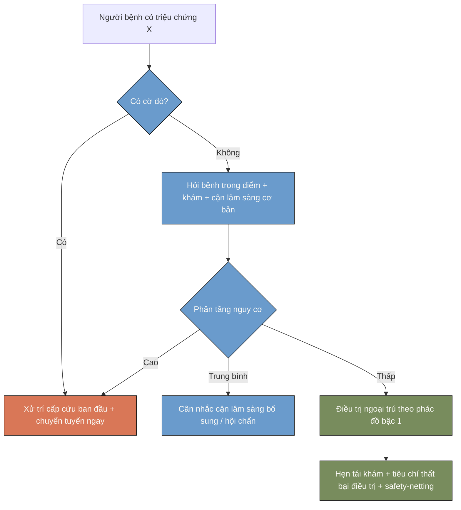

# Phong cách thị giác: màu, font và mẫu trực quan

Đọc file này khi tạo sản phẩm có định dạng (slide .pptx, Word .docx, PDF, HTML/
infographic) hoặc khi cần mẫu thuật toán/bảng quyết định. Mục đích là để màu sắc
mang **ý nghĩa lâm sàng nhất quán**, không chỉ trang trí.

## 1. Bảng màu và vai trò ngữ nghĩa

Màu không tùy ý — mỗi màu gắn một vai trò để người học đọc nhanh:

| Vai trò | Màu | Hex | Dùng cho |
|---|---|---|---|
| Cảnh báo / điểm mới quan trọng | Cam | `#d97757` | Cờ đỏ, chống chỉ định, thay đổi guideline mới, "không nên làm" |
| Chẩn đoán / quy trình | Xanh dương | `#6a9bcc` | Bước chẩn đoán, thuật toán tiếp cận, phân tầng |
| Điều trị / theo dõi | Xanh lá | `#788c5d` | Phác đồ điều trị, kế hoạch theo dõi, tái khám |
| Nền tối / chữ chính | Đen | `#141413` | Văn bản, tiêu đề trên nền sáng |
| Nền sáng | Kem | `#faf9f5` | Nền slide/trang |
| Xám trung | Xám | `#b0aea5` | Đường kẻ, chú thích phụ, văn bản thứ cấp |
| Xám nhạt | Xám nhạt | `#e8e6dc` | Nền bảng xen kẽ, khối phụ |

Nguyên tắc: dùng màu **tiết chế và đúng vai trò**. Nếu mọi thứ đều tô màu thì
không gì nổi bật — chỉ tô cờ đỏ/cảnh báo, đầu mục chẩn đoán, đầu mục điều trị.

## 2. Font

Dùng khi kiểm soát được định dạng (pptx/docx/HTML):
- Tiêu đề: **Poppins**, dự phòng **Arial**.
- Nội dung: **Lora**, dự phòng **Georgia**.
- Nếu môi trường không có font này (ví dụ python-pptx không nhúng được), dùng font
  dự phòng và ghi chú để người dùng tự cài/đổi.

## 3. Áp dụng theo loại file

- **Slide .pptx** (đọc `/mnt/skills/public/pptx/SKILL.md` trước): đặt màu nền kem,
  thanh tiêu đề/đầu mục theo màu vai trò (chẩn đoán xanh dương, điều trị xanh lá),
  hộp cờ đỏ/cảnh báo nền hoặc viền cam. Đặt font tiêu đề/nội dung theo mục 2.
- **Word .docx** (đọc `/mnt/skills/public/docx/SKILL.md` trước): dùng heading style
  với màu vai trò; bảng quyết định tô header theo nhóm; hộp cảnh báo dùng nền cam
  nhạt hoặc viền cam.
- **PDF** (đọc `/mnt/skills/public/pdf/SKILL.md` trước): nếu tạo mới, thường soạn
  HTML/Word rồi xuất PDF; giữ cùng bảng màu/font.
- **HTML / infographic / poster / web** (đọc `/mnt/skills/public/frontend-design/SKILL.md`
  trước): khai báo biến CSS cho 7 màu trên và dùng nhất quán.

## 4. Mẫu bảng quyết định có mã màu

Trong Markdown không tô nền ô được, nên **chú thích vai trò màu bằng nhãn** để khi
chuyển sang slide/Word áp đúng màu. Ví dụ:

| Bước | Nội dung | Vai trò màu |
|---|---|---|
| Sàng lọc cờ đỏ | Khó thở khi nghỉ, đau ngực, rối loạn tri giác | 🟧 Cảnh báo (`#d97757`) |
| Chẩn đoán | Hỏi bệnh + khám + cận lâm sàng ban đầu | 🟦 Chẩn đoán (`#6a9bcc`) |
| Điều trị ngoại trú | Phác đồ bậc 1, dặn dò, hẹn tái khám | 🟩 Điều trị (`#788c5d`) |

Khi xuất ra file thật, dịch nhãn 🟧/🟦/🟩 thành màu nền/viền tương ứng.

## 5. Mẫu thuật toán bằng Mermaid

Mermaid render được trong nhiều môi trường và dễ chỉnh. Mẫu tiếp cận chung (thay
nội dung theo chủ đề), đặt cờ đỏ ở nhánh ưu tiên trước:

Quy ước màu trong Mermaid: `redflag` = cam (cờ đỏ/cấp cứu), `dx` = xanh dương
(chẩn đoán/phân tầng), `tx` = xanh lá (điều trị/theo dõi) — khớp mục 1.
