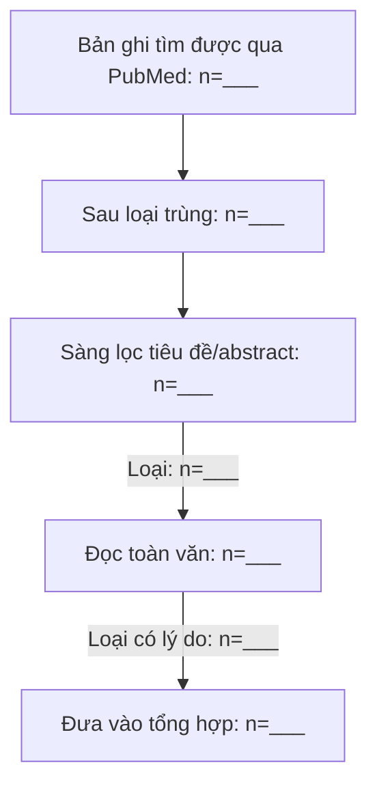

# EBM-MASTER

## Core Principles

1. Patient safety first.
2. Prefer official guidelines, systematic reviews/meta-analyses, large RCTs, large cohorts.
3. Do not change practice based on preprints, marketing, blogs, or low-quality evidence.
4. Always report evidence strength and implementation implications.
5. Verify source, version, date, and target population before recommending practice changes.

## Added Modules

### Guideline Monitor
ESC, ACC/AHA, ADA, KDIGO, GOLD, GINA, EULAR, ACR, IDSA, NICE, AASLD, EASL.

### Drug Safety Monitor
FDA, EMA, MHRA, WHO safety alerts.

### Antibiotic Stewardship
WHO AWaRe, Sanford Guide, IDSA principles.

### Clinical Score Manager
Maintain and update clinical scoring tools used in outpatient/internal medicine practice.

### Dashboard Master
Support Excel and HTML dashboard workflows for EBM updates and implementation tracking.

### Research Project Manager
Support protocol development, ethics review, data collection, SPSS workflows, reporting and publication.

---
# Inherited Skills


# MODULE: citation-management

---
name: citation-management
description: 'Quản lý trích dẫn học thuật: tìm bài trên PubMed (E-utilities miễn phí) và Google Scholar, trích xuất metadata chính xác, kiểm chứng trích dẫn, sinh BibTeX đúng chuẩn. Dùng khi cần tìm bài, xác minh thông tin trích dẫn, đổi DOI→BibTeX hoặc bảo đảm độ chính xác tài liệu tham khảo. Luôn kèm PMID/DOI.'
allowed-tools: Read Write Edit Bash
license: MIT License
metadata:
  version: "1.0"
  skill-author: K-Dense Inc.
---

<!-- EBM-VN-GUARD -->
> **⚕️ Bản điều chỉnh cho bác sĩ EBM ngoại trú (Việt Nam).** Skill gốc của K-Dense Inc. đã được chỉnh để phù hợp quy ước trong `CLAUDE.md` của người dùng.
>
> **QUY TẮC BẮT BUỘC — đọc trước, GHI ĐÈ mọi hướng dẫn tiếng Anh bên dưới:**
> 1. **Ngôn ngữ:** Mọi trao đổi và đầu ra cho người dùng viết bằng **tiếng Việt** (giữ thuật ngữ y khoa tiếng Anh khi cần; tên thuốc theo INN).
> 2. **Disclaimer:** Mọi đầu ra y khoa kết thúc bằng câu **"⚠️ Cần bác sĩ kiểm chứng trước khi áp dụng lâm sàng."**
> 3. **Nguồn:** Mọi nhận định/khuyến cáo phải **ghi nguồn (PMID/DOI)**; không có nguồn thì không khẳng định. **Tuyệt đối không bịa dữ liệu hay nguồn.**
> 4. **Không PII:** **KHÔNG** lưu hay tạo thông tin định danh bệnh nhân (tên, ngày sinh, số hồ sơ, địa chỉ...). Dùng mã ẩn danh.
> 5. **Chỉ nguồn miễn phí:** Khi tra cứu y văn dùng **PubMed E-utilities** (miễn phí, không cần API key) và các CSDL mở. **KHÔNG** dùng dịch vụ trả phí (parallel.ai, Perplexity, OpenRouter...). Nếu một lệnh gốc gọi `parallel-cli`/Perplexity, thay bằng `python scripts/pubmed_lookup.py "..."` hoặc REST miễn phí.
> 6. **Bối cảnh:** Bỏ qua phần chỉ phục vụ ngữ cảnh dược phẩm/pháp lý Mỹ (HIPAA/FDA/ICH-CSR) khi không liên quan ngoại trú VN; ưu tiên guideline quốc tế mới nhất rồi hiệu chỉnh theo Bộ Y tế VN.
>
> Phần kỹ thuật chi tiết (template, script, references) giữ nguyên tiếng Anh nhưng phải tạo ra **đầu ra tiếng Việt** theo các quy tắc trên.


# Citation Management

## Overview

Manage citations systematically throughout the research and writing process. This skill provides tools and strategies for searching academic databases (Google Scholar, PubMed), extracting accurate metadata from multiple sources (CrossRef, PubMed, arXiv), validating citation information, and generating properly formatted BibTeX entries.

Critical for maintaining citation accuracy, avoiding reference errors, and ensuring reproducible research. Integrates seamlessly with the literature-review skill for comprehensive research workflows.

## When to Use This Skill

Use this skill when:
- Searching for specific papers on Google Scholar or PubMed
- Converting DOIs, PMIDs, or arXiv IDs to properly formatted BibTeX
- Extracting complete metadata for citations (authors, title, journal, year, etc.)
- Validating existing citations for accuracy
- Cleaning and formatting BibTeX files
- Finding highly cited papers in a specific field
- Verifying that citation information matches the actual publication
- Building a bibliography for a manuscript or thesis
- Checking for duplicate citations
- Ensuring consistent citation formatting

## Visual Enhancement with Scientific Schematics

**When creating documents with this skill, always consider adding scientific diagrams and schematics to enhance visual communication.**

If your document does not already contain schematics or diagrams:
- Use the **scientific-schematics** skill to generate AI-powered publication-quality diagrams
- Simply describe your desired diagram in natural language
- Nano Banana Pro will automatically generate, review, and refine the schematic

**For new documents:** Scientific schematics should be generated by default to visually represent key concepts, workflows, architectures, or relationships described in the text.

**How to generate schematics:**
```bash
python scripts/generate_schematic.py "your diagram description" -o figures/output.png
```

The AI will automatically:
- Create publication-quality images with proper formatting
- Review and refine through multiple iterations
- Ensure accessibility (colorblind-friendly, high contrast)
- Save outputs in the figures/ directory

**When to add schematics:**
- Citation workflow diagrams
- Literature search methodology flowcharts
- Reference management system architectures
- Citation style decision trees
- Database integration diagrams
- Any complex concept that benefits from visualization

For detailed guidance on creating schematics, refer to the scientific-schematics skill documentation.

---

## Core Workflow

Citation management follows a systematic process:

### Phase 1: Paper Discovery and Search

**Goal**: Find relevant papers using academic search engines.

#### Google Scholar Search

Google Scholar provides the most comprehensive coverage across disciplines.

**Basic Search**:
```bash
# Search for papers on a topic
python scripts/search_google_scholar.py "CRISPR gene editing" \
  --limit 50 \
  --output results.json

# Search with year filter
python scripts/search_google_scholar.py "machine learning protein folding" \
  --year-start 2020 \
  --year-end 2024 \
  --limit 100 \
  --output ml_proteins.json
```

**Advanced Search Strategies** (see `references/google_scholar_search.md`):
- Use quotation marks for exact phrases: `"deep learning"`
- Search by author: `author:LeCun`
- Search in title: `intitle:"neural networks"`
- Exclude terms: `machine learning -survey`
- Find highly cited papers using sort options
- Filter by date ranges to get recent work

**Best Practices**:
- Use specific, targeted search terms
- Include key technical terms and acronyms
- Filter by recent years for fast-moving fields
- Check "Cited by" to find seminal papers
- Export top results for further analysis

#### PubMed Search

PubMed specializes in biomedical and life sciences literature (35+ million citations).

**Basic Search**:
```bash
# Search PubMed
python scripts/search_pubmed.py "Alzheimer's disease treatment" \
  --limit 100 \
  --output alzheimers.json

# Search with MeSH terms and filters
python scripts/search_pubmed.py \
  --query '"Alzheimer Disease"[MeSH] AND "Drug Therapy"[MeSH]' \
  --date-start 2020 \
  --date-end 2024 \
  --publication-types "Clinical Trial,Review" \
  --output alzheimers_trials.json
```

**Advanced PubMed Queries** (see `references/pubmed_search.md`):
- Use MeSH terms: `"Diabetes Mellitus"[MeSH]`
- Field tags: `"cancer"[Title]`, `"Smith J"[Author]`
- Boolean operators: `AND`, `OR`, `NOT`
- Date filters: `2020:2024[Publication Date]`
- Publication types: `"Review"[Publication Type]`
- Combine with E-utilities API for automation

**Best Practices**:
- Use MeSH Browser to find correct controlled vocabulary
- Construct complex queries in PubMed Advanced Search Builder first
- Include multiple synonyms with OR
- Retrieve PMIDs for easy metadata extraction
- Export to JSON or directly to BibTeX

### Phase 2: Metadata Extraction

**Goal**: Convert paper identifiers (DOI, PMID, arXiv ID) to complete, accurate metadata.

#### Quick DOI to BibTeX Conversion

For single DOIs, use the quick conversion tool:

```bash
# Convert single DOI
python scripts/doi_to_bibtex.py 10.1038/s41586-021-03819-2

# Convert multiple DOIs from a file
python scripts/doi_to_bibtex.py --input dois.txt --output references.bib

# Different output formats
python scripts/doi_to_bibtex.py 10.1038/nature12345 --format json
```

#### Comprehensive Metadata Extraction

For DOIs, PMIDs, arXiv IDs, or URLs:

```bash
# Extract from DOI
python scripts/extract_metadata.py --doi 10.1038/s41586-021-03819-2

# Extract from PMID
python scripts/extract_metadata.py --pmid 34265844

# Extract from arXiv ID
python scripts/extract_metadata.py --arxiv 2103.14030

# Extract from URL
python scripts/extract_metadata.py --url "https://www.nature.com/articles/s41586-021-03819-2"

# Batch extraction from file (mixed identifiers)
python scripts/extract_metadata.py --input identifiers.txt --output citations.bib
```

**Metadata Sources** (see `references/metadata_extraction.md`):

1. **CrossRef API**: Primary source for DOIs
   - Comprehensive metadata for journal articles
   - Publisher-provided information
   - Includes authors, title, journal, volume, pages, dates
   - Free, no API key required

2. **PubMed E-utilities**: Biomedical literature
   - Official NCBI metadata
   - Includes MeSH terms, abstracts
   - PMID and PMCID identifiers
   - Free, API key recommended for high volume

3. **arXiv API**: Preprints in physics, math, CS, q-bio
   - Complete metadata for preprints
   - Version tracking
   - Author affiliations
   - Free, open access

4. **DataCite API**: Research datasets, software, other resources
   - Metadata for non-traditional scholarly outputs
   - DOIs for datasets and code
   - Free access

**What Gets Extracted**:
- **Required fields**: author, title, year
- **Journal articles**: journal, volume, number, pages, DOI
- **Books**: publisher, ISBN, edition
- **Conference papers**: booktitle, conference location, pages
- **Preprints**: repository (arXiv, bioRxiv), preprint ID
- **Additional**: abstract, keywords, URL

### Phase 3: BibTeX Formatting

**Goal**: Generate clean, properly formatted BibTeX entries.

#### Understanding BibTeX Entry Types

See `references/bibtex_formatting.md` for complete guide.

**Common Entry Types**:
- `@article`: Journal articles (most common)
- `@book`: Books
- `@inproceedings`: Conference papers
- `@incollection`: Book chapters
- `@phdthesis`: Dissertations
- `@misc`: Preprints, software, datasets

**Required Fields by Type**:

```bibtex
@article{citationkey,
  author  = {Last1, First1 and Last2, First2},
  title   = {Article Title},
  journal = {Journal Name},
  year    = {2024},
  volume  = {10},
  number  = {3},
  pages   = {123--145},
  doi     = {10.1234/example}
}

@inproceedings{citationkey,
  author    = {Last, First},
  title     = {Paper Title},
  booktitle = {Conference Name},
  year      = {2024},
  pages     = {1--10}
}

@book{citationkey,
  author    = {Last, First},
  title     = {Book Title},
  publisher = {Publisher Name},
  year      = {2024}
}
```

#### Formatting and Cleaning

Use the formatter to standardize BibTeX files:

```bash
# Format and clean BibTeX file
python scripts/format_bibtex.py references.bib \
  --output formatted_references.bib

# Sort entries by citation key
python scripts/format_bibtex.py references.bib \
  --sort key \
  --output sorted_references.bib

# Sort by year (newest first)
python scripts/format_bibtex.py references.bib \
  --sort year \
  --descending \
  --output sorted_references.bib

# Remove duplicates
python scripts/format_bibtex.py references.bib \
  --deduplicate \
  --output clean_references.bib

# Validate and report issues
python scripts/format_bibtex.py references.bib \
  --validate \
  --report validation_report.txt
```

**Formatting Operations**:
- Standardize field order
- Consistent indentation and spacing
- Proper capitalization in titles (protected with {})
- Standardized author name format
- Consistent citation key format
- Remove unnecessary fields
- Fix common errors (missing commas, braces)

### Phase 4: Citation Validation

**Goal**: Verify all citations are accurate and complete.

#### Comprehensive Validation

```bash
# Validate BibTeX file
python scripts/validate_citations.py references.bib

# Validate and fix common issues
python scripts/validate_citations.py references.bib \
  --auto-fix \
  --output validated_references.bib

# Generate detailed validation report
python scripts/validate_citations.py references.bib \
  --report validation_report.json \
  --verbose
```

**Validation Checks** (see `references/citation_validation.md`):

1. **DOI Verification**:
   - DOI resolves correctly via doi.org
   - Metadata matches between BibTeX and CrossRef
   - No broken or invalid DOIs

2. **Required Fields**:
   - All required fields present for entry type
   - No empty or missing critical information
   - Author names properly formatted

3. **Data Consistency**:
   - Year is valid (4 digits, reasonable range)
   - Volume/number are numeric
   - Pages formatted correctly (e.g., 123--145)
   - URLs are accessible

4. **Duplicate Detection**:
   - Same DOI used multiple times
   - Similar titles (possible duplicates)
   - Same author/year/title combinations

5. **Format Compliance**:
   - Valid BibTeX syntax
   - Proper bracing and quoting
   - Citation keys are unique
   - Special characters handled correctly

**Validation Output**:
```json
{
  "total_entries": 150,
  "valid_entries": 145,
  "errors": [
    {
      "citation_key": "Smith2023",
      "error_type": "missing_field",
      "field": "journal",
      "severity": "high"
    },
    {
      "citation_key": "Jones2022",
      "error_type": "invalid_doi",
      "doi": "10.1234/broken",
      "severity": "high"
    }
  ],
  "warnings": [
    {
      "citation_key": "Brown2021",
      "warning_type": "possible_duplicate",
      "duplicate_of": "Brown2021a",
      "severity": "medium"
    }
  ]
}
```

### Phase 5: Integration with Writing Workflow

#### Building References for Manuscripts

Complete workflow for creating a bibliography:

```bash
# 1. Search for papers on your topic
python scripts/search_pubmed.py \
  '"CRISPR-Cas Systems"[MeSH] AND "Gene Editing"[MeSH]' \
  --date-start 2020 \
  --limit 200 \
  --output crispr_papers.json

# 2. Extract DOIs from search results and convert to BibTeX
python scripts/extract_metadata.py \
  --input crispr_papers.json \
  --output crispr_refs.bib

# 3. Add specific papers by DOI
python scripts/doi_to_bibtex.py 10.1038/nature12345 >> crispr_refs.bib
python scripts/doi_to_bibtex.py 10.1126/science.abcd1234 >> crispr_refs.bib

# 4. Format and clean the BibTeX file
python scripts/format_bibtex.py crispr_refs.bib \
  --deduplicate \
  --sort year \
  --descending \
  --output references.bib

# 5. Validate all citations
python scripts/validate_citations.py references.bib \
  --auto-fix \
  --report validation.json \
  --output final_references.bib

# 6. Review validation report and fix any remaining issues
cat validation.json

# 7. Use in your LaTeX document
# \bibliography{final_references}
```

#### Integration with Literature Review Skill

This skill complements the `literature-review` skill:

**Literature Review Skill** → Systematic search and synthesis
**Citation Management Skill** → Technical citation handling

**Combined Workflow**:
1. Use `literature-review` for comprehensive multi-database search
2. Use `citation-management` to extract and validate all citations
3. Use `literature-review` to synthesize findings thematically
4. Use `citation-management` to verify final bibliography accuracy

```bash
# After completing literature review
# Verify all citations in the review document
python scripts/validate_citations.py my_review_references.bib --report review_validation.json

# Format for specific citation style if needed
python scripts/format_bibtex.py my_review_references.bib \
  --style nature \
  --output formatted_refs.bib
```

## Search Strategies

### Google Scholar Best Practices

**Finding Seminal and High-Impact Papers** (CRITICAL):

Always prioritize papers based on citation count, venue quality, and author reputation:

**Citation Count Thresholds:**
| Paper Age | Citations | Classification |
|-----------|-----------|----------------|
| 0-3 years | 20+ | Noteworthy |
| 0-3 years | 100+ | Highly Influential |
| 3-7 years | 100+ | Significant |
| 3-7 years | 500+ | Landmark Paper |
| 7+ years | 500+ | Seminal Work |
| 7+ years | 1000+ | Foundational |

**Venue Quality Tiers:**
- **Tier 1 (Prefer):** Nature, Science, Cell, NEJM, Lancet, JAMA, PNAS
- **Tier 2 (High Priority):** Impact Factor >10, top conferences (NeurIPS, ICML, ICLR)
- **Tier 3 (Good):** Specialized journals (IF 5-10)
- **Tier 4 (Sparingly):** Lower-impact peer-reviewed venues

**Author Reputation Indicators:**
- Senior researchers with h-index >40
- Multiple publications in Tier-1 venues
- Leadership at recognized institutions
- Awards and editorial positions

**Search Strategies for High-Impact Papers:**
- Sort by citation count (most cited first)
- Look for review articles from Tier-1 journals for overview
- Check "Cited by" for impact assessment and recent follow-up work
- Use citation alerts for tracking new citations to key papers
- Filter by top venues using `source:Nature` or `source:Science`
- Search for papers by known field leaders using `author:LastName`

**Advanced Operators** (full list in `references/google_scholar_search.md`):
```
"exact phrase"           # Exact phrase matching
author:lastname          # Search by author
intitle:keyword          # Search in title only
source:journal           # Search specific journal
-exclude                 # Exclude terms
OR                       # Alternative terms
2020..2024              # Year range
```

**Example Searches**:
```
# Find recent reviews on a topic
"CRISPR" intitle:review 2023..2024

# Find papers by specific author on topic
author:Church "synthetic biology"

# Find highly cited foundational work
"deep learning" 2012..2015 sort:citations

# Exclude surveys and focus on methods
"protein folding" -survey -review intitle:method
```

### PubMed Best Practices

**Using MeSH Terms**:
MeSH (Medical Subject Headings) provides controlled vocabulary for precise searching.

1. **Find MeSH terms** at https://meshb.nlm.nih.gov/search
2. **Use in queries**: `"Diabetes Mellitus, Type 2"[MeSH]`
3. **Combine with keywords** for comprehensive coverage

**Field Tags**:
```
[Title]              # Search in title only
[Title/Abstract]     # Search in title or abstract
[Author]             # Search by author name
[Journal]            # Search specific journal
[Publication Date]   # Date range
[Publication Type]   # Article type
[MeSH]              # MeSH term
```

**Building Complex Queries**:
```bash
# Clinical trials on diabetes treatment published recently
"Diabetes Mellitus, Type 2"[MeSH] AND "Drug Therapy"[MeSH] 
AND "Clinical Trial"[Publication Type] AND 2020:2024[Publication Date]

# Reviews on CRISPR in specific journal
"CRISPR-Cas Systems"[MeSH] AND "Nature"[Journal] AND "Review"[Publication Type]

# Specific author's recent work
"Smith AB"[Author] AND cancer[Title/Abstract] AND 2022:2024[Publication Date]
```

**E-utilities for Automation**:
The scripts use NCBI E-utilities API for programmatic access:
- **ESearch**: Search and retrieve PMIDs
- **EFetch**: Retrieve full metadata
- **ESummary**: Get summary information
- **ELink**: Find related articles

See `references/pubmed_search.md` for complete API documentation.

## Tools and Scripts

### search_google_scholar.py

Search Google Scholar and export results.

**Features**:
- Automated searching with rate limiting
- Pagination support
- Year range filtering
- Export to JSON or BibTeX
- Citation count information

**Usage**:
```bash
# Basic search
python scripts/search_google_scholar.py "quantum computing"

# Advanced search with filters
python scripts/search_google_scholar.py "quantum computing" \
  --year-start 2020 \
  --year-end 2024 \
  --limit 100 \
  --sort-by citations \
  --output quantum_papers.json

# Export directly to BibTeX
python scripts/search_google_scholar.py "machine learning" \
  --limit 50 \
  --format bibtex \
  --output ml_papers.bib
```

### search_pubmed.py

Search PubMed using E-utilities API.

**Features**:
- Complex query support (MeSH, field tags, Boolean)
- Date range filtering
- Publication type filtering
- Batch retrieval with metadata
- Export to JSON or BibTeX

**Usage**:
```bash
# Simple keyword search
python scripts/search_pubmed.py "CRISPR gene editing"

# Complex query with filters
python scripts/search_pubmed.py \
  --query '"CRISPR-Cas Systems"[MeSH] AND "therapeutic"[Title/Abstract]' \
  --date-start 2020-01-01 \
  --date-end 2024-12-31 \
  --publication-types "Clinical Trial,Review" \
  --limit 200 \
  --output crispr_therapeutic.json

# Export to BibTeX
python scripts/search_pubmed.py "Alzheimer's disease" \
  --limit 100 \
  --format bibtex \
  --output alzheimers.bib
```

### extract_metadata.py

Extract complete metadata from paper identifiers.

**Features**:
- Supports DOI, PMID, arXiv ID, URL
- Queries CrossRef, PubMed, arXiv APIs
- Handles multiple identifier types
- Batch processing
- Multiple output formats

**Usage**:
```bash
# Single DOI
python scripts/extract_metadata.py --doi 10.1038/s41586-021-03819-2

# Single PMID
python scripts/extract_metadata.py --pmid 34265844

# Single arXiv ID
python scripts/extract_metadata.py --arxiv 2103.14030

# From URL
python scripts/extract_metadata.py \
  --url "https://www.nature.com/articles/s41586-021-03819-2"

# Batch processing (file with one identifier per line)
python scripts/extract_metadata.py \
  --input paper_ids.txt \
  --output references.bib

# Different output formats
python scripts/extract_metadata.py \
  --doi 10.1038/nature12345 \
  --format json  # or bibtex, yaml
```

### validate_citations.py

Validate BibTeX entries for accuracy and completeness.

**Features**:
- DOI verification via doi.org and CrossRef
- Required field checking
- Duplicate detection
- Format validation
- Auto-fix common issues
- Detailed reporting

**Usage**:
```bash
# Basic validation
python scripts/validate_citations.py references.bib

# With auto-fix
python scripts/validate_citations.py references.bib \
  --auto-fix \
  --output fixed_references.bib

# Detailed validation report
python scripts/validate_citations.py references.bib \
  --report validation_report.json \
  --verbose

# Only check DOIs
python scripts/validate_citations.py references.bib \
  --check-dois-only
```

### format_bibtex.py

Format and clean BibTeX files.

**Features**:
- Standardize formatting
- Sort entries (by key, year, author)
- Remove duplicates
- Validate syntax
- Fix common errors
- Enforce citation key conventions

**Usage**:
```bash
# Basic formatting
python scripts/format_bibtex.py references.bib

# Sort by year (newest first)
python scripts/format_bibtex.py references.bib \
  --sort year \
  --descending \
  --output sorted_refs.bib

# Remove duplicates
python scripts/format_bibtex.py references.bib \
  --deduplicate \
  --output clean_refs.bib

# Complete cleanup
python scripts/format_bibtex.py references.bib \
  --deduplicate \
  --sort year \
  --validate \
  --auto-fix \
  --output final_refs.bib
```

### doi_to_bibtex.py

Quick DOI to BibTeX conversion.

**Features**:
- Fast single DOI conversion
- Batch processing
- Multiple output formats
- Clipboard support

**Usage**:
```bash
# Single DOI
python scripts/doi_to_bibtex.py 10.1038/s41586-021-03819-2

# Multiple DOIs
python scripts/doi_to_bibtex.py \
  10.1038/nature12345 \
  10.1126/science.abc1234 \
  10.1016/j.cell.2023.01.001

# From file (one DOI per line)
python scripts/doi_to_bibtex.py --input dois.txt --output references.bib

# Copy to clipboard
python scripts/doi_to_bibtex.py 10.1038/nature12345 --clipboard
```

## Best Practices

### Search Strategy

1. **Start broad, then narrow**:
   - Begin with general terms to understand the field
   - Refine with specific keywords and filters
   - Use synonyms and related terms

2. **Use multiple sources**:
   - Google Scholar for comprehensive coverage
   - PubMed for biomedical focus
   - arXiv for preprints
   - Combine results for completeness

3. **Leverage citations**:
   - Check "Cited by" for seminal papers
   - Review references from key papers
   - Use citation networks to discover related work

4. **Document your searches**:
   - Save search queries and dates
   - Record number of results
   - Note any filters or restrictions applied

### Metadata Extraction

1. **Always use DOIs when available**:
   - Most reliable identifier
   - Permanent link to the publication
   - Best metadata source via CrossRef

2. **Verify extracted metadata**:
   - Check author names are correct
   - Verify journal/conference names
   - Confirm publication year
   - Validate page numbers and volume

3. **Handle edge cases**:
   - Preprints: Include repository and ID
   - Preprints later published: Use published version
   - Conference papers: Include conference name and location
   - Book chapters: Include book title and editors

4. **Maintain consistency**:
   - Use consistent author name format
   - Standardize journal abbreviations
   - Use same DOI format (URL preferred)

### BibTeX Quality

1. **Follow conventions**:
   - Use meaningful citation keys (FirstAuthor2024keyword)
   - Protect capitalization in titles with {}
   - Use -- for page ranges (not single dash)
   - Include DOI field for all modern publications

2. **Keep it clean**:
   - Remove unnecessary fields
   - No redundant information
   - Consistent formatting
   - Validate syntax regularly

3. **Organize systematically**:
   - Sort by year or topic
   - Group related papers
   - Use separate files for different projects
   - Merge carefully to avoid duplicates

### Validation

1. **Validate early and often**:
   - Check citations when adding them
   - Validate complete bibliography before submission
   - Re-validate after any manual edits

2. **Fix issues promptly**:
   - Broken DOIs: Find correct identifier
   - Missing fields: Extract from original source
   - Duplicates: Choose best version, remove others
   - Format errors: Use auto-fix when safe

3. **Manual review for critical citations**:
   - Verify key papers cited correctly
   - Check author names match publication
   - Confirm page numbers and volume
   - Ensure URLs are current

## Common Pitfalls to Avoid

1. **Single source bias**: Only using Google Scholar or PubMed
   - **Solution**: Search multiple databases for comprehensive coverage

2. **Accepting metadata blindly**: Not verifying extracted information
   - **Solution**: Spot-check extracted metadata against original sources

3. **Ignoring DOI errors**: Broken or incorrect DOIs in bibliography
   - **Solution**: Run validation before final submission

4. **Inconsistent formatting**: Mixed citation key styles, formatting
   - **Solution**: Use format_bibtex.py to standardize

5. **Duplicate entries**: Same paper cited multiple times with different keys
   - **Solution**: Use duplicate detection in validation

6. **Missing required fields**: Incomplete BibTeX entries
   - **Solution**: Validate and ensure all required fields present

7. **Outdated preprints**: Citing preprint when published version exists
   - **Solution**: Check if preprints have been published, update to journal version

8. **Special character issues**: Broken LaTeX compilation due to characters
   - **Solution**: Use proper escaping or Unicode in BibTeX

9. **No validation before submission**: Submitting with citation errors
   - **Solution**: Always run validation as final check

10. **Manual BibTeX entry**: Typing entries by hand
    - **Solution**: Always extract from metadata sources using scripts

## Example Workflows

### Example 1: Building a Bibliography for a Paper

```bash
# Step 1: Find key papers on your topic
python scripts/search_google_scholar.py "transformer neural networks" \
  --year-start 2017 \
  --limit 50 \
  --output transformers_gs.json

python scripts/search_pubmed.py "deep learning medical imaging" \
  --date-start 2020 \
  --limit 50 \
  --output medical_dl_pm.json

# Step 2: Extract metadata from search results
python scripts/extract_metadata.py \
  --input transformers_gs.json \
  --output transformers.bib

python scripts/extract_metadata.py \
  --input medical_dl_pm.json \
  --output medical.bib

# Step 3: Add specific papers you already know
python scripts/doi_to_bibtex.py 10.1038/s41586-021-03819-2 >> specific.bib
python scripts/doi_to_bibtex.py 10.1126/science.aam9317 >> specific.bib

# Step 4: Combine all BibTeX files
cat transformers.bib medical.bib specific.bib > combined.bib

# Step 5: Format and deduplicate
python scripts/format_bibtex.py combined.bib \
  --deduplicate \
  --sort year \
  --descending \
  --output formatted.bib

# Step 6: Validate
python scripts/validate_citations.py formatted.bib \
  --auto-fix \
  --report validation.json \
  --output final_references.bib

# Step 7: Review any issues
cat validation.json | grep -A 3 '"errors"'

# Step 8: Use in LaTeX
# \bibliography{final_references}
```

### Example 2: Converting a List of DOIs

```bash
# You have a text file with DOIs (one per line)
# dois.txt contains:
# 10.1038/s41586-021-03819-2
# 10.1126/science.aam9317
# 10.1016/j.cell.2023.01.001

# Convert all to BibTeX
python scripts/doi_to_bibtex.py --input dois.txt --output references.bib

# Validate the result
python scripts/validate_citations.py references.bib --verbose
```

### Example 3: Cleaning an Existing BibTeX File

```bash
# You have a messy BibTeX file from various sources
# Clean it up systematically

# Step 1: Format and standardize
python scripts/format_bibtex.py messy_references.bib \
  --output step1_formatted.bib

# Step 2: Remove duplicates
python scripts/format_bibtex.py step1_formatted.bib \
  --deduplicate \
  --output step2_deduplicated.bib

# Step 3: Validate and auto-fix
python scripts/validate_citations.py step2_deduplicated.bib \
  --auto-fix \
  --output step3_validated.bib

# Step 4: Sort by year
python scripts/format_bibtex.py step3_validated.bib \
  --sort year \
  --descending \
  --output clean_references.bib

# Step 5: Final validation report
python scripts/validate_citations.py clean_references.bib \
  --report final_validation.json \
  --verbose

# Review report
cat final_validation.json
```

### Example 4: Finding and Citing Seminal Papers

```bash
# Find highly cited papers on a topic
python scripts/search_google_scholar.py "AlphaFold protein structure" \
  --year-start 2020 \
  --year-end 2024 \
  --sort-by citations \
  --limit 20 \
  --output alphafold_seminal.json

# Extract the top 10 by citation count
# (script will have included citation counts in JSON)

# Convert to BibTeX
python scripts/extract_metadata.py \
  --input alphafold_seminal.json \
  --output alphafold_refs.bib

# The BibTeX file now contains the most influential papers
```

## Integration with Other Skills

### Literature Review Skill

**Citation Management** provides the technical infrastructure for **Literature Review**:

- **Literature Review**: Multi-database systematic search and synthesis
- **Citation Management**: Metadata extraction and validation

**Combined workflow**:
1. Use literature-review for systematic search methodology
2. Use citation-management to extract and validate citations
3. Use literature-review to synthesize findings
4. Use citation-management to ensure bibliography accuracy

### Scientific Writing Skill

**Citation Management** ensures accurate references for **Scientific Writing**:

- Export validated BibTeX for use in LaTeX manuscripts
- Verify citations match publication standards
- Format references according to journal requirements

### Venue Templates Skill

**Citation Management** works with **Venue Templates** for submission-ready manuscripts:

- Different venues require different citation styles
- Generate properly formatted references
- Validate citations meet venue requirements

## Resources

### Bundled Resources

**References** (in `references/`):
- `google_scholar_search.md`: Complete Google Scholar search guide
- `pubmed_search.md`: PubMed and E-utilities API documentation
- `metadata_extraction.md`: Metadata sources and field requirements
- `citation_validation.md`: Validation criteria and quality checks
- `bibtex_formatting.md`: BibTeX entry types and formatting rules

**Scripts** (in `scripts/`):
- `search_google_scholar.py`: Google Scholar search automation
- `search_pubmed.py`: PubMed E-utilities API client
- `extract_metadata.py`: Universal metadata extractor
- `validate_citations.py`: Citation validation and verification
- `format_bibtex.py`: BibTeX formatter and cleaner
- `doi_to_bibtex.py`: Quick DOI to BibTeX converter

**Assets** (in `assets/`):
- `bibtex_template.bib`: Example BibTeX entries for all types
- `citation_checklist.md`: Quality assurance checklist

### External Resources

**Search Engines**:
- Google Scholar: https://scholar.google.com/
- PubMed: https://pubmed.ncbi.nlm.nih.gov/
- PubMed Advanced Search: https://pubmed.ncbi.nlm.nih.gov/advanced/

**Metadata APIs**:
- CrossRef API: https://api.crossref.org/
- PubMed E-utilities: https://www.ncbi.nlm.nih.gov/books/NBK25501/
- arXiv API: https://arxiv.org/help/api/
- DataCite API: https://api.datacite.org/

**Tools and Validators**:
- MeSH Browser: https://meshb.nlm.nih.gov/search
- DOI Resolver: https://doi.org/
- BibTeX Format: http://www.bibtex.org/Format/

**Citation Styles**:
- BibTeX documentation: http://www.bibtex.org/
- LaTeX bibliography management: https://www.overleaf.com/learn/latex/Bibliography_management

## Dependencies

### Required Python Packages

```bash
# Core dependencies
pip install requests  # HTTP requests for APIs
pip install bibtexparser  # BibTeX parsing and formatting
pip install biopython  # PubMed E-utilities access

# Optional (for Google Scholar)
pip install scholarly  # Google Scholar API wrapper
# or
pip install selenium  # For more robust Scholar scraping
```

### Optional Tools

```bash
# For advanced validation
pip install crossref-commons  # Enhanced CrossRef API access
pip install pylatexenc  # LaTeX special character handling
```

## Summary

The citation-management skill provides:

1. **Comprehensive search capabilities** for Google Scholar and PubMed
2. **Automated metadata extraction** from DOI, PMID, arXiv ID, URLs
3. **Citation validation** with DOI verification and completeness checking
4. **BibTeX formatting** with standardization and cleaning tools
5. **Quality assurance** through validation and reporting
6. **Integration** with scientific writing workflow
7. **Reproducibility** through documented search and extraction methods

Use this skill to maintain accurate, complete citations throughout your research and ensure publication-ready bibliographies.


# MODULE: clinical-decision-support

---
name: clinical-decision-support
description: 'Tạo tài liệu hỗ trợ quyết định lâm sàng (CDS): phân tích nhóm bệnh nhân (cohort) theo dấu ấn sinh học, báo cáo khuyến cáo điều trị dựa trên bằng chứng kèm thuật toán quyết định và phân độ GRADE; phân tích thống kê (HR, đường sống còn); xuất LaTeX/PDF. Dùng cho nghiên cứu/tổng hợp bằng chứng. Mọi đầu ra y khoa kèm nguồn PMID/DOI, disclaimer ''Cần bác sĩ kiểm chứng'', KHÔNG lưu PII.'
allowed-tools: Read Write Edit Bash
license: MIT License
metadata:
  version: "1.0"
  skill-author: K-Dense Inc.
---

<!-- EBM-VN-GUARD -->
> **⚕️ Bản điều chỉnh cho bác sĩ EBM ngoại trú (Việt Nam).** Skill gốc của K-Dense Inc. đã được chỉnh để phù hợp quy ước trong `CLAUDE.md` của người dùng.
>
> **QUY TẮC BẮT BUỘC — đọc trước, GHI ĐÈ mọi hướng dẫn tiếng Anh bên dưới:**
> 1. **Ngôn ngữ:** Mọi trao đổi và đầu ra cho người dùng viết bằng **tiếng Việt** (giữ thuật ngữ y khoa tiếng Anh khi cần; tên thuốc theo INN).
> 2. **Disclaimer:** Mọi đầu ra y khoa kết thúc bằng câu **"⚠️ Cần bác sĩ kiểm chứng trước khi áp dụng lâm sàng."**
> 3. **Nguồn:** Mọi nhận định/khuyến cáo phải **ghi nguồn (PMID/DOI)**; không có nguồn thì không khẳng định. **Tuyệt đối không bịa dữ liệu hay nguồn.**
> 4. **Không PII:** **KHÔNG** lưu hay tạo thông tin định danh bệnh nhân (tên, ngày sinh, số hồ sơ, địa chỉ...). Dùng mã ẩn danh.
> 5. **Chỉ nguồn miễn phí:** Khi tra cứu y văn dùng **PubMed E-utilities** (miễn phí, không cần API key) và các CSDL mở. **KHÔNG** dùng dịch vụ trả phí (parallel.ai, Perplexity, OpenRouter...). Nếu một lệnh gốc gọi `parallel-cli`/Perplexity, thay bằng `python scripts/pubmed_lookup.py "..."` hoặc REST miễn phí.
> 6. **Bối cảnh:** Bỏ qua phần chỉ phục vụ ngữ cảnh dược phẩm/pháp lý Mỹ (HIPAA/FDA/ICH-CSR) khi không liên quan ngoại trú VN; ưu tiên guideline quốc tế mới nhất rồi hiệu chỉnh theo Bộ Y tế VN.
>
> Phần kỹ thuật chi tiết (template, script, references) giữ nguyên tiếng Anh nhưng phải tạo ra **đầu ra tiếng Việt** theo các quy tắc trên.


# Clinical Decision Support Documents

## Description

Generate professional clinical decision support (CDS) documents for pharmaceutical companies, clinical researchers, and medical decision-makers. This skill specializes in analytical, evidence-based documents that inform treatment strategies and drug development:

1. **Patient Cohort Analysis** - Biomarker-stratified group analyses with statistical outcome comparisons
2. **Treatment Recommendation Reports** - Evidence-based clinical guidelines with GRADE grading and decision algorithms

All documents are generated as publication-ready LaTeX/PDF files optimized for pharmaceutical research, regulatory submissions, and clinical guideline development.

**Note:** For individual patient treatment plans at the bedside, use the `treatment-plans` skill instead. This skill focuses on group-level analyses and evidence synthesis for pharmaceutical/research settings.

**Writing Style:** For publication-ready documents targeting medical journals, consult the **venue-templates** skill's `medical_journal_styles.md` for guidance on structured abstracts, evidence language, and CONSORT/STROBE compliance.

## Capabilities

### Document Types

**Patient Cohort Analysis**
- Biomarker-based patient stratification (molecular subtypes, gene expression, IHC)
- Molecular subtype classification (e.g., GBM mesenchymal-immune-active vs proneural, breast cancer subtypes)
- Outcome metrics with statistical analysis (OS, PFS, ORR, DOR, DCR)
- Statistical comparisons between subgroups (hazard ratios, p-values, 95% CI)
- Survival analysis with Kaplan-Meier curves and log-rank tests
- Efficacy tables and waterfall plots
- Comparative effectiveness analyses
- Pharmaceutical cohort reporting (trial subgroups, real-world evidence)

**Treatment Recommendation Reports**
- Evidence-based treatment guidelines for specific disease states
- Strength of recommendation grading (GRADE system: 1A, 1B, 2A, 2B, 2C)
- Quality of evidence assessment (high, moderate, low, very low)
- Treatment algorithm flowcharts with TikZ diagrams
- Line-of-therapy sequencing based on biomarkers
- Decision pathways with clinical and molecular criteria
- Pharmaceutical strategy documents
- Clinical guideline development for medical societies

### Clinical Features

- **Biomarker Integration**: Genomic alterations (mutations, CNV, fusions), gene expression signatures, IHC markers, PD-L1 scoring
- **Statistical Analysis**: Hazard ratios, p-values, confidence intervals, survival curves, Cox regression, log-rank tests
- **Evidence Grading**: GRADE system (1A/1B/2A/2B/2C), Oxford CEBM levels, quality of evidence assessment
- **Clinical Terminology**: SNOMED-CT, LOINC, proper medical nomenclature, trial nomenclature
- **Regulatory Compliance**: HIPAA de-identification, confidentiality headers, ICH-GCP alignment
- **Professional Formatting**: Compact 0.5in margins, color-coded recommendations, publication-ready, suitable for regulatory submissions

## Pharmaceutical and Research Use Cases

This skill is specifically designed for pharmaceutical and clinical research applications:

**Drug Development**
- **Phase 2/3 Trial Analyses**: Biomarker-stratified efficacy and safety analyses
- **Subgroup Analyses**: Forest plots showing treatment effects across patient subgroups
- **Companion Diagnostic Development**: Linking biomarkers to drug response
- **Regulatory Submissions**: IND/NDA documentation with evidence summaries

**Medical Affairs**
- **KOL Education Materials**: Evidence-based treatment algorithms for thought leaders
- **Medical Strategy Documents**: Competitive landscape and positioning strategies
- **Advisory Board Materials**: Cohort analyses and treatment recommendation frameworks
- **Publication Planning**: Manuscript-ready analyses for peer-reviewed journals

**Clinical Guidelines**
- **Guideline Development**: Evidence synthesis with GRADE methodology for specialty societies
- **Consensus Recommendations**: Multi-stakeholder treatment algorithm development
- **Practice Standards**: Biomarker-based treatment selection criteria
- **Quality Measures**: Evidence-based performance metrics

**Real-World Evidence**
- **RWE Cohort Studies**: Retrospective analyses of patient cohorts from EMR data
- **Comparative Effectiveness**: Head-to-head treatment comparisons in real-world settings
- **Outcomes Research**: Long-term survival and safety in clinical practice
- **Health Economics**: Cost-effectiveness analyses by biomarker subgroup

## When to Use

Use this skill when you need to:

- **Analyze patient cohorts** stratified by biomarkers, molecular subtypes, or clinical characteristics
- **Generate treatment recommendation reports** with evidence grading for clinical guidelines or pharmaceutical strategies
- **Compare outcomes** between patient subgroups with statistical analysis (survival, response rates, hazard ratios)
- **Produce pharmaceutical research documents** for drug development, clinical trials, or regulatory submissions
- **Develop clinical practice guidelines** with GRADE evidence grading and decision algorithms
- **Document biomarker-guided therapy selection** at the population level (not individual patients)
- **Synthesize evidence** from multiple trials or real-world data sources
- **Create clinical decision algorithms** with flowcharts for treatment sequencing

**Do NOT use this skill for:**
- Individual patient treatment plans (use `treatment-plans` skill)
- Bedside clinical care documentation (use `treatment-plans` skill)
- Simple patient-specific treatment protocols (use `treatment-plans` skill)

## Visual Enhancement with Scientific Schematics

**⚠️ MANDATORY: Every clinical decision support document MUST include at least 1-2 AI-generated figures using the scientific-schematics skill.**

This is not optional. Clinical decision documents require clear visual algorithms. Before finalizing any document:
1. Generate at minimum ONE schematic or diagram (e.g., clinical decision algorithm, treatment pathway, or biomarker stratification tree)
2. For cohort analyses: include patient flow diagram
3. For treatment recommendations: include decision flowchart

**How to generate figures:**
- Use the **scientific-schematics** skill to generate AI-powered publication-quality diagrams
- Simply describe your desired diagram in natural language
- Nano Banana Pro will automatically generate, review, and refine the schematic

**How to generate schematics:**
```bash
python scripts/generate_schematic.py "your diagram description" -o figures/output.png
```

The AI will automatically:
- Create publication-quality images with proper formatting
- Review and refine through multiple iterations
- Ensure accessibility (colorblind-friendly, high contrast)
- Save outputs in the figures/ directory

**When to add schematics:**
- Clinical decision algorithm flowcharts
- Treatment pathway diagrams
- Biomarker stratification trees
- Patient cohort flow diagrams (CONSORT-style)
- Survival curve visualizations
- Molecular mechanism diagrams
- Any complex concept that benefits from visualization

For detailed guidance on creating schematics, refer to the scientific-schematics skill documentation.

---

## Document Structure

**CRITICAL REQUIREMENT: All clinical decision support documents MUST begin with a complete executive summary on page 1 that spans the entire first page before any table of contents or detailed sections.**

### Page 1 Executive Summary Structure

The first page of every CDS document should contain ONLY the executive summary with the following components:

**Required Elements (all on page 1):**
1. **Document Title and Type**
   - Main title (e.g., "Biomarker-Stratified Cohort Analysis" or "Evidence-Based Treatment Recommendations")
   - Subtitle with disease state and focus
   
2. **Report Information Box** (using colored tcolorbox)
   - Document type and purpose
   - Date of analysis/report
   - Disease state and patient population
   - Author/institution (if applicable)
   - Analysis framework or methodology
   
3. **Key Findings Boxes** (3-5 colored boxes using tcolorbox)
   - **Primary Results** (blue box): Main efficacy/outcome findings
   - **Biomarker Insights** (green box): Key molecular subtype findings
   - **Clinical Implications** (yellow/orange box): Actionable treatment implications
   - **Statistical Summary** (gray box): Hazard ratios, p-values, key statistics
   - **Safety Highlights** (red box, if applicable): Critical adverse events or warnings

**Visual Requirements:**
- Use `\thispagestyle{empty}` to remove page numbers from page 1
- All content must fit on page 1 (before `\newpage`)
- Use colored tcolorbox environments with different colors for visual hierarchy
- Boxes should be scannable and highlight most critical information
- Use bullet points, not narrative paragraphs
- End page 1 with `\newpage` before table of contents or detailed sections

**Example First Page LaTeX Structure:**
```latex
\maketitle
\thispagestyle{empty}

% Report Information Box
\begin{tcolorbox}[colback=blue!5!white, colframe=blue!75!black, title=Report Information]
\textbf{Document Type:} Patient Cohort Analysis\\
\textbf{Disease State:} HER2-Positive Metastatic Breast Cancer\\
\textbf{Analysis Date:} \today\\
\textbf{Population:} 60 patients, biomarker-stratified by HR status
\end{tcolorbox}

\vspace{0.3cm}

% Key Finding #1: Primary Results
\begin{tcolorbox}[colback=blue!5!white, colframe=blue!75!black, title=Primary Efficacy Results]
\begin{itemize}
    \item Overall ORR: 72\% (95\% CI: 59-83\%)
    \item Median PFS: 18.5 months (95\% CI: 14.2-22.8)
    \item Median OS: 35.2 months (95\% CI: 28.1-NR)
\end{itemize}
\end{tcolorbox}

\vspace{0.3cm}

% Key Finding #2: Biomarker Insights
\begin{tcolorbox}[colback=green!5!white, colframe=green!75!black, title=Biomarker Stratification Findings]
\begin{itemize}
    \item HR+/HER2+: ORR 68\%, median PFS 16.2 months
    \item HR-/HER2+: ORR 78\%, median PFS 22.1 months
    \item HR status significantly associated with outcomes (p=0.041)
\end{itemize}
\end{tcolorbox}

\vspace{0.3cm}

% Key Finding #3: Clinical Implications
\begin{tcolorbox}[colback=orange!5!white, colframe=orange!75!black, title=Clinical Recommendations]
\begin{itemize}
    \item Strong efficacy observed regardless of HR status (Grade 1A)
    \item HR-/HER2+ patients showed numerically superior outcomes
    \item Treatment recommended for all HER2+ MBC patients
\end{itemize}
\end{tcolorbox}

\newpage
\tableofcontents  % TOC on page 2
\newpage  % Detailed content starts page 3
```

### Patient Cohort Analysis (Detailed Sections - Page 3+)
- **Cohort Characteristics**: Demographics, baseline features, patient selection criteria
- **Biomarker Stratification**: Molecular subtypes, genomic alterations, IHC profiles
- **Treatment Exposure**: Therapies received, dosing, treatment duration by subgroup
- **Outcome Analysis**: Response rates (ORR, DCR), survival data (OS, PFS), DOR
- **Statistical Methods**: Kaplan-Meier survival curves, hazard ratios, log-rank tests, Cox regression
- **Subgroup Comparisons**: Biomarker-stratified efficacy, forest plots, statistical significance
- **Safety Profile**: Adverse events by subgroup, dose modifications, discontinuations
- **Clinical Recommendations**: Treatment implications based on biomarker profiles
- **Figures**: Waterfall plots, swimmer plots, survival curves, forest plots
- **Tables**: Demographics table, biomarker frequency, outcomes by subgroup

### Treatment Recommendation Reports (Detailed Sections - Page 3+)

**Page 1 Executive Summary for Treatment Recommendations should include:**
1. **Report Information Box**: Disease state, guideline version/date, target population
2. **Key Recommendations Box** (green): Top 3-5 GRADE-graded recommendations by line of therapy
3. **Biomarker Decision Criteria Box** (blue): Key molecular markers influencing treatment selection
4. **Evidence Summary Box** (gray): Major trials supporting recommendations (e.g., KEYNOTE-189, FLAURA)
5. **Critical Monitoring Box** (orange/red): Essential safety monitoring requirements

**Detailed Sections (Page 3+):**
- **Clinical Context**: Disease state, epidemiology, current treatment landscape
- **Target Population**: Patient characteristics, biomarker criteria, staging
- **Evidence Review**: Systematic literature synthesis, guideline summary, trial data
- **Treatment Options**: Available therapies with mechanism of action
- **Evidence Grading**: GRADE assessment for each recommendation (1A, 1B, 2A, 2B, 2C)
- **Recommendations by Line**: First-line, second-line, subsequent therapies
- **Biomarker-Guided Selection**: Decision criteria based on molecular profiles
- **Treatment Algorithms**: TikZ flowcharts showing decision pathways
- **Monitoring Protocol**: Safety assessments, efficacy monitoring, dose modifications
- **Special Populations**: Elderly, renal/hepatic impairment, comorbidities
- **References**: Full bibliography with trial names and citations

## Output Format

**MANDATORY FIRST PAGE REQUIREMENT:**
- **Page 1**: Full-page executive summary with 3-5 colored tcolorbox elements
- **Page 2**: Table of contents (optional)
- **Page 3+**: Detailed sections with methods, results, figures, tables

**Document Specifications:**
- **Primary**: LaTeX/PDF with 0.5in margins for compact, data-dense presentation
- **Length**: Typically 5-15 pages (1 page executive summary + 4-14 pages detailed content)
- **Style**: Publication-ready, pharmaceutical-grade, suitable for regulatory submissions
- **First Page**: Always a complete executive summary spanning entire page 1 (see Document Structure section)

**Visual Elements:**
- **Colors**: 
  - Page 1 boxes: blue=data/information, green=biomarkers/recommendations, yellow/orange=clinical implications, red=warnings
  - Recommendation boxes (green=strong recommendation, yellow=conditional, blue=research needed)
  - Biomarker stratification (color-coded molecular subtypes)
  - Statistical significance (color-coded p-values, hazard ratios)
- **Tables**: 
  - Demographics with baseline characteristics
  - Biomarker frequency by subgroup
  - Outcomes table (ORR, PFS, OS, DOR by molecular subtype)
  - Adverse events by cohort
  - Evidence summary tables with GRADE ratings
- **Figures**: 
  - Kaplan-Meier survival curves with log-rank p-values and number at risk tables
  - Waterfall plots showing best response by patient
  - Forest plots for subgroup analyses with confidence intervals
  - TikZ decision algorithm flowcharts
  - Swimmer plots for individual patient timelines
- **Statistics**: Hazard ratios with 95% CI, p-values, median survival times, landmark survival rates
- **Compliance**: De-identification per HIPAA Safe Harbor, confidentiality notices for proprietary data

## Integration

This skill integrates with:
- **scientific-writing**: Citation management, statistical reporting, evidence synthesis
- **clinical-reports**: Medical terminology, HIPAA compliance, regulatory documentation
- **scientific-schematics**: TikZ flowcharts for decision algorithms and treatment pathways
- **treatment-plans**: Individual patient applications of cohort-derived insights (bidirectional)

## Key Differentiators from Treatment-Plans Skill

**Clinical Decision Support (this skill):**
- **Audience**: Pharmaceutical companies, clinical researchers, guideline committees, medical affairs
- **Scope**: Population-level analyses, evidence synthesis, guideline development
- **Focus**: Biomarker stratification, statistical comparisons, evidence grading
- **Output**: Multi-page analytical documents (5-15 pages typical) with extensive figures and tables
- **Use Cases**: Drug development, regulatory submissions, clinical practice guidelines, medical strategy
- **Example**: "Analyze 60 HER2+ breast cancer patients by hormone receptor status with survival outcomes"

**Treatment-Plans Skill:**
- **Audience**: Clinicians, patients, care teams
- **Scope**: Individual patient care planning
- **Focus**: SMART goals, patient-specific interventions, monitoring plans
- **Output**: Concise 1-4 page actionable care plans
- **Use Cases**: Bedside clinical care, EMR documentation, patient-centered planning
- **Example**: "Create treatment plan for a 55-year-old patient with newly diagnosed type 2 diabetes"

**When to use each:**
- Use **clinical-decision-support** for: cohort analyses, biomarker stratification studies, treatment guideline development, pharmaceutical strategy documents
- Use **treatment-plans** for: individual patient care plans, treatment protocols for specific patients, bedside clinical documentation

## Example Usage

### Patient Cohort Analysis

**Example 1: NSCLC Biomarker Stratification**
```
> Analyze a cohort of 45 NSCLC patients stratified by PD-L1 expression (<1%, 1-49%, ≥50%) 
> receiving pembrolizumab. Include outcomes: ORR, median PFS, median OS with hazard ratios 
> comparing PD-L1 ≥50% vs <50%. Generate Kaplan-Meier curves and waterfall plot.
```

**Example 2: GBM Molecular Subtype Analysis**
```
> Generate cohort analysis for 30 GBM patients classified into Cluster 1 (Mesenchymal-Immune-Active) 
> and Cluster 2 (Proneural) molecular subtypes. Compare outcomes including median OS, 6-month PFS rate, 
> and response to TMZ+bevacizumab. Include biomarker profile table and statistical comparison.
```

**Example 3: Breast Cancer HER2 Cohort**
```
> Analyze 60 HER2-positive metastatic breast cancer patients treated with trastuzumab-deruxtecan, 
> stratified by prior trastuzumab exposure (yes/no). Include ORR, DOR, median PFS with forest plot 
> showing subgroup analyses by hormone receptor status, brain metastases, and number of prior lines.
```

### Treatment Recommendation Report

**Example 1: HER2+ Metastatic Breast Cancer Guidelines**
```
> Create evidence-based treatment recommendations for HER2-positive metastatic breast cancer including 
> biomarker-guided therapy selection. Use GRADE system to grade recommendations for first-line 
> (trastuzumab+pertuzumab+taxane), second-line (trastuzumab-deruxtecan), and third-line options. 
> Include decision algorithm flowchart based on brain metastases, hormone receptor status, and prior therapies.
```

**Example 2: Advanced NSCLC Treatment Algorithm**
```
> Generate treatment recommendation report for advanced NSCLC based on PD-L1 expression, EGFR mutation, 
> ALK rearrangement, and performance status. Include GRADE-graded recommendations for each molecular subtype, 
> TikZ flowchart for biomarker-directed therapy selection, and evidence tables from KEYNOTE-189, FLAURA, 
> and CheckMate-227 trials.
```

**Example 3: Multiple Myeloma Line-of-Therapy Sequencing**
```
> Create treatment algorithm for newly diagnosed multiple myeloma through relapsed/refractory setting. 
> Include GRADE recommendations for transplant-eligible vs ineligible, high-risk cytogenetics considerations, 
> and sequencing of daratumumab, carfilzomib, and CAR-T therapy. Provide flowchart showing decision points 
> at each line of therapy.
```

## Key Features

### Biomarker Classification
- Genomic: Mutations, CNV, gene fusions
- Expression: RNA-seq, IHC scores
- Molecular subtypes: Disease-specific classifications
- Clinical actionability: Therapy selection guidance

### Outcome Metrics
- Survival: OS (overall survival), PFS (progression-free survival)
- Response: ORR (objective response rate), DOR (duration of response), DCR (disease control rate)
- Quality: ECOG performance status, symptom burden
- Safety: Adverse events, dose modifications

### Statistical Methods
- Survival analysis: Kaplan-Meier curves, log-rank tests
- Group comparisons: t-tests, chi-square, Fisher's exact
- Effect sizes: Hazard ratios, odds ratios with 95% CI
- Significance: p-values, multiple testing corrections

### Evidence Grading

**GRADE System**
- **1A**: Strong recommendation, high-quality evidence
- **1B**: Strong recommendation, moderate-quality evidence  
- **2A**: Weak recommendation, high-quality evidence
- **2B**: Weak recommendation, moderate-quality evidence
- **2C**: Weak recommendation, low-quality evidence

**Recommendation Strength**
- **Strong**: Benefits clearly outweigh risks
- **Conditional**: Trade-offs exist, patient values important
- **Research**: Insufficient evidence, clinical trials needed

## Best Practices

### For Cohort Analyses

1. **Patient Selection Transparency**: Clearly document inclusion/exclusion criteria, patient flow, and reasons for exclusions
2. **Biomarker Clarity**: Specify assay methods, platforms (e.g., FoundationOne, Caris), cut-points, and validation status
3. **Statistical Rigor**: 
   - Report hazard ratios with 95% confidence intervals, not just p-values
   - Include median follow-up time for survival analyses
   - Specify statistical tests used (log-rank, Cox regression, Fisher's exact)
   - Account for multiple comparisons when appropriate
4. **Outcome Definitions**: Use standard criteria:
   - Response: RECIST 1.1, iRECIST for immunotherapy
   - Adverse events: CTCAE version 5.0
   - Performance status: ECOG or Karnofsky
5. **Survival Data Presentation**:
   - Median OS/PFS with 95% CI
   - Landmark survival rates (6-month, 12-month, 24-month)
   - Number at risk tables below Kaplan-Meier curves
   - Censoring clearly indicated
6. **Subgroup Analyses**: Pre-specify subgroups; clearly label exploratory vs pre-planned analyses
7. **Data Completeness**: Report missing data and how it was handled

### For Treatment Recommendation Reports

1. **Evidence Grading Transparency**: 
   - Use GRADE system consistently (1A, 1B, 2A, 2B, 2C)
   - Document rationale for each grade
   - Clearly state quality of evidence (high, moderate, low, very low)
2. **Comprehensive Evidence Review**: 
   - Include phase 3 randomized trials as primary evidence
   - Supplement with phase 2 data for emerging therapies
   - Note real-world evidence and meta-analyses
   - Cite trial names (e.g., KEYNOTE-189, CheckMate-227)
3. **Biomarker-Guided Recommendations**:
   - Link specific biomarkers to therapy recommendations
   - Specify testing methods and validated assays
   - Include FDA/EMA approval status for companion diagnostics
4. **Clinical Actionability**: Every recommendation should have clear implementation guidance
5. **Decision Algorithm Clarity**: TikZ flowcharts should be unambiguous with clear yes/no decision points
6. **Special Populations**: Address elderly, renal/hepatic impairment, pregnancy, drug interactions
7. **Monitoring Guidance**: Specify safety labs, imaging, and frequency
8. **Update Frequency**: Date recommendations and plan for periodic updates

### General Best Practices

1. **First Page Executive Summary (MANDATORY)**: 
   - ALWAYS create a complete executive summary on page 1 that spans the entire first page
   - Use 3-5 colored tcolorbox elements to highlight key findings
   - No table of contents or detailed sections on page 1
   - Use `\thispagestyle{empty}` and end with `\newpage`
   - This is the single most important page - it should be scannable in 60 seconds
2. **De-identification**: Remove all 18 HIPAA identifiers before document generation (Safe Harbor method)
3. **Regulatory Compliance**: Include confidentiality notices for proprietary pharmaceutical data
4. **Publication-Ready Formatting**: Use 0.5in margins, professional fonts, color-coded sections
5. **Reproducibility**: Document all statistical methods to enable replication
6. **Conflict of Interest**: Disclose pharmaceutical funding or relationships when applicable
7. **Visual Hierarchy**: Use colored boxes consistently (blue=data, green=biomarkers, yellow/orange=recommendations, red=warnings)

## References

See the `references/` directory for detailed guidance on:
- Patient cohort analysis and stratification methods
- Treatment recommendation development
- Clinical decision algorithms
- Biomarker classification and interpretation
- Outcome analysis and statistical methods
- Evidence synthesis and grading systems

## Templates

See the `assets/` directory for LaTeX templates:
- `cohort_analysis_template.tex` - Biomarker-stratified patient cohort analysis with statistical comparisons
- `treatment_recommendation_template.tex` - Evidence-based clinical practice guidelines with GRADE grading
- `clinical_pathway_template.tex` - TikZ decision algorithm flowcharts for treatment sequencing
- `biomarker_report_template.tex` - Molecular subtype classification and genomic profile reports

**Template Features:**
- 0.5in margins for compact presentation
- Color-coded recommendation boxes
- Professional tables for demographics, biomarkers, outcomes
- Built-in support for Kaplan-Meier curves, waterfall plots, forest plots
- GRADE evidence grading tables
- Confidentiality headers for pharmaceutical documents

## Scripts

See the `scripts/` directory for analysis and visualization tools:
- `generate_survival_analysis.py` - Kaplan-Meier curve generation with log-rank tests, hazard ratios, 95% CI
- `create_waterfall_plot.py` - Best response visualization for cohort analyses
- `create_forest_plot.py` - Subgroup analysis visualization with confidence intervals
- `create_cohort_tables.py` - Demographics, biomarker frequency, and outcomes tables
- `build_decision_tree.py` - TikZ flowchart generation for treatment algorithms
- `biomarker_classifier.py` - Patient stratification algorithms by molecular subtype
- `calculate_statistics.py` - Hazard ratios, Cox regression, log-rank tests, Fisher's exact
- `validate_cds_document.py` - Quality and compliance checks (HIPAA, statistical reporting standards)
- `grade_evidence.py` - Automated GRADE assessment helper for treatment recommendations


# MODULE: clinical-reports

---
name: clinical-reports
description: 'Viết báo cáo lâm sàng: case report (chuẩn CARE), báo cáo chẩn đoán (X-quang/giải phẫu bệnh/xét nghiệm), báo cáo thử nghiệm lâm sàng (ICH-E3) và hồ sơ bệnh án (SOAP, H&P, tóm tắt xuất viện). Kèm template và công cụ kiểm tra. Mọi đầu ra kèm nguồn PMID/DOI, disclaimer ''Cần bác sĩ kiểm chứng'', KHÔNG lưu thông tin định danh bệnh nhân (PII).'
allowed-tools: Read Write Edit Bash
license: MIT License
metadata:
  version: "1.0"
  skill-author: K-Dense Inc.
---

<!-- EBM-VN-GUARD -->
> **⚕️ Bản điều chỉnh cho bác sĩ EBM ngoại trú (Việt Nam).** Skill gốc của K-Dense Inc. đã được chỉnh để phù hợp quy ước trong `CLAUDE.md` của người dùng.
>
> **QUY TẮC BẮT BUỘC — đọc trước, GHI ĐÈ mọi hướng dẫn tiếng Anh bên dưới:**
> 1. **Ngôn ngữ:** Mọi trao đổi và đầu ra cho người dùng viết bằng **tiếng Việt** (giữ thuật ngữ y khoa tiếng Anh khi cần; tên thuốc theo INN).
> 2. **Disclaimer:** Mọi đầu ra y khoa kết thúc bằng câu **"⚠️ Cần bác sĩ kiểm chứng trước khi áp dụng lâm sàng."**
> 3. **Nguồn:** Mọi nhận định/khuyến cáo phải **ghi nguồn (PMID/DOI)**; không có nguồn thì không khẳng định. **Tuyệt đối không bịa dữ liệu hay nguồn.**
> 4. **Không PII:** **KHÔNG** lưu hay tạo thông tin định danh bệnh nhân (tên, ngày sinh, số hồ sơ, địa chỉ...). Dùng mã ẩn danh.
> 5. **Chỉ nguồn miễn phí:** Khi tra cứu y văn dùng **PubMed E-utilities** (miễn phí, không cần API key) và các CSDL mở. **KHÔNG** dùng dịch vụ trả phí (parallel.ai, Perplexity, OpenRouter...). Nếu một lệnh gốc gọi `parallel-cli`/Perplexity, thay bằng `python scripts/pubmed_lookup.py "..."` hoặc REST miễn phí.
> 6. **Bối cảnh:** Bỏ qua phần chỉ phục vụ ngữ cảnh dược phẩm/pháp lý Mỹ (HIPAA/FDA/ICH-CSR) khi không liên quan ngoại trú VN; ưu tiên guideline quốc tế mới nhất rồi hiệu chỉnh theo Bộ Y tế VN.
>
> Phần kỹ thuật chi tiết (template, script, references) giữ nguyên tiếng Anh nhưng phải tạo ra **đầu ra tiếng Việt** theo các quy tắc trên.


# Clinical Report Writing

## Overview

Clinical report writing is the process of documenting medical information with precision, accuracy, and compliance with regulatory standards. This skill covers four major categories of clinical reports: case reports for journal publication, diagnostic reports for clinical practice, clinical trial reports for regulatory submission, and patient documentation for medical records. Apply this skill for healthcare documentation, research dissemination, and regulatory compliance.

**Critical Principle: Clinical reports must be accurate, complete, objective, and compliant with applicable regulations (HIPAA, FDA, ICH-GCP).** Patient privacy and data integrity are paramount. All clinical documentation must support evidence-based decision-making and meet professional standards.

## When to Use This Skill

This skill should be used when:
- Writing clinical case reports for journal submission (CARE guidelines)
- Creating diagnostic reports (radiology, pathology, laboratory)
- Documenting clinical trial data and adverse events
- Preparing clinical study reports (CSR) for regulatory submission
- Writing patient progress notes, SOAP notes, and clinical summaries
- Drafting discharge summaries, H&P documents, or consultation notes
- Ensuring HIPAA compliance and proper de-identification
- Validating clinical documentation for completeness and accuracy
- Preparing serious adverse event (SAE) reports
- Creating data safety monitoring board (DSMB) reports

## Visual Enhancement with Scientific Schematics

**⚠️ MANDATORY: Every clinical report MUST include at least 1 AI-generated figure using the scientific-schematics skill.**

This is not optional. Clinical reports benefit greatly from visual elements. Before finalizing any document:
1. Generate at minimum ONE schematic or diagram (e.g., patient timeline, diagnostic algorithm, or treatment workflow)
2. For case reports: include clinical progression timeline
3. For trial reports: include CONSORT flow diagram

**How to generate figures:**
- Use the **scientific-schematics** skill to generate AI-powered publication-quality diagrams
- Simply describe your desired diagram in natural language
- Nano Banana Pro will automatically generate, review, and refine the schematic

**How to generate schematics:**
```bash
python scripts/generate_schematic.py "your diagram description" -o figures/output.png
```

The AI will automatically:
- Create publication-quality images with proper formatting
- Review and refine through multiple iterations
- Ensure accessibility (colorblind-friendly, high contrast)
- Save outputs in the figures/ directory

**When to add schematics:**
- Patient case timelines and clinical progression diagrams
- Diagnostic algorithm flowcharts
- Treatment protocol workflows
- Anatomical diagrams for case reports
- Clinical trial participant flow diagrams (CONSORT)
- Adverse event classification trees
- Any complex concept that benefits from visualization

For detailed guidance on creating schematics, refer to the scientific-schematics skill documentation.

---

## Core Capabilities

### 1. Clinical Case Reports for Journal Publication

Clinical case reports describe unusual clinical presentations, novel diagnoses, or rare complications. They contribute to medical knowledge and are published in peer-reviewed journals.

#### CARE Guidelines Compliance

The CARE (CAse REport) guidelines provide a standardized framework for case report writing. All case reports should follow this checklist:

**Title**
- Include the words "case report" or "case study"
- Indicate the area of focus
- Example: "Unusual Presentation of Acute Myocardial Infarction in a Young Patient: A Case Report"

**Keywords**
- 2-5 keywords for indexing and searchability
- Use MeSH (Medical Subject Headings) terms when possible

**Abstract** (structured or unstructured, 150-250 words)
- Introduction: What is unique or novel about the case?
- Patient concerns: Primary symptoms and key medical history
- Diagnoses: Primary and secondary diagnoses
- Interventions: Key treatments and procedures
- Outcomes: Clinical outcome and follow-up
- Conclusions: Main takeaway or clinical lesson

**Introduction**
- Brief background on the medical condition
- Why this case is novel or important
- Literature review of similar cases (brief)
- What makes this case worth reporting

**Patient Information**
- Demographics (age, sex, race/ethnicity if relevant)
- Medical history, family history, social history
- Relevant comorbidities
- **De-identification**: Remove or alter 18 HIPAA identifiers
- **Patient consent**: Document informed consent for publication

**Clinical Findings**
- Chief complaint and presenting symptoms
- Physical examination findings
- Timeline of symptoms (consider timeline figure or table)
- Relevant clinical observations

**Timeline**
- Chronological summary of key events
- Dates of symptoms, diagnosis, interventions, outcomes
- Can be presented as a table or figure
- Example format:
  - Day 0: Initial presentation with symptoms X, Y, Z
  - Day 2: Diagnostic test A performed, revealed finding B
  - Day 5: Treatment initiated with drug C
  - Day 14: Clinical improvement noted
  - Month 3: Follow-up examination shows complete resolution

**Diagnostic Assessment**
- Diagnostic tests performed (labs, imaging, procedures)
- Results and interpretation
- Differential diagnosis considered
- Rationale for final diagnosis
- Challenges in diagnosis

**Therapeutic Interventions**
- Medications (names, dosages, routes, duration)
- Procedures or surgeries performed
- Non-pharmacological interventions
- Reasoning for treatment choices
- Alternative treatments considered

**Follow-up and Outcomes**
- Clinical outcome (resolution, improvement, unchanged, worsened)
- Follow-up duration and frequency
- Long-term outcomes if available
- Patient-reported outcomes
- Adherence to treatment

**Discussion**
- Strengths and novelty of the case
- How this case compares to existing literature
- Limitations of the case report
- Potential mechanisms or explanations
- Clinical implications and lessons learned
- Unanswered questions or areas for future research

**Patient Perspective** (optional but encouraged)
- Patient's experience and viewpoint
- Impact on quality of life
- Patient-reported outcomes
- Quote from patient if appropriate

**Informed Consent**
- Statement documenting patient consent for publication
- If patient deceased or unable to consent, describe proxy consent
- For pediatric cases, parental/guardian consent
- Example: "Written informed consent was obtained from the patient for publication of this case report and accompanying images. A copy of the written consent is available for review by the Editor-in-Chief of this journal."

For detailed CARE guidelines, refer to `references/case_report_guidelines.md`.

#### Journal-Specific Requirements

Different journals have specific formatting requirements:
- Word count limits (typically 1500-3000 words)
- Number of figures/tables allowed
- Reference style (AMA, Vancouver, APA)
- Structured vs. unstructured abstract
- Supplementary materials policies

Check journal instructions for authors before submission.

#### De-identification and Privacy

**18 HIPAA Identifiers to Remove or Alter:**
1. Names
2. Geographic subdivisions smaller than state
3. Dates (except year)
4. Telephone numbers
5. Fax numbers
6. Email addresses
7. Social Security numbers
8. Medical record numbers
9. Health plan beneficiary numbers
10. Account numbers
11. Certificate/license numbers
12. Vehicle identifiers and serial numbers
13. Device identifiers and serial numbers
14. Web URLs
15. IP addresses
16. Biometric identifiers
17. Full-face photographs
18. Any other unique identifying characteristic

**Best Practices:**
- Use "the patient" instead of names
- Report age ranges (e.g., "a woman in her 60s") or exact age if relevant
- Use approximate dates or time intervals (e.g., "3 months prior")
- Remove institution names unless necessary
- Blur or crop identifying features in images
- Obtain explicit consent for any potentially identifying information

### 2. Clinical Diagnostic Reports

Diagnostic reports communicate findings from imaging studies, pathological examinations, and laboratory tests. They must be clear, accurate, and actionable.

#### Radiology Reports

Radiology reports follow a standardized structure to ensure clarity and completeness.

**Standard Structure:**

**1. Patient Demographics**
- Patient name (or ID in research contexts)
- Date of birth or age
- Medical record number
- Examination date and time

**2. Clinical Indication**
- Reason for examination
- Relevant clinical history
- Specific clinical question to be answered
- Example: "Rule out pulmonary embolism in patient with acute dyspnea"

**3. Technique**
- Imaging modality (X-ray, CT, MRI, ultrasound, PET, etc.)
- Anatomical region examined
- Contrast administration (type, route, volume)
- Protocol or sequence used
- Technical quality and limitations
- Example: "Contrast-enhanced CT of the chest, abdomen, and pelvis was performed using 100 mL of intravenous iodinated contrast. Oral contrast was not administered."

**4. Comparison**
- Prior imaging studies available for comparison
- Dates of prior studies
- Stability or change from prior imaging
- Example: "Comparison: CT chest from [date]"

**5. Findings**
- Systematic description of imaging findings
- Organ-by-organ or region-by-region approach
- Positive findings first, then pertinent negatives
- Measurements of lesions or abnormalities
- Use of standardized terminology (ACR lexicon, RadLex)
- Example:
  - Lungs: Bilateral ground-glass opacities, predominant in the lower lobes. No consolidation or pleural effusion.
  - Mediastinum: No lymphadenopathy. Heart size normal.
  - Abdomen: Liver, spleen, pancreas unremarkable. No free fluid.

**6. Impression/Conclusion**
- Concise summary of key findings
- Answers to the clinical question
- Differential diagnosis if applicable
- Recommendations for follow-up or additional studies
- Level of suspicion or diagnostic certainty
- Example:
  - "1. Bilateral ground-glass opacities consistent with viral pneumonia or atypical infection. COVID-19 cannot be excluded. Clinical correlation recommended.
  - 2. No evidence of pulmonary embolism.
  - 3. Recommend follow-up imaging in 4-6 weeks to assess resolution."

**Structured Reporting:**

Many radiology departments use structured reporting templates for common examinations:
- Lung nodule reporting (Lung-RADS)
- Breast imaging (BI-RADS)
- Liver imaging (LI-RADS)
- Prostate imaging (PI-RADS)
- CT colonography (C-RADS)

Structured reports improve consistency, reduce ambiguity, and facilitate data extraction.

For radiology reporting standards, see `references/diagnostic_reports_standards.md`.

#### Pathology Reports

Pathology reports document microscopic findings from tissue specimens and provide diagnostic conclusions.

**Surgical Pathology Report Structure:**

**1. Patient Information**
- Patient name and identifiers
- Date of birth, age, sex
- Ordering physician
- Medical record number
- Specimen received date

**2. Specimen Information**
- Specimen type (biopsy, excision, resection)
- Anatomical site
- Laterality if applicable
- Number of specimens/blocks/slides
- Example: "Skin, left forearm, excisional biopsy"

**3. Clinical History**
- Relevant clinical information
- Indication for biopsy
- Prior diagnoses
- Example: "History of melanoma. New pigmented lesion, rule out recurrence."

**4. Gross Description**
- Macroscopic appearance of specimen
- Size, weight, color, consistency
- Orientation markers if present
- Sectioning and sampling approach
- Example: "The specimen consists of an ellipse of skin measuring 2.5 x 1.0 x 0.5 cm. A pigmented lesion measuring 0.6 cm in diameter is present on the surface. The specimen is serially sectioned and entirely submitted in cassettes A1-A3."

**5. Microscopic Description**
- Histological findings
- Cellular characteristics
- Architectural patterns
- Presence of malignancy
- Margins if applicable
- Special stains or immunohistochemistry results

**6. Diagnosis**
- Primary diagnosis
- Grade and stage if applicable (cancer)
- Margin status
- Lymph node status if applicable
- Synoptic reporting for cancers (CAP protocols)
- Example:
  - "MALIGNANT MELANOMA, SUPERFICIAL SPREADING TYPE
  - Breslow thickness: 1.2 mm
  - Clark level: IV
  - Mitotic rate: 3/mm²
  - Ulceration: Absent
  - Margins: Negative (closest margin 0.4 cm)
  - Lymphovascular invasion: Not identified"

**7. Comment** (if needed)
- Additional context or interpretation
- Differential diagnosis
- Recommendations for additional studies
- Clinical correlation suggestions

**Synoptic Reporting:**

The College of American Pathologists (CAP) provides synoptic reporting templates for cancer specimens. These checklists ensure all relevant diagnostic elements are documented.

Key elements for cancer reporting:
- Tumor site
- Tumor size
- Histologic type
- Histologic grade
- Extent of invasion
- Lymph-vascular invasion
- Perineural invasion
- Margins
- Lymph nodes (number examined, number positive)
- Pathologic stage (TNM classification)
- Ancillary studies (molecular markers, biomarkers)

#### Laboratory Reports

Laboratory reports communicate test results for clinical specimens (blood, urine, tissue, etc.).

**Standard Components:**

**1. Patient and Specimen Information**
- Patient identifiers
- Specimen type (blood, serum, urine, CSF, etc.)
- Collection date and time
- Received date and time
- Ordering provider

**2. Test Name and Method**
- Full test name
- Methodology (immunoassay, spectrophotometry, PCR, etc.)
- Laboratory accession number

**3. Results**
- Quantitative or qualitative result
- Units of measurement
- Reference range (normal values)
- Flags for abnormal values (H = high, L = low)
- Critical values highlighted
- Example:
  - Hemoglobin: 8.5 g/dL (L) [Reference: 12.0-16.0 g/dL]
  - White Blood Cell Count: 15.2 x10³/μL (H) [Reference: 4.5-11.0 x10³/μL]

**4. Interpretation** (when applicable)
- Clinical significance of results
- Suggested follow-up or additional testing
- Correlation with diagnosis
- Drug levels and therapeutic ranges

**5. Quality Control Information**
- Specimen adequacy
- Specimen quality issues (hemolyzed, lipemic, clotted)
- Delays in processing
- Technical limitations

**Critical Value Reporting:**
- Life-threatening results require immediate notification
- Examples: glucose <40 or >500 mg/dL, potassium <2.5 or >6.5 mEq/L
- Document notification time and recipient

For laboratory standards and terminology, see `references/diagnostic_reports_standards.md`.

### 3. Clinical Trial Reports

Clinical trial reports document the conduct, results, and safety of clinical research studies. These reports are essential for regulatory submissions and scientific publication.

#### Serious Adverse Event (SAE) Reports

SAE reports document unexpected serious adverse reactions during clinical trials. Regulatory requirements mandate timely reporting to IRBs, sponsors, and regulatory agencies.

**Definition of Serious Adverse Event:**
An adverse event is serious if it:
- Results in death
- Is life-threatening
- Requires inpatient hospitalization or prolongation of existing hospitalization
- Results in persistent or significant disability/incapacity
- Is a congenital anomaly/birth defect
- Requires intervention to prevent permanent impairment or damage

**SAE Report Components:**

**1. Study Information**
- Protocol number and title
- Study phase
- Sponsor name
- Principal investigator
- IND/IDE number (if applicable)
- Clinical trial registry number (NCT number)

**2. Patient Information (De-identified)**
- Subject ID or randomization number
- Age, sex, race/ethnicity
- Study arm or treatment group
- Date of informed consent
- Date of first study intervention

**3. Event Information**
- Event description (narrative)
- Date of onset
- Date of resolution (or ongoing)
- Severity (mild, moderate, severe)
- Seriousness criteria met
- Outcome (recovered, recovering, not recovered, fatal, unknown)

**4. Causality Assessment**
- Relationship to study intervention (unrelated, unlikely, possible, probable, definite)
- Relationship to study procedures
- Relationship to underlying disease
- Rationale for causality determination

**5. Action Taken**
- Modification of study intervention (dose reduction, temporary hold, permanent discontinuation)
- Concomitant medications or treatments administered
- Hospitalization details
- Outcome and follow-up plan

**6. Expectedness**
- Expected per protocol or investigator's brochure
- Unexpected event requiring expedited reporting
- Comparison to known safety profile

**7. Narrative**
- Detailed description of the event
- Timeline of events
- Clinical course and management
- Laboratory and diagnostic test results
- Final diagnosis or conclusion

**8. Reporter Information**
- Name and contact of reporter
- Report date
- Signature

**Regulatory Timelines:**
- Fatal or life-threatening unexpected SAEs: 7 days for preliminary report, 15 days for complete report
- Other serious unexpected events: 15 days
- IRB notification: per institutional policy, typically within 5-10 days

For detailed SAE reporting guidance, see `references/clinical_trial_reporting.md`.

#### Clinical Study Reports (CSR)

Clinical study reports are comprehensive documents summarizing the design, conduct, and results of clinical trials. They are submitted to regulatory agencies as part of drug approval applications.

**ICH-E3 Structure:**

The ICH E3 guideline defines the structure and content of clinical study reports.

**Main Sections:**

**1. Title Page**
- Study title and protocol number
- Sponsor and investigator information
- Report date and version

**2. Synopsis** (5-15 pages)
- Brief summary of entire study
- Objectives, methods, results, conclusions
- Key efficacy and safety findings
- Can stand alone

**3. Table of Contents**

**4. List of Abbreviations and Definitions**

**5. Ethics** (Section 2)
- IRB/IEC approvals
- Informed consent process
- GCP compliance statement

**6. Investigators and Study Administrative Structure** (Section 3)
- List of investigators and sites
- Study organization
- Monitoring and quality assurance

**7. Introduction** (Section 4)
- Background and rationale
- Study objectives and purpose

**8. Study Objectives and Plan** (Section 5)
- Overall design and plan
- Objectives (primary and secondary)
- Endpoints (efficacy and safety)
- Sample size determination

**9. Study Patients** (Section 6)
- Inclusion and exclusion criteria
- Patient disposition
- Protocol deviations
- Demographic and baseline characteristics

**10. Efficacy Evaluation** (Section 7)
- Data sets analyzed (ITT, PP, safety)
- Demographic and other baseline characteristics
- Efficacy results for primary and secondary endpoints
- Subgroup analyses
- Dropouts and missing data

**11. Safety Evaluation** (Section 8)
- Extent of exposure
- Adverse events (summary tables)
- Serious adverse events (narratives)
- Laboratory values
- Vital signs and physical findings
- Deaths and other serious events

**12. Discussion and Overall Conclusions** (Section 9)
- Interpretation of results
- Benefit-risk assessment
- Clinical implications

**13. Tables, Figures, and Graphs** (Section 10)

**14. Reference List** (Section 11)

**15. Appendices** (Section 12)
- Study protocol and amendments
- Sample case report forms
- List of investigators and ethics committees
- Patient information and consent forms
- Investigator's brochure references
- Publications based on the study

**Key Principles:**
- Objectivity and transparency
- Comprehensive data presentation
- Adherence to statistical analysis plan
- Clear presentation of safety data
- Integration of appendices

For ICH-E3 templates and detailed guidance, see `references/clinical_trial_reporting.md` and `assets/clinical_trial_csr_template.md`.

#### Protocol Deviations

Protocol deviations are departures from the approved study protocol. They must be documented, assessed, and reported.

**Categories:**
- **Minor deviation**: Does not significantly impact patient safety or data integrity
- **Major deviation**: May impact patient safety, data integrity, or study conduct
- **Violation**: Serious deviation requiring immediate action and reporting

**Documentation Requirements:**
- Description of deviation
- Date of occurrence
- Subject ID affected
- Impact on safety and data
- Corrective and preventive actions (CAPA)
- Root cause analysis
- Preventive measures implemented

### 4. Patient Clinical Documentation

Patient documentation records clinical encounters, progress, and care plans. Accurate documentation supports continuity of care, billing, and legal protection.

#### SOAP Notes

SOAP notes are the most common format for progress notes in clinical practice.

**Structure:**

**S - Subjective**
- Patient's reported symptoms and concerns
- History of present illness (HPI)
- Review of systems (ROS) relevant to visit
- Patient's own words (use quotes when helpful)
- Example: "Patient reports worsening shortness of breath over the past 3 days, particularly with exertion. Denies chest pain, fever, or cough."

**O - Objective**
- Measurable clinical findings
- Vital signs (temperature, blood pressure, heart rate, respiratory rate, oxygen saturation)
- Physical examination findings (organized by system)
- Laboratory and imaging results
- Example:
  - Vitals: T 98.6°F, BP 142/88, HR 92, RR 22, SpO2 91% on room air
  - General: Mild respiratory distress
  - Cardiovascular: Regular rhythm, no murmurs
  - Pulmonary: Bilateral crackles at bases
  - Extremities: 2+ pitting edema bilaterally

**A - Assessment**
- Clinical impression or diagnosis
- Differential diagnosis
- Severity and stability
- Progress toward treatment goals
- Example:
  - "1. Acute decompensated heart failure, NYHA Class III
  - 2. Hypertension, poorly controlled
  - 3. Chronic kidney disease, stage 3"

**P - Plan**
- Diagnostic plan (further testing)
- Therapeutic plan (medications, procedures)
- Patient education and counseling
- Follow-up arrangements
- Example:
  - "Diagnostics: BNP, chest X-ray, echocardiogram
  - Therapeutics: Increase furosemide to 40 mg PO BID, continue lisinopril 10 mg daily, strict fluid restriction to 1.5 L/day
  - Education: Signs of worsening heart failure, daily weights
  - Follow-up: Cardiology appointment in 1 week, call if weight gain >2 lbs in 1 day"

**Documentation Tips:**
- Be concise but complete
- Use standard medical abbreviations
- Document time of encounter
- Sign and date all notes
- Avoid speculation or judgment
- Document medical necessity for billing
- Include patient's response to treatment

For SOAP note templates and examples, see `assets/soap_note_template.md`.

#### History and Physical (H&P)

The H&P is a comprehensive assessment performed at admission or initial encounter.

**Components:**

**1. Chief Complaint (CC)**
- Brief statement of why patient is seeking care
- Use patient's own words
- Example: "Chest pain for 2 hours"

**2. History of Present Illness (HPI)**
- Detailed chronological narrative of current problem
- Use OPQRST mnemonic for pain:
  - Onset: When did it start?
  - Provocation/Palliation: What makes it better or worse?
  - Quality: What does it feel like?
  - Region/Radiation: Where is it? Does it spread?
  - Severity: How bad is it (0-10 scale)?
  - Timing: Constant or intermittent? Duration?
- Associated symptoms
- Prior evaluations or treatments

**3. Past Medical History (PMH)**
- Chronic medical conditions
- Previous hospitalizations
- Surgeries and procedures
- Example: "Hypertension (diagnosed 2015), type 2 diabetes mellitus (diagnosed 2018), prior appendectomy (2010)"

**4. Medications**
- Current medications with doses and frequencies
- Over-the-counter medications
- Herbal supplements
- Allergies and reactions

**5. Allergies**
- Drug allergies with type of reaction
- Food allergies
- Environmental allergies
- Example: "Penicillin (rash), shellfish (anaphylaxis)"

**6. Family History (FH)**
- Medical conditions in first-degree relatives
- Age and cause of death of parents
- Hereditary conditions
- Example: "Father with coronary artery disease (MI at age 55), mother with breast cancer (diagnosed age 62)"

**7. Social History (SH)**
- Tobacco use (pack-years)
- Alcohol use (drinks per week)
- Illicit drug use
- Occupation
- Living situation
- Sexual history if relevant
- Example: "Former smoker, quit 5 years ago (20 pack-year history). Occasional alcohol (2-3 drinks/week). Works as accountant. Lives with spouse."

**8. Review of Systems (ROS)**
- Systematic review of symptoms by organ system
- Typically 10-14 systems
- Pertinent positives and negatives
- Systems: Constitutional, Eyes, ENT, Cardiovascular, Respiratory, GI, GU, Musculoskeletal, Skin, Neurological, Psychiatric, Endocrine, Hematologic/Lymphatic, Allergic/Immunologic

**9. Physical Examination**
- Vital signs
- General appearance
- Systematic examination by organ system
- HEENT, Neck, Cardiovascular, Pulmonary, Abdomen, Extremities, Neurological, Skin
- Use standard terminology and abbreviations

**10. Assessment and Plan**
- Problem list with assessment and plan for each
- Numbered list format
- Diagnostic and therapeutic plans
- Disposition (admit, discharge, transfer)

For H&P templates, see `assets/history_physical_template.md`.

#### Discharge Summaries

Discharge summaries document the hospital stay and communicate care plan to outpatient providers.

**Required Elements:**

**1. Patient Identification**
- Name, date of birth, medical record number
- Admission and discharge dates
- Attending physician
- Admitting and discharge diagnoses

**2. Reason for Hospitalization**
- Brief description of presenting problem
- Chief complaint

**3. Hospital Course**
- Chronological narrative of key events
- Significant findings and procedures
- Response to treatment
- Complications
- Consultations obtained
- Organized by problem or chronologically

**4. Discharge Diagnoses**
- Primary diagnosis
- Secondary diagnoses
- Complications
- Comorbidities

**5. Procedures Performed**
- Surgeries
- Invasive procedures
- Diagnostic procedures

**6. Discharge Medications**
- Complete medication list with instructions
- Changes from admission medications
- New medications with indications

**7. Discharge Condition**
- Stable, improved, unchanged, expired
- Functional status
- Mental status

**8. Discharge Disposition**
- Home, skilled nursing facility, rehabilitation, hospice
- With or without services

**9. Follow-up Plans**
- Appointments scheduled
- Recommended follow-up timing
- Pending tests or studies
- Referrals

**10. Patient Instructions**
- Activity restrictions
- Dietary restrictions
- Wound care
- Warning signs to seek care
- Medication instructions

**Best Practices:**
- Complete within 24-48 hours of discharge
- Use clear language for outpatient providers
- Highlight important pending results
- Document code status discussions
- Include patient education provided

For discharge summary templates, see `assets/discharge_summary_template.md`.

## Regulatory Compliance and Privacy

### HIPAA Compliance

The Health Insurance Portability and Accountability Act (HIPAA) mandates protection of patient health information.

**Key Requirements:**
- Minimum necessary disclosure
- Patient authorization for use beyond treatment/payment/operations
- Secure storage and transmission
- Audit trails for electronic records
- Breach notification procedures

**De-identification Methods:**
1. **Safe Harbor Method**: Remove 18 identifiers
2. **Expert Determination**: Statistical method confirming low re-identification risk

**Business Associate Agreements:**
Required when PHI is shared with third parties for services

For detailed HIPAA guidance, see `references/regulatory_compliance.md`.

### FDA Regulations

Clinical trial documentation must comply with FDA regulations:
- 21 CFR Part 11 (Electronic Records and Signatures)
- 21 CFR Part 50 (Informed Consent)
- 21 CFR Part 56 (IRB Standards)
- 21 CFR Part 312 (IND Regulations)

### ICH-GCP Guidelines

Good Clinical Practice (GCP) guidelines ensure quality and ethical standards in clinical trials:
- Protocol adherence
- Informed consent documentation
- Source document requirements
- Audit trails and data integrity
- Investigator responsibilities

For ICH-GCP compliance, see `references/regulatory_compliance.md`.

## Medical Terminology and Standards

### Standardized Nomenclature

**SNOMED CT (Systematized Nomenclature of Medicine - Clinical Terms)**
- Comprehensive clinical terminology
- Used for electronic health records
- Enables semantic interoperability

**LOINC (Logical Observation Identifiers Names and Codes)**
- Standard for laboratory and clinical observations
- Facilitates data exchange and reporting

**ICD-10-CM (International Classification of Diseases, 10th Revision, Clinical Modification)**
- Diagnosis coding for billing and epidemiology
- Required for reimbursement

**CPT (Current Procedural Terminology)**
- Procedure coding for billing
- Maintained by AMA

### Abbreviation Standards

**Acceptable Abbreviations:**
Use standard abbreviations to improve efficiency while maintaining clarity.

**Do Not Use List (Joint Commission):**
- U (unit) - write "unit"
- IU (international unit) - write "international unit"
- QD, QOD (daily, every other day) - write "daily" or "every other day"
- Trailing zero (X.0 mg) - never use after decimal
- Lack of leading zero (.X mg) - always use before decimal (0.X mg)
- MS, MSO4, MgSO4 - write "morphine sulfate" or "magnesium sulfate"

For comprehensive terminology standards, see `references/medical_terminology.md`.

## Quality Assurance and Validation

### Documentation Quality Principles

**Completeness:**
- All required elements present
- No missing data fields
- Comprehensive patient information

**Accuracy:**
- Factually correct information
- Verified data sources
- Appropriate clinical reasoning

**Timeliness:**
- Documented contemporaneously or shortly after encounter
- Time-sensitive reports prioritized
- Regulatory deadlines met

**Clarity:**
- Clear and unambiguous language
- Organized logical structure
- Appropriate use of medical terminology

**Compliance:**
- Regulatory requirements met
- Privacy protections in place
- Institutional policies followed

### Validation Checklists

For each report type, use validation checklists to ensure quality:
- Case report CARE checklist
- Diagnostic report completeness
- SAE report regulatory compliance
- Clinical documentation billing requirements

Validation scripts are available in the `scripts/` directory.

## Data Presentation in Clinical Reports

### Tables and Figures

**Tables for Clinical Data:**
- Demographic and baseline characteristics
- Adverse events summary
- Laboratory values over time
- Efficacy outcomes

**Table Design Principles:**
- Clear column headers with units
- Footnotes for abbreviations and statistical notes
- Consistent formatting
- Appropriate precision (significant figures)

**Figures for Clinical Data:**
- Kaplan-Meier survival curves
- Forest plots for subgroup analyses
- Patient flow diagrams (CONSORT)
- Timeline figures for case reports
- Before-and-after images

**Image Guidelines:**
- High resolution (300 dpi minimum)
- Appropriate scale bars
- Annotations for key features
- De-identified (no patient identifiers visible)
- Informed consent for recognizable images

For data presentation standards, see `references/data_presentation.md`.

## Integration with Other Skills

This clinical reports skill integrates with:
- **Scientific Writing**: For clear, professional medical writing
- **Peer Review**: For quality assessment of case reports
- **Citation Management**: For literature references in case reports
- **Research Grants**: For clinical trial protocol development
- **Literature Review**: For background sections in case reports

## Workflow for Clinical Report Writing

### Case Report Workflow

**Phase 1: Case Identification and Consent (Week 1)**
- Identify novel or educational case
- Obtain patient informed consent
- De-identify patient information
- Collect clinical data and images

**Phase 2: Literature Review (Week 1-2)**
- Search for similar cases
- Review relevant pathophysiology
- Identify knowledge gaps
- Determine novelty and significance

**Phase 3: Drafting (Week 2-3)**
- Write structured outline following CARE guidelines
- Draft all sections (abstract through discussion)
- Create timeline and figures
- Format references

**Phase 4: Internal Review (Week 3-4)**
- Co-author review
- Attending physician review
- Institutional review if required
- Patient review of de-identified draft

**Phase 5: Journal Selection and Submission (Week 4-5)**
- Select appropriate journal
- Format per journal guidelines
- Prepare cover letter
- Submit manuscript

**Phase 6: Revision (Variable)**
- Respond to peer reviewer comments
- Revise manuscript
- Resubmit

### Diagnostic Report Workflow

**Real-time Workflow:**
- Review clinical indication and prior studies
- Interpret imaging, pathology, or laboratory findings
- Dictate or type report using structured format
- Peer review for complex cases
- Final sign-out and distribution
- Critical value notification if applicable

**Turnaround Time Benchmarks:**
- STAT reports: <1 hour
- Routine reports: 24-48 hours
- Complex cases: 2-5 days
- Pending additional studies: documented delay

### Clinical Trial Report Workflow

**SAE Report: 24 hours to 15 days**
- Event identified by site
- Initial assessment and documentation
- Causality and expectedness determination
- Report completion and review
- Submission to sponsor, IRB, FDA (as required)
- Follow-up reporting until resolution

**CSR: 6-12 months post-study completion**
- Database lock and data cleaning
- Statistical analysis per SAP
- Drafting by medical writer
- Review by biostatistician and clinical team
- Quality control review
- Final approval and regulatory submission

## Resources

This skill includes comprehensive reference files and templates:

### Reference Files

- `references/case_report_guidelines.md` - CARE guidelines, journal requirements, writing tips
- `references/diagnostic_reports_standards.md` - ACR, CAP, laboratory reporting standards
- `references/clinical_trial_reporting.md` - ICH-E3, CONSORT, SAE reporting, CSR structure
- `references/patient_documentation.md` - SOAP notes, H&P, discharge summaries, coding
- `references/regulatory_compliance.md` - HIPAA, 21 CFR Part 11, ICH-GCP, FDA requirements
- `references/medical_terminology.md` - SNOMED, LOINC, ICD-10, abbreviations, nomenclature
- `references/data_presentation.md` - Tables, figures, safety data, CONSORT diagrams
- `references/peer_review_standards.md` - Review criteria for clinical manuscripts

### Template Assets

- `assets/case_report_template.md` - Structured case report following CARE guidelines
- `assets/radiology_report_template.md` - Standard radiology report format
- `assets/pathology_report_template.md` - Surgical pathology report with synoptic elements
- `assets/lab_report_template.md` - Clinical laboratory report format
- `assets/clinical_trial_sae_template.md` - Serious adverse event report form
- `assets/clinical_trial_csr_template.md` - Clinical study report outline per ICH-E3
- `assets/soap_note_template.md` - SOAP progress note format
- `assets/history_physical_template.md` - Comprehensive H&P template
- `assets/discharge_summary_template.md` - Hospital discharge summary
- `assets/consult_note_template.md` - Consultation note format
- `assets/quality_checklist.md` - Quality assurance checklist for all report types
- `assets/hipaa_compliance_checklist.md` - Privacy and de-identification checklist

### Automation Scripts

- `scripts/validate_case_report.py` - Check CARE guideline compliance and completeness
- `scripts/validate_trial_report.py` - Verify ICH-E3 structure and required elements
- `scripts/check_deidentification.py` - Scan for 18 HIPAA identifiers in text
- `scripts/format_adverse_events.py` - Generate AE summary tables from data
- `scripts/generate_report_template.py` - Interactive template selection and generation
- `scripts/extract_clinical_data.py` - Parse structured data from clinical reports
- `scripts/compliance_checker.py` - Verify regulatory compliance requirements
- `scripts/terminology_validator.py` - Validate medical terminology and coding

Load these resources as needed when working on specific clinical reports.

## Common Pitfalls to Avoid

### Case Reports
- **Privacy violations**: Inadequate de-identification or missing consent
- **Lack of novelty**: Reporting common or well-documented cases
- **Insufficient detail**: Missing key clinical information
- **Poor literature review**: Failure to contextualize within existing knowledge
- **Overgeneralization**: Drawing broad conclusions from single case

### Diagnostic Reports
- **Vague language**: Using ambiguous terms like "unremarkable" without specifics
- **Incomplete comparison**: Not reviewing prior imaging
- **Missing clinical correlation**: Failing to answer clinical question
- **Technical jargon**: Overuse of terminology without explanation
- **Delayed critical value notification**: Not communicating urgent findings

### Clinical Trial Reports
- **Late reporting**: Missing regulatory deadlines for SAE reporting
- **Incomplete causality**: Inadequate causality assessment
- **Data inconsistencies**: Discrepancies between data sources
- **Protocol deviations**: Unreported or inadequately documented deviations
- **Selective reporting**: Omitting negative or unfavorable results

### Patient Documentation
- **Illegibility**: Poor handwriting in paper records
- **Copy-forward errors**: Propagating outdated information
- **Insufficient detail**: Vague or incomplete documentation affecting billing
- **Lack of medical necessity**: Not documenting indication for services
- **Missing signatures**: Unsigned or undated notes

## Final Checklist

Before finalizing any clinical report, verify:

- [ ] All required sections complete
- [ ] Patient privacy protected (HIPAA compliance)
- [ ] Informed consent obtained (if applicable)
- [ ] Accurate and verified clinical data
- [ ] Appropriate medical terminology and coding
- [ ] Clear, professional language
- [ ] Proper formatting per guidelines
- [ ] References cited appropriately
- [ ] Figures and tables labeled correctly
- [ ] Spell-checked and proofread
- [ ] Regulatory requirements met
- [ ] Institutional policies followed
- [ ] Signatures and dates present
- [ ] Quality assurance review completed

---

**Final Note**: Clinical report writing requires attention to detail, medical accuracy, regulatory compliance, and clear communication. Whether documenting patient care, reporting research findings, or communicating diagnostic results, the quality of clinical reports directly impacts patient safety, healthcare delivery, and medical knowledge advancement. Always prioritize accuracy, privacy, and professionalism in all clinical documentation.


# MODULE: literature-review

---
name: literature-review
description: 'Thực hiện tổng quan y văn có hệ thống (systematic review, tổng quan, meta-analysis) bằng các CSDL học thuật MIỄN PHÍ (PubMed E-utilities, PMC, bioRxiv, medRxiv, OpenAlex, Crossref, Semantic Scholar). Dùng khi cần tổng hợp bằng chứng cho một câu hỏi lâm sàng/PICO, rà soát y văn hoặc viết phần tổng quan. Tạo tài liệu Markdown/PDF có trích dẫn đã kiểm chứng (Vancouver/APA), kèm PMID/DOI và disclaimer ''Cần bác sĩ kiểm chứng''. KHÔNG dùng API trả phí.'
allowed-tools: Read Write Edit Bash
license: MIT license
metadata:
  version: "1.0"
  skill-author: K-Dense Inc.
---

<!-- EBM-VN-GUARD -->
> **⚕️ Bản điều chỉnh cho bác sĩ EBM ngoại trú (Việt Nam).** Skill gốc của K-Dense Inc. đã được chỉnh để phù hợp quy ước trong `CLAUDE.md` của người dùng.
>
> **QUY TẮC BẮT BUỘC — đọc trước, GHI ĐÈ mọi hướng dẫn tiếng Anh bên dưới:**
> 1. **Ngôn ngữ:** Mọi trao đổi và đầu ra cho người dùng viết bằng **tiếng Việt** (giữ thuật ngữ y khoa tiếng Anh khi cần; tên thuốc theo INN).
> 2. **Disclaimer:** Mọi đầu ra y khoa kết thúc bằng câu **"⚠️ Cần bác sĩ kiểm chứng trước khi áp dụng lâm sàng."**
> 3. **Nguồn:** Mọi nhận định/khuyến cáo phải **ghi nguồn (PMID/DOI)**; không có nguồn thì không khẳng định. **Tuyệt đối không bịa dữ liệu hay nguồn.**
> 4. **Không PII:** **KHÔNG** lưu hay tạo thông tin định danh bệnh nhân (tên, ngày sinh, số hồ sơ, địa chỉ...). Dùng mã ẩn danh.
> 5. **Chỉ nguồn miễn phí:** Khi tra cứu y văn dùng **PubMed E-utilities** (miễn phí, không cần API key) và các CSDL mở. **KHÔNG** dùng dịch vụ trả phí (parallel.ai, Perplexity, OpenRouter...). Nếu một lệnh gốc gọi `parallel-cli`/Perplexity, thay bằng `python scripts/pubmed_lookup.py "..."` hoặc REST miễn phí.
> 6. **Bối cảnh:** Bỏ qua phần chỉ phục vụ ngữ cảnh dược phẩm/pháp lý Mỹ (HIPAA/FDA/ICH-CSR) khi không liên quan ngoại trú VN; ưu tiên guideline quốc tế mới nhất rồi hiệu chỉnh theo Bộ Y tế VN.
>
> Phần kỹ thuật chi tiết (template, script, references) giữ nguyên tiếng Anh nhưng phải tạo ra **đầu ra tiếng Việt** theo các quy tắc trên.


# Literature Review

## Overview

Conduct systematic, comprehensive literature reviews following rigorous academic methodology. Search multiple literature databases, synthesize findings thematically, verify all citations for accuracy, and generate professional output documents in markdown and PDF formats.

> **[EBM-VN] Backend tìm kiếm đã đổi:** bản gốc dùng `parallel-cli search` (trả phí). Bản này dùng **PubMed E-utilities miễn phí** qua `python scripts/pubmed_lookup.py "..."` làm công cụ chính, bổ sung bằng các CSDL mở qua skill **paper-lookup** (PMC, bioRxiv, medRxiv, OpenAlex, Crossref, Semantic Scholar, Unpaywall). **Bỏ qua mọi lệnh `parallel-cli`/`gget`/`bioservices`** bên dưới và thay bằng `pubmed_lookup.py` hoặc paper-lookup.

This skill conducts systematic reviews using **free PubMed E-utilities** (`scripts/pubmed_lookup.py`) as the primary search tool, supplemented by the **paper-lookup** skill's free open databases. It provides specialized tools for citation verification, result aggregation, and document generation.

## When to Use This Skill

Use this skill when:
- Conducting a systematic literature review for research or publication
- Synthesizing current knowledge on a specific topic across multiple sources
- Performing meta-analysis or scoping reviews
- Writing the literature review section of a research paper or thesis
- Investigating the state of the art in a research domain
- Identifying research gaps and future directions
- Requiring verified citations and professional formatting

## Hình minh họa (ưu tiên Mermaid miễn phí)

> **[EBM-VN]** Bản gốc bắt buộc tạo hình bằng AI (Nano Banana/OpenRouter — **trả phí**). Theo quy tắc "chỉ nguồn miễn phí", **ưu tiên dùng Mermaid** (miễn phí, render trong Markdown) cho sơ đồ — đặc biệt là **PRISMA flow diagram**. Hình AY chỉ là tùy chọn nếu người dùng đã cấu hình dịch vụ riêng.

Nên có ít nhất 1 sơ đồ cho tổng quan có hệ thống (thường là **PRISMA flow** số bài qua các bước sàng lọc). Viết bằng Mermaid, ví dụ:



Các sơ đồ hữu ích khác (đều làm được bằng Mermaid): chiến lược tìm kiếm, sơ đồ tổng hợp theo chủ đề, khung khái niệm. Chi tiết cú pháp xem skill **markdown-mermaid-writing** nếu có.

<details><summary>(Tùy chọn) Tạo hình bằng AI — chỉ khi đã có dịch vụ riêng, KHÔNG bắt buộc</summary>

```bash
python scripts/generate_schematic.py "your diagram description" -o figures/output.png
```
Lưu ý: script này gọi API tạo ảnh trả phí — bỏ qua nếu không dùng.
</details>

The AI will automatically:
- Create publication-quality images with proper formatting
- Review and refine through multiple iterations
- Ensure accessibility (colorblind-friendly, high contrast)
- Save outputs in the figures/ directory

**When to add schematics:**
- PRISMA flow diagrams for systematic reviews
- Literature search strategy flowcharts
- Thematic synthesis diagrams
- Research gap visualization maps
- Citation network diagrams
- Conceptual framework illustrations
- Any complex concept that benefits from visualization

For detailed guidance on creating schematics, refer to the scientific-schematics skill documentation.

---

## Core Workflow

Literature reviews follow a structured, multi-phase workflow:

### Phase 1: Planning and Scoping

1. **Define Research Question**: Use PICO framework (Population, Intervention, Comparison, Outcome) for clinical/biomedical reviews
   - Example: "What is the efficacy of CRISPR-Cas9 (I) for treating sickle cell disease (P) compared to standard care (C)?"

2. **Establish Scope and Objectives**:
   - Define clear, specific research questions
   - Determine review type (narrative, systematic, scoping, meta-analysis)
   - Set boundaries (time period, geographic scope, study types)

3. **Develop Search Strategy**:
   - Identify 2-4 main concepts from research question
   - List synonyms, abbreviations, and related terms for each concept
   - Plan Boolean operators (AND, OR, NOT) to combine terms
   - Select minimum 3 complementary databases
   - **Dùng PubMed để khảo sát nhanh ban đầu:** `python scripts/pubmed_lookup.py "chủ đề" --limit 10` để nắm bức tranh trước khi tìm chính thức

4. **Set Inclusion/Exclusion Criteria**:
   - Date range (e.g., last 10 years: 2015-2024)
   - Language (typically English, or specify multilingual)
   - Publication types (peer-reviewed, preprints, reviews)
   - Study designs (RCTs, observational, in vitro, etc.)
   - Document all criteria clearly

### Phase 2: Systematic Literature Search

1. **Multi-Database Search**:

   Select databases appropriate for the domain. **Bắt đầu với PubMed (miễn phí) để có độ bao phủ rộng**, rồi bổ sung CSDL chuyên biệt qua skill paper-lookup.

   **Tìm kiếm chính — PubMed E-utilities (MIỄN PHÍ — BẮT ĐẦU TỪ ĐÂY):**
   - Dùng `scripts/pubmed_lookup.py`; ưu tiên lọc bằng chứng mạnh cho EBM.
   ```bash
   # Tìm tổng quát theo chủ đề/PICO, lưu vào sources/
   python scripts/pubmed_lookup.py "your research topic" \
     --limit 30 --years 2015-2026 \
     -o sources/litreview_<topic>.md

   # Lọc bằng chứng mức cao (meta-analysis/RCT) cho câu hỏi điều trị
   python scripts/pubmed_lookup.py "your PICO query" \
     --types "Meta-Analysis,Systematic Review,Randomized Controlled Trial" \
     --years 2015-2026 \
     -o sources/litreview_<topic>-highevidence.md
   ```
   - Lấy toàn văn / bản open access: dùng skill **paper-lookup** (PMC, Unpaywall).

   **Bổ sung đa CSDL mở (qua skill paper-lookup — đều miễn phí):**
   - PubMed/PMC (y sinh, toàn văn), bioRxiv/medRxiv (preprint), arXiv
   - OpenAlex, Crossref, Semantic Scholar (đồ thị trích dẫn), CORE, Unpaywall (OA)

   **General Scientific Literature:**
   - Search arXiv via direct API (preprints in physics, math, CS, q-bio)
   - Search Semantic Scholar via API (200M+ papers, cross-disciplinary)
   - Use Google Scholar for comprehensive coverage (manual or careful scraping)

   **Specialized Databases:**
   - Use `gget alphafold` for protein structures
   - Use `gget cosmic` for cancer genomics
   - Use `datacommons-client` for demographic/statistical data
   - Use specialized databases as appropriate for the domain

2. **Document Search Parameters**:
   ```markdown
   ## Search Strategy

   ### Database: PubMed
   - **Date searched**: 2024-10-25
   - **Date range**: 2015-01-01 to 2024-10-25
   - **Search string**:
     ```
     ("CRISPR"[Title] OR "Cas9"[Title])
     AND ("sickle cell"[MeSH] OR "SCD"[Title/Abstract])
     AND 2015:2024[Publication Date]
     ```
   - **Results**: 247 articles
   ```

   Repeat for each database searched.

3. **Export and Aggregate Results**:
   - Export results in JSON format from each database
   - Combine all results into a single file
   - Use `scripts/search_databases.py` for post-processing:
     ```bash
     python search_databases.py combined_results.json \
       --deduplicate \
       --format markdown \
       --output aggregated_results.md
     ```

### Phase 3: Screening and Selection

1. **Deduplication**:
   ```bash
   python search_databases.py results.json --deduplicate --output unique_results.json
   ```
   - Removes duplicates by DOI (primary) or title (fallback)
   - Document number of duplicates removed

2. **Title Screening**:
   - Review all titles against inclusion/exclusion criteria
   - Exclude obviously irrelevant studies
   - Document number excluded at this stage

3. **Abstract Screening**:
   - Read abstracts of remaining studies
   - Apply inclusion/exclusion criteria rigorously
   - Document reasons for exclusion

4. **Full-Text Screening**:
   - Obtain full texts of remaining studies
   - Conduct detailed review against all criteria
   - Document specific reasons for exclusion
   - Record final number of included studies

5. **Create PRISMA Flow Diagram**:
   ```
   Initial search: n = X
   ├─ After deduplication: n = Y
   ├─ After title screening: n = Z
   ├─ After abstract screening: n = A
   └─ Included in review: n = B
   ```

### Phase 4: Data Extraction and Quality Assessment

1. **Extract Key Data** from each included study:
   - Study metadata (authors, year, journal, DOI)
   - Study design and methods
   - Sample size and population characteristics
   - Key findings and results
   - Limitations noted by authors
   - Funding sources and conflicts of interest

2. **Assess Study Quality**:
   - **For RCTs**: Use Cochrane Risk of Bias tool
   - **For observational studies**: Use Newcastle-Ottawa Scale
   - **For systematic reviews**: Use AMSTAR 2
   - Rate each study: High, Moderate, Low, or Very Low quality
   - Consider excluding very low-quality studies

3. **Organize by Themes**:
   - Identify 3-5 major themes across studies
   - Group studies by theme (studies may appear in multiple themes)
   - Note patterns, consensus, and controversies

### Phase 5: Synthesis and Analysis

1. **Create Review Document** from template:
   ```bash
   cp assets/review_template.md my_literature_review.md
   ```

2. **Write Thematic Synthesis** (NOT study-by-study summaries):
   - Organize Results section by themes or research questions
   - Synthesize findings across multiple studies within each theme
   - Compare and contrast different approaches and results
   - Identify consensus areas and points of controversy
   - Highlight the strongest evidence

   Example structure:
   ```markdown
   #### 3.3.1 Theme: CRISPR Delivery Methods

   Multiple delivery approaches have been investigated for therapeutic
   gene editing. Viral vectors (AAV) were used in 15 studies^1-15^ and
   showed high transduction efficiency (65-85%) but raised immunogenicity
   concerns^3,7,12^. In contrast, lipid nanoparticles demonstrated lower
   efficiency (40-60%) but improved safety profiles^16-23^.
   ```

3. **Critical Analysis**:
   - Evaluate methodological strengths and limitations across studies
   - Assess quality and consistency of evidence
   - Identify knowledge gaps and methodological gaps
   - Note areas requiring future research

4. **Write Discussion**:
   - Interpret findings in broader context
   - Discuss clinical, practical, or research implications
   - Acknowledge limitations of the review itself
   - Compare with previous reviews if applicable
   - Propose specific future research directions

### Phase 6: Citation Verification

**CRITICAL**: All citations must be verified for accuracy before final submission.

1. **Verify All DOIs**:
   ```bash
   python scripts/verify_citations.py my_literature_review.md
   ```

   This script:
   - Extracts all DOIs from the document
   - Verifies each DOI resolves correctly
   - Retrieves metadata from CrossRef
   - Generates verification report
   - Outputs properly formatted citations

2. **Review Verification Report**:
   - Check for any failed DOIs
   - Verify author names, titles, and publication details match
   - Correct any errors in the original document
   - Re-run verification until all citations pass

3. **Format Citations Consistently**:
   - Choose one citation style and use throughout (see `references/citation_styles.md`)
   - Common styles: APA, Nature, Vancouver, Chicago, IEEE
   - Use verification script output to format citations correctly
   - Ensure in-text citations match reference list format

### Phase 7: Document Generation

1. **Generate PDF**:
   ```bash
   python scripts/generate_pdf.py my_literature_review.md \
     --citation-style apa \
     --output my_review.pdf
   ```

   Options:
   - `--citation-style`: apa, nature, chicago, vancouver, ieee
   - `--no-toc`: Disable table of contents
   - `--no-numbers`: Disable section numbering
   - `--check-deps`: Check if pandoc/xelatex are installed

2. **Review Final Output**:
   - Check PDF formatting and layout
   - Verify all sections are present
   - Ensure citations render correctly
   - Check that figures/tables appear properly
   - Verify table of contents is accurate

3. **Quality Checklist**:
   - [ ] All DOIs verified with verify_citations.py
   - [ ] Citations formatted consistently
   - [ ] PRISMA flow diagram included (for systematic reviews)
   - [ ] Search methodology fully documented
   - [ ] Inclusion/exclusion criteria clearly stated
   - [ ] Results organized thematically (not study-by-study)
   - [ ] Quality assessment completed
   - [ ] Limitations acknowledged
   - [ ] References complete and accurate
   - [ ] PDF generates without errors

## Database-Specific Search Guidance

### PubMed / PubMed Central

Access via `gget` skill:
```bash
# Search PubMed
gget search pubmed "CRISPR gene editing" -l 100

# Search with filters
# Use PubMed Advanced Search Builder to construct complex queries
# Then execute via gget or direct Entrez API
```

**Search tips**:
- Use MeSH terms: `"sickle cell disease"[MeSH]`
- Field tags: `[Title]`, `[Title/Abstract]`, `[Author]`
- Date filters: `2020:2024[Publication Date]`
- Boolean operators: AND, OR, NOT
- See MeSH browser: https://meshb.nlm.nih.gov/search

### bioRxiv / medRxiv

Access via `gget` skill:
```bash
gget search biorxiv "CRISPR sickle cell" -l 50
```

**Important considerations**:
- Preprints are not peer-reviewed
- Verify findings with caution
- Check if preprint has been published (CrossRef)
- Note preprint version and date

### arXiv

Access via direct API or WebFetch:
```python
# Example search categories:
# q-bio.QM (Quantitative Methods)
# q-bio.GN (Genomics)
# q-bio.MN (Molecular Networks)
# cs.LG (Machine Learning)
# stat.ML (Machine Learning Statistics)

# Search format: category AND terms
search_query = "cat:q-bio.QM AND ti:\"single cell sequencing\""
```

### Semantic Scholar

Access via direct API (requires API key, or use free tier):
- 200M+ papers across all fields
- Excellent for cross-disciplinary searches
- Provides citation graphs and paper recommendations
- Use for finding highly influential papers

### Specialized Biomedical Databases

Use appropriate skills:
- **ChEMBL**: `bioservices` skill for chemical bioactivity
- **UniProt**: `gget` or `bioservices` skill for protein information
- **KEGG**: `bioservices` skill for pathways and genes
- **COSMIC**: `gget` skill for cancer mutations
- **AlphaFold**: `gget alphafold` for protein structures
- **PDB**: `gget` or direct API for experimental structures

### Citation Chaining

Expand search via citation networks:

1. **Forward citations** (papers citing key papers):
   - Use `parallel-cli search` to find papers citing a specific work:
     ```bash
     parallel-cli search "papers citing [Author et al. Year] [paper title]" \
       -q "citing" -q "[key author]" \
       --json --max-results 10 --excerpt-max-chars-total 27000 \
       --include-domains "scholar.google.com,semanticscholar.org,arxiv.org,pubmed.ncbi.nlm.nih.gov" \
       -o sources/litreview_forward_citations.json
     ```
   - Use Google Scholar "Cited by"
   - Use Semantic Scholar or OpenAlex APIs
   - Identifies newer research building on seminal work

2. **Backward citations** (references from key papers):
   - Use `parallel-cli extract` to fetch full text of key papers and extract their reference lists:
     ```bash
     parallel-cli extract "https://doi.org/10.xxxx/yyyy" --json
     ```
   - Extract references from included papers
   - Identify highly cited foundational work
   - Find papers cited by multiple included studies

## Citation Style Guide

Detailed formatting guidelines are in `references/citation_styles.md`. Quick reference:

### APA (7th Edition)
- In-text: (Smith et al., 2023)
- Reference: Smith, J. D., Johnson, M. L., & Williams, K. R. (2023). Title. *Journal*, *22*(4), 301-318. https://doi.org/10.xxx/yyy

### Nature
- In-text: Superscript numbers^1,2^
- Reference: Smith, J. D., Johnson, M. L. & Williams, K. R. Title. *Nat. Rev. Drug Discov.* **22**, 301-318 (2023).

### Vancouver
- In-text: Superscript numbers^1,2^
- Reference: Smith JD, Johnson ML, Williams KR. Title. Nat Rev Drug Discov. 2023;22(4):301-18.

**Always verify citations** with verify_citations.py before finalizing.

### Prioritizing High-Impact Papers (CRITICAL)

**Always prioritize influential, highly-cited papers from reputable authors and top venues.** Quality matters more than quantity in literature reviews.

#### Citation Count Thresholds

Use citation counts to identify the most impactful papers:

| Paper Age | Citation Threshold | Classification |
|-----------|-------------------|----------------|
| 0-3 years | 20+ citations | Noteworthy |
| 0-3 years | 100+ citations | Highly Influential |
| 3-7 years | 100+ citations | Significant |
| 3-7 years | 500+ citations | Landmark Paper |
| 7+ years | 500+ citations | Seminal Work |
| 7+ years | 1000+ citations | Foundational |

#### Journal and Venue Tiers

Prioritize papers from higher-tier venues:

- **Tier 1 (Always Prefer):** Nature, Science, Cell, NEJM, Lancet, JAMA, PNAS, Nature Medicine, Nature Biotechnology
- **Tier 2 (Strong Preference):** High-impact specialized journals (IF>10), top conferences (NeurIPS, ICML for ML/AI)
- **Tier 3 (Include When Relevant):** Respected specialized journals (IF 5-10)
- **Tier 4 (Use Sparingly):** Lower-impact peer-reviewed venues

#### Author Reputation Assessment

Prefer papers from:
- **Senior researchers** with high h-index (>40 in established fields)
- **Leading research groups** at recognized institutions (Harvard, Stanford, MIT, Oxford, etc.)
- **Authors with multiple Tier-1 publications** in the relevant field
- **Researchers with recognized expertise** (awards, editorial positions, society fellows)

#### Identifying Seminal Papers

For any topic, identify foundational work by:
1. **High citation count** (typically 500+ for papers 5+ years old)
2. **Frequently cited by other included studies** (appears in many reference lists)
3. **Published in Tier-1 venues** (Nature, Science, Cell family)
4. **Written by field pioneers** (often cited as establishing concepts)

## Best Practices

### Search Strategy
1. **Start with parallel-web**: Use `parallel-cli search` with academic domains for initial broad coverage before querying specialized databases
2. **Use multiple databases** (minimum 3): Ensures comprehensive coverage — parallel-web counts as one source
3. **Include preprint servers**: Captures latest unpublished findings
4. **Document everything**: Search strings, dates, result counts for reproducibility — save all parallel-cli output to `sources/`
5. **Test and refine**: Run pilot searches, review results, adjust search terms
6. **Sort by citations**: When available, sort search results by citation count to surface influential work first
7. **Use parallel-cli extract**: Fetch full content from promising URLs found during search to verify relevance before full-text screening

### Screening and Selection
1. **Use multiple databases** (minimum 3): Ensures comprehensive coverage
2. **Include preprint servers**: Captures latest unpublished findings
3. **Document everything**: Search strings, dates, result counts for reproducibility
4. **Test and refine**: Run pilot searches, review results, adjust search terms

### Screening and Selection
1. **Use clear criteria**: Document inclusion/exclusion criteria before screening
2. **Screen systematically**: Title → Abstract → Full text
3. **Document exclusions**: Record reasons for excluding studies
4. **Consider dual screening**: For systematic reviews, have two reviewers screen independently

### Synthesis
1. **Organize thematically**: Group by themes, NOT by individual studies
2. **Synthesize across studies**: Compare, contrast, identify patterns
3. **Be critical**: Evaluate quality and consistency of evidence
4. **Identify gaps**: Note what's missing or understudied

### Quality and Reproducibility
1. **Assess study quality**: Use appropriate quality assessment tools
2. **Verify all citations**: Run verify_citations.py script
3. **Document methodology**: Provide enough detail for others to reproduce
4. **Follow guidelines**: Use PRISMA for systematic reviews

### Writing
1. **Be objective**: Present evidence fairly, acknowledge limitations
2. **Be systematic**: Follow structured template
3. **Be specific**: Include numbers, statistics, effect sizes where available
4. **Be clear**: Use clear headings, logical flow, thematic organization

## Common Pitfalls to Avoid

1. **Single database search**: Misses relevant papers; always search multiple databases
2. **No search documentation**: Makes review irreproducible; document all searches
3. **Study-by-study summary**: Lacks synthesis; organize thematically instead
4. **Unverified citations**: Leads to errors; always run verify_citations.py
5. **Too broad search**: Yields thousands of irrelevant results; refine with specific terms
6. **Too narrow search**: Misses relevant papers; include synonyms and related terms
7. **Ignoring preprints**: Misses latest findings; include bioRxiv, medRxiv, arXiv
8. **No quality assessment**: Treats all evidence equally; assess and report quality
9. **Publication bias**: Only positive results published; note potential bias
10. **Outdated search**: Field evolves rapidly; clearly state search date

## Example Workflow

Complete workflow for a biomedical literature review:

```bash
# 1. Create review document from template
cp assets/review_template.md crispr_sickle_cell_review.md

# 2. Start with parallel-web for broad academic search
parallel-cli search "CRISPR Cas9 sickle cell disease gene therapy efficacy" \
  -q "CRISPR" -q "sickle cell" -q "gene therapy" \
  --json --max-results 10 --excerpt-max-chars-total 27000 \
  --include-domains "scholar.google.com,arxiv.org,pubmed.ncbi.nlm.nih.gov,semanticscholar.org,biorxiv.org,nature.com,science.org,cell.com,pnas.org,nih.gov" \
  -o sources/litreview_crispr_scd-academic.json

parallel-cli search "CRISPR sickle cell disease clinical trials treatment" \
  -q "CRISPR" -q "sickle cell" \
  --json --max-results 10 --excerpt-max-chars-total 27000 \
  -o sources/litreview_crispr_scd-general.json

# 3. Search specialized databases using appropriate skills
# - Use gget skill for PubMed, bioRxiv
# - Use direct API access for arXiv, Semantic Scholar
# - Export results in JSON format

# 4. Aggregate and process results (combine parallel-cli + database results)
python scripts/search_databases.py combined_results.json \
  --deduplicate \
  --rank citations \
  --year-start 2015 \
  --year-end 2024 \
  --format markdown \
  --output search_results.md \
  --summary

# 5. Screen results and extract data
# - Use parallel-cli extract to fetch full content from promising URLs
# - Manually screen titles, abstracts, full texts
# - Extract key data into the review document
# - Organize by themes

# 6. Write the review following template structure
# - Introduction with clear objectives
# - Detailed methodology section
# - Results organized thematically
# - Critical discussion
# - Clear conclusions

# 7. Verify all citations
python scripts/verify_citations.py crispr_sickle_cell_review.md

# Review the citation report
cat crispr_sickle_cell_review_citation_report.json

# Fix any failed citations and re-verify
python scripts/verify_citations.py crispr_sickle_cell_review.md

# 8. Generate professional PDF
python scripts/generate_pdf.py crispr_sickle_cell_review.md \
  --citation-style nature \
  --output crispr_sickle_cell_review.pdf

# 9. Review final PDF and markdown outputs
```

## Integration with Other Skills

This skill works seamlessly with other scientific skills:

### Web Search & Extraction (parallel-web skill — PRIMARY)
- **parallel-cli search**: Broad academic and general web search with domain filtering — use for initial scoping, finding papers, citation chaining, and supplementary searches
- **parallel-cli extract**: Fetch full content from paper URLs, journal websites, and preprint servers — use for reading abstracts, extracting reference lists, and verifying paper details
- **parallel-cli search --include-domains**: Academic-focused search across scholarly domains (arxiv.org, pubmed, nature.com, etc.)

### Database Access Skills
- **gget**: PubMed, bioRxiv, COSMIC, AlphaFold, Ensembl, UniProt
- **bioservices**: ChEMBL, KEGG, Reactome, UniProt, PubChem
- **datacommons-client**: Demographics, economics, health statistics

### Analysis Skills
- **pydeseq2**: RNA-seq differential expression (for methods sections)
- **scanpy**: Single-cell analysis (for methods sections)
- **anndata**: Single-cell data (for methods sections)
- **biopython**: Sequence analysis (for background sections)

### Visualization Skills
- **matplotlib**: Generate figures and plots for review
- **seaborn**: Statistical visualizations

### Writing Skills
- **brand-guidelines**: Apply institutional branding to PDF
- **internal-comms**: Adapt review for different audiences

## Resources

### Bundled Resources

**Scripts:**
- `scripts/verify_citations.py`: Verify DOIs and generate formatted citations
- `scripts/generate_pdf.py`: Convert markdown to professional PDF
- `scripts/search_databases.py`: Process, deduplicate, and format search results

**References:**
- `references/citation_styles.md`: Detailed citation formatting guide (APA, Nature, Vancouver, Chicago, IEEE)
- `references/database_strategies.md`: Comprehensive database search strategies

**Assets:**
- `assets/review_template.md`: Complete literature review template with all sections

### External Resources

**Guidelines:**
- PRISMA (Systematic Reviews): http://www.prisma-statement.org/
- Cochrane Handbook: https://training.cochrane.org/handbook
- AMSTAR 2 (Review Quality): https://amstar.ca/

**Tools:**
- MeSH Browser: https://meshb.nlm.nih.gov/search
- PubMed Advanced Search: https://pubmed.ncbi.nlm.nih.gov/advanced/
- Boolean Search Guide: https://www.ncbi.nlm.nih.gov/books/NBK3827/

**Citation Styles:**
- APA Style: https://apastyle.apa.org/
- Nature Portfolio: https://www.nature.com/nature-portfolio/editorial-policies/reporting-standards
- NLM/Vancouver: https://www.nlm.nih.gov/bsd/uniform_requirements.html

## Dependencies

### Required CLI Tools
```bash
# parallel-cli (PRIMARY — for web search and URL extraction)
curl -fsSL https://parallel.ai/install.sh | bash
# Or: uv tool install "parallel-web-tools[cli]"
# Authenticate: parallel-cli auth
```

### Required Python Packages
```bash
pip install requests  # For citation verification
```

### Required System Tools
```bash
# For PDF generation
brew install pandoc  # macOS
apt-get install pandoc  # Linux

# For LaTeX (PDF generation)
brew install --cask mactex  # macOS
apt-get install texlive-xetex  # Linux
```

Check dependencies:
```bash
python scripts/generate_pdf.py --check-deps
```

## Summary

This literature-review skill provides:

1. **Systematic methodology** following academic best practices
2. **Parallel-web powered search** using `parallel-cli search` for fast, broad academic literature discovery with scholarly domain filtering
3. **Multi-database integration** via existing scientific skills (gget, bioservices, datacommons-client)
4. **Citation verification** ensuring accuracy and credibility
5. **Professional output** in markdown and PDF formats
6. **Comprehensive guidance** covering the entire review process
7. **Quality assurance** with verification and validation tools
8. **Reproducibility** through detailed documentation requirements

Conduct thorough, rigorous literature reviews that meet academic standards and provide comprehensive synthesis of current knowledge in any domain.


# MODULE: paper-lookup

---
name: paper-lookup
description: 'Tra cứu bài báo khoa học qua REST API MIỄN PHÍ của nhiều CSDL: PubMed, PMC (toàn văn), bioRxiv, medRxiv, arXiv, OpenAlex, Crossref, Semantic Scholar, CORE, Unpaywall. Dùng khi cần tìm bài theo chủ đề, tra DOI/PMID, lấy abstract/toàn văn, tìm bản open access, đồ thị trích dẫn hoặc tìm theo tác giả. Mọi kết quả ghi rõ PMID/DOI.'
metadata:
  version: "1.0"
  skill-author: K-Dense Inc.
---

<!-- EBM-VN-GUARD -->
> **⚕️ Bản điều chỉnh cho bác sĩ EBM ngoại trú (Việt Nam).** Skill gốc của K-Dense Inc. đã được chỉnh để phù hợp quy ước trong `CLAUDE.md` của người dùng.
>
> **QUY TẮC BẮT BUỘC — đọc trước, GHI ĐÈ mọi hướng dẫn tiếng Anh bên dưới:**
> 1. **Ngôn ngữ:** Mọi trao đổi và đầu ra cho người dùng viết bằng **tiếng Việt** (giữ thuật ngữ y khoa tiếng Anh khi cần; tên thuốc theo INN).
> 2. **Disclaimer:** Mọi đầu ra y khoa kết thúc bằng câu **"⚠️ Cần bác sĩ kiểm chứng trước khi áp dụng lâm sàng."**
> 3. **Nguồn:** Mọi nhận định/khuyến cáo phải **ghi nguồn (PMID/DOI)**; không có nguồn thì không khẳng định. **Tuyệt đối không bịa dữ liệu hay nguồn.**
> 4. **Không PII:** **KHÔNG** lưu hay tạo thông tin định danh bệnh nhân (tên, ngày sinh, số hồ sơ, địa chỉ...). Dùng mã ẩn danh.
> 5. **Chỉ nguồn miễn phí:** Khi tra cứu y văn dùng **PubMed E-utilities** (miễn phí, không cần API key) và các CSDL mở. **KHÔNG** dùng dịch vụ trả phí (parallel.ai, Perplexity, OpenRouter...). Nếu một lệnh gốc gọi `parallel-cli`/Perplexity, thay bằng `python scripts/pubmed_lookup.py "..."` hoặc REST miễn phí.
> 6. **Bối cảnh:** Bỏ qua phần chỉ phục vụ ngữ cảnh dược phẩm/pháp lý Mỹ (HIPAA/FDA/ICH-CSR) khi không liên quan ngoại trú VN; ưu tiên guideline quốc tế mới nhất rồi hiệu chỉnh theo Bộ Y tế VN.
>
> Phần kỹ thuật chi tiết (template, script, references) giữ nguyên tiếng Anh nhưng phải tạo ra **đầu ra tiếng Việt** theo các quy tắc trên.


# Paper Lookup

You have access to 10 academic paper databases through their REST APIs. Your job is to figure out which database(s) best serve the user's query, call them, and return the results.

## Core Workflow

1. **Understand the query** -- What is the user looking for? A specific paper by DOI? Papers on a topic? An author's publications? Open access PDFs? Full text? This determines which database(s) to hit.

2. **Select database(s)** -- Use the database selection guide below. Many queries benefit from hitting multiple databases -- for example, searching PubMed for papers and then checking Unpaywall for open access copies.

3. **Read the reference file** -- Each database has a reference file in `references/` with endpoint details, query formats, and example calls. Read the relevant file(s) before making API calls.

4. **Make the API call(s)** -- See the **Making API Calls** section below for which HTTP fetch tool to use on your platform.

5. **Return results** -- Always return:
   - The **raw JSON** (or parsed XML for arXiv) response from each database
   - A **list of databases queried** with the specific endpoints used
   - If a query returned no results, say so explicitly rather than omitting it

## Database Selection Guide

Match the user's intent to the right database(s).

### By Use Case

| User is asking about... | Primary database(s) | Also consider |
|---|---|---|
| Papers on a biomedical topic | PubMed | Semantic Scholar, OpenAlex |
| Full text of a biomedical article | PMC | CORE |
| Biology preprints | bioRxiv | Semantic Scholar, OpenAlex |
| Health/medical preprints | medRxiv | Semantic Scholar, OpenAlex |
| Physics, math, or CS preprints | arXiv | Semantic Scholar, OpenAlex |
| Papers across all fields | OpenAlex | Semantic Scholar, Crossref |
| A specific paper by DOI | Crossref | Unpaywall, Semantic Scholar |
| Open access PDF for a paper | Unpaywall | CORE, PMC |
| Citation graph (who cites whom) | Semantic Scholar | OpenAlex |
| Author's publications | Semantic Scholar | OpenAlex |
| Paper recommendations | Semantic Scholar | -- |
| Full text (any field) | CORE | PMC (biomedical only) |
| Journal/publisher metadata | Crossref | OpenAlex |
| Funder information | Crossref | OpenAlex |
| Convert between PMID/PMCID/DOI | PMC (ID Converter) | Crossref |
| Recent preprints by date | bioRxiv, medRxiv | arXiv |

### Cross-Database Queries

| User is asking about... | Databases to query |
|---|---|
| Everything about a paper (metadata + citations + OA) | Crossref + Semantic Scholar + Unpaywall |
| Comprehensive literature search | PubMed + OpenAlex + Semantic Scholar |
| Find and read a paper | PubMed (find) + Unpaywall (OA link) + PMC or CORE (full text) |
| Preprint and its published version | bioRxiv/medRxiv + Crossref |
| Author overview with citation metrics | Semantic Scholar + OpenAlex |

When a query spans multiple needs (e.g., "find papers about CRISPR and get me the PDFs"), query the relevant databases in parallel.

## Common Identifier Formats

Different databases use different identifier systems. If a query fails, the identifier format may be wrong.

| Identifier | Format | Example | Used by |
|---|---|---|---|
| DOI | `10.xxxx/xxxxx` | `10.1038/nature12373` | All databases |
| PMID | Integer | `34567890` | PubMed, PMC, Semantic Scholar |
| PMCID | `PMC` + digits | `PMC7029759` | PMC, Europe PMC |
| arXiv ID | `YYMM.NNNNN` | `2103.15348` | arXiv, Semantic Scholar |
| OpenAlex ID | `W` + digits | `W2741809807` | OpenAlex |
| Semantic Scholar ID | 40-char hex | `649def34f8be...` | Semantic Scholar |
| ORCID | `0000-XXXX-XXXX-XXXX` | `0000-0001-6187-6610` | OpenAlex, Crossref |
| ISSN | `XXXX-XXXX` | `0028-0836` | Crossref, OpenAlex |

**Cross-referencing IDs:** Semantic Scholar accepts DOI, PMID, PMCID, and arXiv ID via prefixes (e.g., `DOI:10.1038/nature12373`, `PMID:34567890`, `ARXIV:2103.15348`). OpenAlex accepts DOI and PMID via prefixes (`doi:10.1038/...`, `pmid:34567890`). Use the PMC ID Converter to translate between PMID, PMCID, and DOI.

## API Keys and Access

Most of these databases are fully open. A few benefit from API keys for higher rate limits.

### Databases requiring or benefiting from API keys

| Database | Env Variable | Required? | Registration |
|---|---|---|---|
| NCBI (PubMed, PMC) | `NCBI_API_KEY` | No (3 req/s without, 10 with) | https://www.ncbi.nlm.nih.gov/account/settings/ |
| CORE | `CORE_API_KEY` | Yes for full text | https://core.ac.uk/services/api |
| Semantic Scholar | `S2_API_KEY` | No (shared pool without) | https://www.semanticscholar.org/product/api#api-key-form |
| OpenAlex | `OPENALEX_API_KEY` | Recommended | https://openalex.org/settings/api |

### Fully open databases (no key needed)

| Database | Notes |
|---|---|
| bioRxiv / medRxiv | No auth, no documented rate limits |
| arXiv | No auth, max 1 request per 3 seconds |
| Crossref | No auth; add `mailto` param for polite pool (2x rate limit) |
| Unpaywall | No auth; requires `email` parameter |

### Loading API keys

1. **Check the environment first** -- the key may already be exported (e.g., `$NCBI_API_KEY`).
2. **Fall back to `.env`** -- check `.env` in the current working directory.
3. **Proceed without** -- most APIs still work at lower rate limits. Tell the user which key is missing and how to get one.

## Making API Calls

Use your environment's HTTP fetch tool to call REST endpoints:

| Platform | HTTP Fetch Tool | Fallback |
|---|---|---|
| Claude Code | `WebFetch` | `curl` via Bash |
| Gemini CLI | `web_fetch` | `curl` via shell |
| Windsurf | `read_url_content` | `curl` via terminal |
| Cursor | No dedicated fetch tool | `curl` via `run_terminal_cmd` |
| Codex CLI | No dedicated fetch tool | `curl` via `shell` |
| Cline | No dedicated fetch tool | `curl` via `execute_command` |

If the fetch tool fails, fall back to `curl` via whatever shell tool is available.

### Special cases

- **arXiv returns Atom XML**, not JSON. Parse it or use `curl` and extract the relevant fields. Consider piping through a simple parser if available.
- **PMC eFetch returns JATS XML** for full text. This is expected -- full text articles are in XML format.
- **Crossref and Unpaywall** benefit from including a `mailto` parameter or email for the polite/fast pool.

### Request guidelines

- For **NCBI APIs** (PubMed, PMC): max 3 req/sec without key, 10 with key. Make requests sequentially.
- For **arXiv**: max 1 request every 3 seconds. Be patient.
- For **Crossref**: 5 req/sec (public), 10 req/sec (polite pool with `mailto`).
- For other APIs with no strict limits, you can query multiple databases in parallel.
- If you get HTTP 429 (rate limit), wait briefly and retry once.

### Error recovery

1. **Check the identifier format** -- use the Common Identifier Formats table. A PMID won't work in arXiv, an arXiv ID won't work in PubMed directly.
2. **Try alternative identifiers** -- if a DOI fails in one database, try the title or PMID instead.
3. **Try a different database** -- if PubMed returns nothing for a CS paper, try Semantic Scholar or OpenAlex.
4. **Report the failure** -- tell the user which database failed, the error, and what you tried instead.

## Output Format

Structure your response like this:

```
## Databases Queried
- **PubMed** -- esearch + esummary for "CRISPR gene therapy"
- **Unpaywall** -- DOI lookup for 10.1038/...

## Results

### PubMed
[raw JSON response or formatted results]

### Unpaywall
[raw JSON response]
```

If results are very large, present the most relevant portion and note that more data is available. But default to showing the full raw JSON -- the user asked for it.

## Available Databases

Read the relevant reference file before making any API call.

### Biomedical Literature
| Database | Reference File | What it covers |
|---|---|---|
| PubMed | `references/pubmed.md` | 37M+ biomedical citations, abstracts, MeSH terms |
| PMC | `references/pmc.md` | 10M+ full-text biomedical articles (JATS XML), ID conversion |

### Preprint Servers
| Database | Reference File | What it covers |
|---|---|---|
| bioRxiv | `references/biorxiv.md` | Biology preprints (browse by date/DOI, no keyword search) |
| medRxiv | `references/medrxiv.md` | Health sciences preprints (browse by date/DOI, no keyword search) |
| arXiv | `references/arxiv.md` | Physics, math, CS, biology, economics preprints (keyword search, Atom XML) |

### Multidisciplinary Indexes
| Database | Reference File | What it covers |
|---|---|---|
| OpenAlex | `references/openalex.md` | 250M+ works, authors, institutions, topics, citation data |
| Crossref | `references/crossref.md` | 150M+ DOI metadata, journals, funders, references |
| Semantic Scholar | `references/semantic-scholar.md` | 200M+ papers, citation graphs, AI-generated TLDRs, recommendations |

### Open Access & Full Text
| Database | Reference File | What it covers |
|---|---|---|
| CORE | `references/core.md` | 37M+ full texts from OA repositories worldwide |
| Unpaywall | `references/unpaywall.md` | OA status and PDF links for any DOI |


# MODULE: peer-review

---
name: peer-review
description: 'Bình duyệt bản thảo/đề cương theo checklist: đánh giá phương pháp, tính hợp lệ thống kê, tuân thủ chuẩn báo cáo (CONSORT/STROBE) và góp ý mang tính xây dựng. Dùng khi viết phản biện chính thức hoặc rà soát bản thảo trước khi nộp.'
allowed-tools: Read Write Edit Bash
license: MIT license
metadata:
  version: "1.0"
  skill-author: K-Dense Inc.
---

<!-- EBM-VN-GUARD -->
> **⚕️ Bản điều chỉnh cho bác sĩ EBM ngoại trú (Việt Nam).** Skill gốc của K-Dense Inc. đã được chỉnh để phù hợp quy ước trong `CLAUDE.md` của người dùng.
>
> **QUY TẮC BẮT BUỘC — đọc trước, GHI ĐÈ mọi hướng dẫn tiếng Anh bên dưới:**
> 1. **Ngôn ngữ:** Mọi trao đổi và đầu ra cho người dùng viết bằng **tiếng Việt** (giữ thuật ngữ y khoa tiếng Anh khi cần; tên thuốc theo INN).
> 2. **Disclaimer:** Mọi đầu ra y khoa kết thúc bằng câu **"⚠️ Cần bác sĩ kiểm chứng trước khi áp dụng lâm sàng."**
> 3. **Nguồn:** Mọi nhận định/khuyến cáo phải **ghi nguồn (PMID/DOI)**; không có nguồn thì không khẳng định. **Tuyệt đối không bịa dữ liệu hay nguồn.**
> 4. **Không PII:** **KHÔNG** lưu hay tạo thông tin định danh bệnh nhân (tên, ngày sinh, số hồ sơ, địa chỉ...). Dùng mã ẩn danh.
> 5. **Chỉ nguồn miễn phí:** Khi tra cứu y văn dùng **PubMed E-utilities** (miễn phí, không cần API key) và các CSDL mở. **KHÔNG** dùng dịch vụ trả phí (parallel.ai, Perplexity, OpenRouter...). Nếu một lệnh gốc gọi `parallel-cli`/Perplexity, thay bằng `python scripts/pubmed_lookup.py "..."` hoặc REST miễn phí.
> 6. **Bối cảnh:** Bỏ qua phần chỉ phục vụ ngữ cảnh dược phẩm/pháp lý Mỹ (HIPAA/FDA/ICH-CSR) khi không liên quan ngoại trú VN; ưu tiên guideline quốc tế mới nhất rồi hiệu chỉnh theo Bộ Y tế VN.
>
> Phần kỹ thuật chi tiết (template, script, references) giữ nguyên tiếng Anh nhưng phải tạo ra **đầu ra tiếng Việt** theo các quy tắc trên.


# Scientific Critical Evaluation and Peer Review

## Overview

Peer review is a systematic process for evaluating scientific manuscripts. Assess methodology, statistics, design, reproducibility, ethics, and reporting standards. Apply this skill for manuscript and grant review across disciplines with constructive, rigorous evaluation.

## When to Use This Skill

This skill should be used when:
- Conducting peer review of scientific manuscripts for journals
- Evaluating grant proposals and research applications
- Assessing methodology and experimental design rigor
- Reviewing statistical analyses and reporting standards
- Evaluating reproducibility and data availability
- Checking compliance with reporting guidelines (CONSORT, STROBE, PRISMA)
- Providing constructive feedback on scientific writing

## Visual Enhancement with Scientific Schematics

**When creating documents with this skill, always consider adding scientific diagrams and schematics to enhance visual communication.**

If your document does not already contain schematics or diagrams:
- Use the **scientific-schematics** skill to generate AI-powered publication-quality diagrams
- Simply describe your desired diagram in natural language
- Nano Banana Pro will automatically generate, review, and refine the schematic

**For new documents:** Scientific schematics should be generated by default to visually represent key concepts, workflows, architectures, or relationships described in the text.

**How to generate schematics:**
```bash
python scripts/generate_schematic.py "your diagram description" -o figures/output.png
```

The AI will automatically:
- Create publication-quality images with proper formatting
- Review and refine through multiple iterations
- Ensure accessibility (colorblind-friendly, high contrast)
- Save outputs in the figures/ directory

**When to add schematics:**
- Peer review workflow diagrams
- Evaluation criteria decision trees
- Review process flowcharts
- Methodology assessment frameworks
- Quality assessment visualizations
- Reporting guidelines compliance diagrams
- Any complex concept that benefits from visualization

For detailed guidance on creating schematics, refer to the scientific-schematics skill documentation.

---

## Peer Review Workflow

Conduct peer review systematically through the following stages, adapting depth and focus based on the manuscript type and discipline.

### Stage 1: Initial Assessment

Begin with a high-level evaluation to determine the manuscript's scope, novelty, and overall quality.

**Key Questions:**
- What is the central research question or hypothesis?
- What are the main findings and conclusions?
- Is the work scientifically sound and significant?
- Is the work appropriate for the intended venue?
- Are there any immediate major flaws that would preclude publication?

**Output:** Brief summary (2-3 sentences) capturing the manuscript's essence and initial impression.

### Stage 2: Detailed Section-by-Section Review

Conduct a thorough evaluation of each manuscript section, documenting specific concerns and strengths.

#### Abstract and Title
- **Accuracy:** Does the abstract accurately reflect the study's content and conclusions?
- **Clarity:** Is the title specific, accurate, and informative?
- **Completeness:** Are key findings and methods summarized appropriately?
- **Accessibility:** Is the abstract comprehensible to a broad scientific audience?

#### Introduction
- **Context:** Is the background information adequate and current?
- **Rationale:** Is the research question clearly motivated and justified?
- **Novelty:** Is the work's originality and significance clearly articulated?
- **Literature:** Are relevant prior studies appropriately cited?
- **Objectives:** Are research aims/hypotheses clearly stated?

#### Methods
- **Reproducibility:** Can another researcher replicate the study from the description provided?
- **Rigor:** Are the methods appropriate for addressing the research questions?
- **Detail:** Are protocols, reagents, equipment, and parameters sufficiently described?
- **Ethics:** Are ethical approvals, consent, and data handling properly documented?
- **Statistics:** Are statistical methods appropriate, clearly described, and justified?
- **Validation:** Are controls, replicates, and validation approaches adequate?

**Critical elements to verify:**
- Sample sizes and power calculations
- Randomization and blinding procedures
- Inclusion/exclusion criteria
- Data collection protocols
- Computational methods and software versions
- Statistical tests and correction for multiple comparisons

#### Results
- **Presentation:** Are results presented logically and clearly?
- **Figures/Tables:** Are visualizations appropriate, clear, and properly labeled?
- **Statistics:** Are statistical results properly reported (effect sizes, confidence intervals, p-values)?
- **Objectivity:** Are results presented without over-interpretation?
- **Completeness:** Are all relevant results included, including negative results?
- **Reproducibility:** Are raw data or summary statistics provided?

**Common issues to identify:**
- Selective reporting of results
- Inappropriate statistical tests
- Missing error bars or measures of variability
- Over-fitting or circular analysis
- Batch effects or confounding variables
- Missing controls or validation experiments

#### Discussion
- **Interpretation:** Are conclusions supported by the data?
- **Limitations:** Are study limitations acknowledged and discussed?
- **Context:** Are findings placed appropriately within existing literature?
- **Speculation:** Is speculation clearly distinguished from data-supported conclusions?
- **Significance:** Are implications and importance clearly articulated?
- **Future directions:** Are next steps or unanswered questions discussed?

**Red flags:**
- Overstated conclusions
- Ignoring contradictory evidence
- Causal claims from correlational data
- Inadequate discussion of limitations
- Mechanistic claims without mechanistic evidence

#### References
- **Completeness:** Are key relevant papers cited?
- **Currency:** Are recent important studies included?
- **Balance:** Are contrary viewpoints appropriately cited?
- **Accuracy:** Are citations accurate and appropriate?
- **Self-citation:** Is there excessive or inappropriate self-citation?

### Stage 3: Methodological and Statistical Rigor

Evaluate the technical quality and rigor of the research with particular attention to common pitfalls.

**Statistical Assessment:**
- Are statistical assumptions met (normality, independence, homoscedasticity)?
- Are effect sizes reported alongside p-values?
- Is multiple testing correction applied appropriately?
- Are confidence intervals provided?
- Is sample size justified with power analysis?
- Are parametric vs. non-parametric tests chosen appropriately?
- Are missing data handled properly?
- Are exploratory vs. confirmatory analyses distinguished?

**Experimental Design:**
- Are controls appropriate and adequate?
- Is replication sufficient (biological and technical)?
- Are potential confounders identified and controlled?
- Is randomization properly implemented?
- Are blinding procedures adequate?
- Is the experimental design optimal for the research question?

**Computational/Bioinformatics:**
- Are computational methods clearly described and justified?
- Are software versions and parameters documented?
- Is code made available for reproducibility?
- Are algorithms and models validated appropriately?
- Are assumptions of computational methods met?
- Is batch correction applied appropriately?

### Stage 4: Reproducibility and Transparency

Assess whether the research meets modern standards for reproducibility and open science.

**Data Availability:**
- Are raw data deposited in appropriate repositories?
- Are accession numbers provided for public databases?
- Are data sharing restrictions justified (e.g., patient privacy)?
- Are data formats standard and accessible?

**Code and Materials:**
- Is analysis code made available (GitHub, Zenodo, etc.)?
- Are unique materials available or described sufficiently for recreation?
- Are protocols detailed in sufficient depth?

**Reporting Standards:**
- Does the manuscript follow discipline-specific reporting guidelines (CONSORT, PRISMA, ARRIVE, MIAME, MINSEQE, etc.)?
- See `references/reporting_standards.md` for common guidelines
- Are all elements of the appropriate checklist addressed?

### Stage 5: Figure and Data Presentation

Evaluate the quality, clarity, and integrity of data visualization.

**Quality Checks:**
- Are figures high resolution and clearly labeled?
- Are axes properly labeled with units?
- Are error bars defined (SD, SEM, CI)?
- Are statistical significance indicators explained?
- Are color schemes appropriate and accessible (colorblind-friendly)?
- Are scale bars included for images?
- Is data visualization appropriate for the data type?

**Integrity Checks:**
- Are there signs of image manipulation (duplications, splicing)?
- Are Western blots and gels appropriately presented?
- Are representative images truly representative?
- Are all conditions shown (no selective presentation)?

**Clarity:**
- Can figures stand alone with their legends?
- Is the message of each figure immediately clear?
- Are there redundant figures or panels?
- Would data be better presented as tables or figures?

### Stage 6: Ethical Considerations

Verify that the research meets ethical standards and guidelines.

**Human Subjects:**
- Is IRB/ethics approval documented?
- Is informed consent described?
- Are vulnerable populations appropriately protected?
- Is patient privacy adequately protected?
- Are potential conflicts of interest disclosed?

**Animal Research:**
- Is IACUC or equivalent approval documented?
- Are procedures humane and justified?
- Are the 3Rs (replacement, reduction, refinement) considered?
- Are euthanasia methods appropriate?

**Research Integrity:**
- Are there concerns about data fabrication or falsification?
- Is authorship appropriate and justified?
- Are competing interests disclosed?
- Is funding source disclosed?
- Are there concerns about plagiarism or duplicate publication?

### Stage 7: Writing Quality and Clarity

Assess the manuscript's clarity, organization, and accessibility.

**Structure and Organization:**
- Is the manuscript logically organized?
- Do sections flow coherently?
- Are transitions between ideas clear?
- Is the narrative compelling and clear?

**Writing Quality:**
- Is the language clear, precise, and concise?
- Are jargon and acronyms minimized and defined?
- Is grammar and spelling correct?
- Are sentences unnecessarily complex?
- Is the passive voice overused?

**Accessibility:**
- Can a non-specialist understand the main findings?
- Are technical terms explained?
- Is the significance clear to a broad audience?

## Structuring Peer Review Reports

Organize feedback in a hierarchical structure that prioritizes issues and provides actionable guidance.

### Summary Statement

Provide a concise overall assessment (1-2 paragraphs):
- Brief synopsis of the research
- Overall recommendation (accept, minor revisions, major revisions, reject)
- Key strengths (2-3 bullet points)
- Key weaknesses (2-3 bullet points)
- Bottom-line assessment of significance and soundness

### Major Comments

List critical issues that significantly impact the manuscript's validity, interpretability, or significance. Number these sequentially for easy reference.

**Major comments typically include:**
- Fundamental methodological flaws
- Inappropriate statistical analyses
- Unsupported or overstated conclusions
- Missing critical controls or experiments
- Serious reproducibility concerns
- Major gaps in literature coverage
- Ethical concerns

**For each major comment:**
1. Clearly state the issue
2. Explain why it's problematic
3. Suggest specific solutions or additional experiments
4. Indicate if addressing it is essential for publication

### Minor Comments

List less critical issues that would improve clarity, completeness, or presentation. Number these sequentially.

**Minor comments typically include:**
- Unclear figure labels or legends
- Missing methodological details
- Typographical or grammatical errors
- Suggestions for improved data presentation
- Minor statistical reporting issues
- Supplementary analyses that would strengthen conclusions
- Requests for clarification

**For each minor comment:**
1. Identify the specific location (section, paragraph, figure)
2. State the issue clearly
3. Suggest how to address it

### Specific Line-by-Line Comments (Optional)

For manuscripts requiring detailed feedback, provide section-specific or line-by-line comments:
- Reference specific page/line numbers or sections
- Note factual errors, unclear statements, or missing citations
- Suggest specific edits for clarity

### Questions for Authors

List specific questions that need clarification:
- Methodological details that are unclear
- Seemingly contradictory results
- Missing information needed to evaluate the work
- Requests for additional data or analyses

## Tone and Approach

Maintain a constructive, professional, and collegial tone throughout the review.

**Best Practices:**
- **Be constructive:** Frame criticism as opportunities for improvement
- **Be specific:** Provide concrete examples and actionable suggestions
- **Be balanced:** Acknowledge strengths as well as weaknesses
- **Be respectful:** Remember that authors have invested significant effort
- **Be objective:** Focus on the science, not the scientists
- **Be thorough:** Don't overlook issues, but prioritize appropriately
- **Be clear:** Avoid ambiguous or vague criticism

**Avoid:**
- Personal attacks or dismissive language
- Sarcasm or condescension
- Vague criticism without specific examples
- Requesting unnecessary experiments beyond the scope
- Demanding adherence to personal preferences vs. best practices
- Revealing your identity if reviewing is double-blind

## Special Considerations by Manuscript Type

### Original Research Articles
- Emphasize rigor, reproducibility, and novelty
- Assess significance and impact
- Verify that conclusions are data-driven
- Check for complete methods and appropriate controls

### Reviews and Meta-Analyses
- Evaluate comprehensiveness of literature coverage
- Assess search strategy and inclusion/exclusion criteria
- Verify systematic approach and lack of bias
- Check for critical analysis vs. mere summarization
- For meta-analyses, evaluate statistical approach and heterogeneity

### Methods Papers
- Emphasize validation and comparison to existing methods
- Assess reproducibility and availability of protocols/code
- Evaluate improvements over existing approaches
- Check for sufficient detail for implementation

### Short Reports/Letters
- Adapt expectations for brevity
- Ensure core findings are still rigorous and significant
- Verify that format is appropriate for findings

### Preprints
- Recognize that these have not undergone formal peer review
- May be less polished than journal submissions
- Still apply rigorous standards for scientific validity
- Consider providing constructive feedback to help authors improve before journal submission

### Presentations and Slide Decks

**⚠️ CRITICAL: For presentations, NEVER read the PDF directly. ALWAYS convert to images first.**

When reviewing scientific presentations (PowerPoint, Beamer, slide decks):

#### Mandatory Image-Based Review Workflow

**NEVER attempt to read presentation PDFs directly** - this causes buffer overflow errors and doesn't show visual formatting issues.

**Required Process:**
1. Convert PDF to images using Python:
   ```bash
   python skills/scientific-slides/scripts/pdf_to_images.py presentation.pdf review/slide --dpi 150
   # Creates: review/slide-001.jpg, review/slide-002.jpg, etc.
   ```
2. Read and inspect EACH slide image file sequentially
3. Document issues with specific slide numbers
4. Provide feedback on visual formatting and content

**Print when starting review:**
```
[HH:MM:SS] PEER REVIEW: Presentation detected - converting to images for review
[HH:MM:SS] PDF REVIEW: NEVER reading PDF directly - using image-based inspection
```

#### Presentation-Specific Evaluation Criteria

**Visual Design and Readability:**
- [ ] Text is large enough (minimum 18pt, ideally 24pt+ for body text)
- [ ] High contrast between text and background (4.5:1 minimum, 7:1 preferred)
- [ ] Color scheme is professional and colorblind-accessible
- [ ] Consistent visual design across all slides
- [ ] White space is adequate (not cramped)
- [ ] Fonts are clear and professional

**Layout and Formatting (Check EVERY Slide Image):**
- [ ] No text overflow or truncation at slide edges
- [ ] No element overlaps (text over images, overlapping shapes)
- [ ] Titles are consistently positioned
- [ ] Content is properly aligned
- [ ] Bullets and text are not cut off
- [ ] Figures fit within slide boundaries
- [ ] Captions and labels are visible and readable

**Content Quality:**
- [ ] One main idea per slide (not overloaded)
- [ ] Minimal text (3-6 bullets per slide maximum)
- [ ] Bullet points are concise (5-7 words each)
- [ ] Figures are simplified and clear (not copy-pasted from papers)
- [ ] Data visualizations have large, readable labels
- [ ] Citations are present and properly formatted
- [ ] Results/data slides dominate the presentation (40-50% of content)

**Structure and Flow:**
- [ ] Clear narrative arc (introduction → methods → results → discussion)
- [ ] Logical progression between slides
- [ ] Slide count appropriate for talk duration (~1 slide per minute)
- [ ] Title slide includes authors, affiliation, date
- [ ] Introduction cites relevant background literature (3-5 papers)
- [ ] Discussion cites comparison papers (3-5 papers)
- [ ] Conclusions slide summarizes key findings
- [ ] Acknowledgments/funding slide at end

**Scientific Content:**
- [ ] Research question clearly stated
- [ ] Methods adequately summarized (not excessive detail)
- [ ] Results presented logically with clear visualizations
- [ ] Statistical significance indicated appropriately
- [ ] Conclusions supported by data shown
- [ ] Limitations acknowledged where appropriate
- [ ] Future directions or broader impact discussed

**Common Presentation Issues to Flag:**

**Critical Issues (Must Fix):**
- Text overflow making content unreadable
- Font sizes too small (<18pt)
- Element overlaps obscuring data
- Insufficient contrast (text hard to read)
- Figures too complex or illegible
- No citations (completely unsupported claims)
- Slide count drastically mismatched to duration

**Major Issues (Should Fix):**
- Inconsistent design across slides
- Too much text (walls of text, not bullets)
- Poorly simplified figures (axis labels too small)
- Cramped layout with insufficient white space
- Missing key structural elements (no conclusion slide)
- Poor color choices (not colorblind-safe)
- Minimal results content (<30% of slides)

**Minor Issues (Suggestions for Improvement):**
- Could use more visuals/diagrams
- Some slides slightly text-heavy
- Minor alignment inconsistencies
- Could benefit from more white space
- Additional citations would strengthen claims
- Color scheme could be more modern

#### Review Report Format for Presentations

**Summary Statement:**
- Overall impression of presentation quality
- Appropriateness for target audience and duration
- Key strengths (visual design, content, clarity)
- Key weaknesses (formatting issues, content gaps)
- Recommendation (ready to present, minor revisions, major revisions)

**Layout and Formatting Issues (By Slide Number):**
```
Slide 3: Text overflow - bullet point 4 extends beyond right margin
Slide 7: Element overlap - figure overlaps with caption text
Slide 12: Font size - axis labels too small to read from distance
Slide 18: Alignment - title not centered
```

**Content and Structure Feedback:**
- Adequacy of background context and citations
- Clarity of research question and objectives
- Quality of methods summary
- Effectiveness of results presentation
- Strength of conclusions and implications

**Design and Accessibility:**
- Overall visual appeal and professionalism
- Color contrast and readability
- Colorblind accessibility
- Consistency across slides

**Timing and Scope:**
- Whether slide count matches intended duration
- Appropriate level of detail for talk type
- Balance between sections

#### Example Image-Based Review Process

```
[14:30:00] PEER REVIEW: Starting review of presentation
[14:30:05] PEER REVIEW: Presentation detected - converting to images
[14:30:10] PDF REVIEW: Running pdf_to_images.py on presentation.pdf
[14:30:15] PDF REVIEW: Converted 25 slides to images in review/ directory
[14:30:20] PDF REVIEW: Inspecting slide 1/25 - title slide
[14:30:25] PDF REVIEW: Inspecting slide 2/25 - introduction
...
[14:35:40] PDF REVIEW: Inspecting slide 25/25 - acknowledgments
[14:35:45] PDF REVIEW: Completed image-based review
[14:35:50] PEER REVIEW: Found 8 layout issues, 3 content issues
[14:35:55] PEER REVIEW: Generating structured feedback by slide number
```

**Remember:** For presentations, the visual inspection via images is MANDATORY. Never attempt to read presentation PDFs as text - it will fail and miss all visual formatting issues.

## Resources

This skill includes reference materials to support comprehensive peer review:

### references/reporting_standards.md
Guidelines for major reporting standards across disciplines (CONSORT, PRISMA, ARRIVE, MIAME, STROBE, etc.) to evaluate completeness of methods and results reporting.

### references/common_issues.md
Catalog of frequent methodological and statistical issues encountered in peer review, with guidance on identifying and addressing them.

## Final Checklist

Before finalizing the review, verify:

- [ ] Summary statement clearly conveys overall assessment
- [ ] Major concerns are clearly identified and justified
- [ ] Suggested revisions are specific and actionable
- [ ] Minor issues are noted but properly categorized
- [ ] Statistical methods have been evaluated
- [ ] Reproducibility and data availability assessed
- [ ] Ethical considerations verified
- [ ] Figures and tables evaluated for quality and integrity
- [ ] Writing quality assessed
- [ ] Tone is constructive and professional throughout
- [ ] Review is thorough but proportionate to manuscript scope
- [ ] Recommendation is consistent with identified issues


# MODULE: research-lookup

---
name: research-lookup
description: 'Tra cứu thông tin nghiên cứu hiện hành qua PubMed E-utilities (MIỄN PHÍ, không cần API key). Dùng để tìm bài báo, thu thập dữ liệu nghiên cứu, kiểm chứng thông tin khoa học cho câu hỏi lâm sàng. Đã LOẠI BỎ mọi backend trả phí (parallel.ai/Perplexity/OpenRouter). Kết quả kèm PMID/DOI và disclaimer ''Cần bác sĩ kiểm chứng''.'
allowed-tools: Read Write Edit Bash
license: MIT license
metadata:
  version: "2.0-vn"
  skill-author: K-Dense Inc. (bản điều chỉnh EBM-VN)
---

<!-- EBM-VN-GUARD -->
> **⚕️ Bản điều chỉnh cho bác sĩ EBM ngoại trú (Việt Nam).** Skill gốc của K-Dense Inc. đã được chỉnh để phù hợp quy ước trong `CLAUDE.md` của người dùng.
>
> **QUY TẮC BẮT BUỘC — đọc trước, GHI ĐÈ mọi hướng dẫn tiếng Anh bên dưới:**
> 1. **Ngôn ngữ:** Mọi trao đổi và đầu ra cho người dùng viết bằng **tiếng Việt** (giữ thuật ngữ y khoa tiếng Anh khi cần; tên thuốc theo INN).
> 2. **Disclaimer:** Mọi đầu ra y khoa kết thúc bằng câu **"⚠️ Cần bác sĩ kiểm chứng trước khi áp dụng lâm sàng."**
> 3. **Nguồn:** Mọi nhận định/khuyến cáo phải **ghi nguồn (PMID/DOI)**; không có nguồn thì không khẳng định. **Tuyệt đối không bịa dữ liệu hay nguồn.**
> 4. **Không PII:** **KHÔNG** lưu hay tạo thông tin định danh bệnh nhân (tên, ngày sinh, số hồ sơ, địa chỉ...). Dùng mã ẩn danh.
> 5. **Chỉ nguồn miễn phí:** Khi tra cứu y văn dùng **PubMed E-utilities** (miễn phí, không cần API key) và các CSDL mở. **KHÔNG** dùng dịch vụ trả phí (parallel.ai, Perplexity, OpenRouter...).
> 6. **Bối cảnh:** Bỏ qua phần chỉ phục vụ ngữ cảnh dược phẩm/pháp lý Mỹ (HIPAA/FDA/ICH-CSR) khi không liên quan ngoại trú VN; ưu tiên guideline quốc tế mới nhất rồi hiệu chỉnh theo Bộ Y tế VN.

# Tra cứu nghiên cứu (PubMed — miễn phí)

## Tổng quan

Skill này tra cứu thông tin nghiên cứu y khoa **chỉ bằng nguồn miễn phí**:

- **PubMed E-utilities** (NCBI) — backend chính, MIỄN PHÍ, **không cần API key**.
  Gọi qua `scripts/pubmed_lookup.py`.
- (Tùy chọn) Các CSDL mở khác qua skill **paper-lookup**: PMC (toàn văn), bioRxiv,
  medRxiv, OpenAlex, Crossref, Semantic Scholar, Unpaywall — tất cả miễn phí.

> **Đã loại bỏ** so với bản gốc K-Dense: `parallel-cli search`, Parallel Chat API,
> Perplexity sonar-pro qua OpenRouter. Các backend này tốn phí và gửi truy vấn ra
> dịch vụ bên thứ ba — trái nguyên tắc "PubMed miễn phí" trong CLAUDE.md.

## Khi nào dùng

- Tìm bài báo, nghiên cứu, khuyến cáo mới cho một câu hỏi lâm sàng.
- Kiểm chứng số liệu/nhận định bằng y văn (có PMID/DOI để truy nguồn).
- Thu thập bằng chứng nền cho phần tổng quan, bàn luận khi viết bài.
- Tìm nguồn để trích dẫn.

Nếu cần **tổng quan có hệ thống** đầy đủ (PICO, chiến lược tìm kiếm, PRISMA) thì
dùng skill **literature-review**. Nếu cần **quản lý trích dẫn/BibTeX** thì dùng
skill **citation-management**.

## Cách dùng cơ bản

```bash
# Tìm cơ bản (mặc định 20 bài, xuất Markdown kèm PMID/DOI + disclaimer)
python scripts/pubmed_lookup.py "SGLT2 inhibitor heart failure" --limit 15

# Lọc theo loại bằng chứng (ưu tiên bằng chứng mạnh cho EBM)
python scripts/pubmed_lookup.py "statin primary prevention elderly" \
  --types "Meta-Analysis,Systematic Review,Randomized Controlled Trial" \
  --years 2019-2026 \
  -o sources/statin_du_phong.md

# Xuất JSON để xử lý tiếp / sinh BibTeX
python scripts/pubmed_lookup.py "metformin CKD" --format json -o sources/metformin_ckd.json
```

Tham số chính:
- `--limit N` — số bài tối đa.
- `--years 2019-2026` — khoảng năm xuất bản.
- `--types "..."` — lọc Publication Type (vd `Meta-Analysis`, `Systematic Review`,
  `Randomized Controlled Trial`, `Practice Guideline`, `Review`).
- `--format markdown|json`, `-o file` — định dạng & file đầu ra.

### Mẹo truy vấn PubMed (nâng độ chính xác EBM)

- Dùng MeSH khi biết: `"Diabetes Mellitus, Type 2"[Mesh]`.
- Kết hợp theo PICO: `(metformin) AND (chronic kidney disease) AND (mortality)`.
- Lọc bằng chứng mạnh bằng `--types` thay vì đọc tất cả.
- Trường: `[tiab]` (title/abstract), `[au]` (tác giả), `[ta]` (tên tạp chí).

## Ưu tiên chất lượng bằng chứng

Khi trình bày kết quả cho bác sĩ, **ưu tiên theo thứ bậc bằng chứng EBM**:

1. Systematic review / meta-analysis của RCT
2. RCT đơn lẻ chất lượng cao
3. Nghiên cứu quan sát (cohort > case-control)
4. Guideline của hội chuyên ngành (kèm năm ban hành)
5. Tổng quan tường thuật, ý kiến chuyên gia (mức thấp)

Luôn ghi **năm xuất bản** và **PMID/DOI**; nêu rõ khi bằng chứng cũ hoặc mâu thuẫn.

## API key NCBI (tùy chọn)

Không bắt buộc. Nếu muốn tăng giới hạn từ 3 → 10 request/giây, đặt biến môi trường
(theo CLAUDE.md: **chỉ để trong `.env`, không hardcode**):

```bash
export NCBI_API_KEY="..."     # lấy free tại https://account.ncbi.nlm.nih.gov/settings/
export NCBI_EMAIL="ban@example.com"
```

## Xử lý lỗi & giới hạn

- `pubmed_lookup.py` đã có **retry + backoff** và tôn trọng giới hạn tốc độ NCBI.
- PubMed chỉ trả **abstract**; muốn toàn văn dùng PMC/Unpaywall qua skill paper-lookup.
- Nếu không có kết quả: nới lỏng truy vấn (bỏ bớt AND, bỏ `--types`, mở rộng `--years`).
- Nếu mạng lỗi kéo dài: báo người dùng, **không bịa** kết quả thay thế.

## Lưu kết quả

Nên lưu mọi lần tra cứu vào `sources/` (kèm PMID/DOI) để tái lập và truy vết:

```bash
python scripts/pubmed_lookup.py "..." -o sources/research_<chu_de>.md
```

## Công cụ bổ trợ

| Nhu cầu | Dùng |
|---|---|
| Tìm nhanh PubMed | `scripts/pubmed_lookup.py` (skill này) |
| Tìm đa CSDL mở (PMC, bioRxiv, OpenAlex...) | skill **paper-lookup** |
| Tổng quan có hệ thống (PICO/PRISMA) | skill **literature-review** |
| Quản lý trích dẫn, DOI→BibTeX | skill **citation-management** |

---

*Mọi đầu ra của skill phải kết thúc bằng:* **⚠️ Cần bác sĩ kiểm chứng trước khi áp dụng lâm sàng.**


# MODULE: scientific-writing

---
name: scientific-writing
description: 'Viết bản thảo khoa học theo cấu trúc IMRAD, văn xuôi liền mạch (không gạch đầu dòng), trích dẫn Vancouver/APA/AMA, tuân thủ chuẩn báo cáo (CONSORT/STROBE/PRISMA). Dùng khi viết bài báo nghiên cứu hoặc bản thảo nộp tạp chí. Quy trình 2 bước: dàn ý → văn xuôi. Trích dẫn kèm PMID/DOI.'
allowed-tools: Read Write Edit Bash
license: MIT license
metadata:
  version: "1.0"
  skill-author: K-Dense Inc.
---

<!-- EBM-VN-GUARD -->
> **⚕️ Bản điều chỉnh cho bác sĩ EBM ngoại trú (Việt Nam).** Skill gốc của K-Dense Inc. đã được chỉnh để phù hợp quy ước trong `CLAUDE.md` của người dùng.
>
> **QUY TẮC BẮT BUỘC — đọc trước, GHI ĐÈ mọi hướng dẫn tiếng Anh bên dưới:**
> 1. **Ngôn ngữ:** Mọi trao đổi và đầu ra cho người dùng viết bằng **tiếng Việt** (giữ thuật ngữ y khoa tiếng Anh khi cần; tên thuốc theo INN).
> 2. **Disclaimer:** Mọi đầu ra y khoa kết thúc bằng câu **"⚠️ Cần bác sĩ kiểm chứng trước khi áp dụng lâm sàng."**
> 3. **Nguồn:** Mọi nhận định/khuyến cáo phải **ghi nguồn (PMID/DOI)**; không có nguồn thì không khẳng định. **Tuyệt đối không bịa dữ liệu hay nguồn.**
> 4. **Không PII:** **KHÔNG** lưu hay tạo thông tin định danh bệnh nhân (tên, ngày sinh, số hồ sơ, địa chỉ...). Dùng mã ẩn danh.
> 5. **Chỉ nguồn miễn phí:** Khi tra cứu y văn dùng **PubMed E-utilities** (miễn phí, không cần API key) và các CSDL mở. **KHÔNG** dùng dịch vụ trả phí (parallel.ai, Perplexity, OpenRouter...). Nếu một lệnh gốc gọi `parallel-cli`/Perplexity, thay bằng `python scripts/pubmed_lookup.py "..."` hoặc REST miễn phí.
> 6. **Bối cảnh:** Bỏ qua phần chỉ phục vụ ngữ cảnh dược phẩm/pháp lý Mỹ (HIPAA/FDA/ICH-CSR) khi không liên quan ngoại trú VN; ưu tiên guideline quốc tế mới nhất rồi hiệu chỉnh theo Bộ Y tế VN.
>
> Phần kỹ thuật chi tiết (template, script, references) giữ nguyên tiếng Anh nhưng phải tạo ra **đầu ra tiếng Việt** theo các quy tắc trên.


# Scientific Writing

## Overview

**This is the core skill for the deep research and writing tool**—combining AI-driven deep research with well-formatted written outputs. Every document produced is backed by comprehensive literature search and verified citations through the research-lookup skill.

Scientific writing is a process for communicating research with precision and clarity. Write manuscripts using IMRAD structure, citations (APA/AMA/Vancouver), figures/tables, and reporting guidelines (CONSORT/STROBE/PRISMA). Apply this skill for research papers and journal submissions.

**Critical Principle: Always write in full paragraphs with flowing prose. Never submit bullet points in the final manuscript.** Use a two-stage process: first create section outlines with key points using research-lookup, then convert those outlines into complete paragraphs.

## When to Use This Skill

This skill should be used when:
- Writing or revising any section of a scientific manuscript (abstract, introduction, methods, results, discussion)
- Structuring a research paper using IMRAD or other standard formats
- Formatting citations and references in specific styles (APA, AMA, Vancouver, Chicago, IEEE)
- Creating, formatting, or improving figures, tables, and data visualizations
- Applying study-specific reporting guidelines (CONSORT for trials, STROBE for observational studies, PRISMA for reviews)
- Drafting abstracts that meet journal requirements (structured or unstructured)
- Preparing manuscripts for submission to specific journals
- Improving writing clarity, conciseness, and precision
- Ensuring proper use of field-specific terminology and nomenclature
- Addressing reviewer comments and revising manuscripts

## Visual Enhancement with Scientific Schematics

**⚠️ MANDATORY: Every scientific paper MUST include a graphical abstract plus 1-2 additional AI-generated figures using the scientific-schematics skill.**

This is not optional. Scientific papers without visual elements are incomplete. Before finalizing any document:
1. **ALWAYS generate a graphical abstract** as the first visual element
2. Generate at minimum ONE additional schematic or diagram using scientific-schematics
3. Prefer 3-4 total figures for comprehensive papers (graphical abstract + methods flowchart + results visualization + conceptual diagram)

### Graphical Abstract (REQUIRED)

**Every scientific writeup MUST include a graphical abstract.** This is a visual summary of your paper that:
- Appears before or immediately after the text abstract
- Captures the entire paper's key message in one image
- Is suitable for journal table of contents display
- Uses landscape orientation (typically 1200x600px)

**Generate the graphical abstract FIRST:**
```bash
python scripts/generate_schematic.py "Graphical abstract for [paper title]: [brief description showing workflow from input → methods → key findings → conclusions]" -o figures/graphical_abstract.png
```

**Graphical Abstract Requirements:**
- **Content**: Visual summary showing workflow, key methods, main findings, and conclusions
- **Style**: Clean, professional, suitable for journal TOC
- **Elements**: Include 3-5 key steps/concepts with connecting arrows or flow
- **Text**: Minimal labels, large readable fonts
- Log: `[HH:MM:SS] GENERATED: Graphical abstract for paper summary`

### Additional Figures (GENERATE EXTENSIVELY)

**⚠️ CRITICAL: Use BOTH scientific-schematics AND generate-image EXTENSIVELY throughout all documents.**

Every document should be richly illustrated. Generate figures liberally - when in doubt, add a visual.

**MINIMUM Figure Requirements:**

| Document Type | Minimum | Recommended |
|--------------|---------|-------------|
| Research Papers | 5 | 6-8 |
| Literature Reviews | 4 | 5-7 |
| Market Research | 20 | 25-30 |
| Presentations | 1/slide | 1-2/slide |
| Posters | 6 | 8-10 |
| Grants | 4 | 5-7 |
| Clinical Reports | 3 | 4-6 |

**Use scientific-schematics EXTENSIVELY for technical diagrams:**
```bash
python scripts/generate_schematic.py "your diagram description" -o figures/output.png
```

- Study design and methodology flowcharts (CONSORT, PRISMA, STROBE)
- Conceptual framework diagrams
- Experimental workflow illustrations
- Data analysis pipeline diagrams
- Biological pathway or mechanism diagrams
- System architecture visualizations
- Neural network architectures
- Decision trees, algorithm flowcharts
- Comparison matrices, timeline diagrams
- Any technical concept that benefits from schematic visualization

**Use generate-image EXTENSIVELY for visual content:**
```bash
python scripts/generate_image.py "your image description" -o figures/output.png
```

- Photorealistic illustrations of concepts
- Medical/anatomical illustrations
- Environmental/ecological scenes
- Equipment and lab setup visualizations
- Artistic visualizations, infographics
- Cover images, header graphics
- Product mockups, prototype visualizations
- Any visual that enhances understanding or engagement

The AI will automatically:
- Create publication-quality images with proper formatting
- Review and refine through multiple iterations
- Ensure accessibility (colorblind-friendly, high contrast)
- Save outputs in the figures/ directory

**When in Doubt, Generate a Figure:**
- Complex concept → generate a schematic
- Data discussion → generate a visualization
- Process description → generate a flowchart
- Comparison → generate a comparison diagram
- Reader benefit → generate a visual

For detailed guidance, refer to the scientific-schematics and generate-image skill documentation.

---

## Core Capabilities

### 1. Manuscript Structure and Organization

**IMRAD Format**: Guide papers through the standard Introduction, Methods, Results, And Discussion structure used across most scientific disciplines. This includes:
- **Introduction**: Establish research context, identify gaps, state objectives
- **Methods**: Detail study design, populations, procedures, and analysis approaches
- **Results**: Present findings objectively without interpretation
- **Discussion**: Interpret results, acknowledge limitations, propose future directions

For detailed guidance on IMRAD structure, refer to `references/imrad_structure.md`.

**Alternative Structures**: Support discipline-specific formats including:
- Review articles (narrative, systematic, scoping)
- Case reports and case series
- Meta-analyses and pooled analyses
- Theoretical/modeling papers
- Methods papers and protocols

### 2. Section-Specific Writing Guidance

**Abstract Composition**: Craft concise, standalone summaries (100-250 words) that capture the paper's purpose, methods, results, and conclusions. Support both structured abstracts (with labeled sections) and unstructured single-paragraph formats.

**Introduction Development**: Build compelling introductions that:
- Establish the research problem's importance
- Review relevant literature systematically
- Identify knowledge gaps or controversies
- State clear research questions or hypotheses
- Explain the study's novelty and significance

**Methods Documentation**: Ensure reproducibility through:
- Detailed participant/sample descriptions
- Clear procedural documentation
- Statistical methods with justification
- Equipment and materials specifications
- Ethical approval and consent statements

**Results Presentation**: Present findings with:
- Logical flow from primary to secondary outcomes
- Integration with figures and tables
- Statistical significance with effect sizes
- Objective reporting without interpretation

**Discussion Construction**: Synthesize findings by:
- Relating results to research questions
- Comparing with existing literature
- Acknowledging limitations honestly
- Proposing mechanistic explanations
- Suggesting practical implications and future research

### 3. Citation and Reference Management

Apply citation styles correctly across disciplines. For comprehensive style guides, refer to `references/citation_styles.md`.

**Major Citation Styles:**
- **AMA (American Medical Association)**: Numbered superscript citations, common in medicine
- **Vancouver**: Numbered citations in square brackets, biomedical standard
- **APA (American Psychological Association)**: Author-date in-text citations, common in social sciences
- **Chicago**: Notes-bibliography or author-date, humanities and sciences
- **IEEE**: Numbered square brackets, engineering and computer science

**Best Practices:**
- Cite primary sources when possible
- Include recent literature (last 5-10 years for active fields)
- Balance citation distribution across introduction and discussion
- Verify all citations against original sources
- Use reference management software (Zotero, Mendeley, EndNote)

### 4. Figures and Tables

Create effective data visualizations that enhance comprehension. For detailed best practices, refer to `references/figures_tables.md`.

**When to Use Tables vs. Figures:**
- **Tables**: Precise numerical data, complex datasets, multiple variables requiring exact values
- **Figures**: Trends, patterns, relationships, comparisons best understood visually

**Design Principles:**
- Make each table/figure self-explanatory with complete captions
- Use consistent formatting and terminology across all display items
- Label all axes, columns, and rows with units
- Include sample sizes (n) and statistical annotations
- Follow the "one table/figure per 1000 words" guideline
- Avoid duplicating information between text, tables, and figures

**Common Figure Types:**
- Bar graphs: Comparing discrete categories
- Line graphs: Showing trends over time
- Scatterplots: Displaying correlations
- Box plots: Showing distributions and outliers
- Heatmaps: Visualizing matrices and patterns

### 5. Reporting Guidelines by Study Type

Ensure completeness and transparency by following established reporting standards. For comprehensive guideline details, refer to `references/reporting_guidelines.md`.

**Key Guidelines:**
- **CONSORT**: Randomized controlled trials
- **STROBE**: Observational studies (cohort, case-control, cross-sectional)
- **PRISMA**: Systematic reviews and meta-analyses
- **STARD**: Diagnostic accuracy studies
- **TRIPOD**: Prediction model studies
- **ARRIVE**: Animal research
- **CARE**: Case reports
- **SQUIRE**: Quality improvement studies
- **SPIRIT**: Study protocols for clinical trials
- **CHEERS**: Economic evaluations

Each guideline provides checklists ensuring all critical methodological elements are reported.

### 6. Writing Principles and Style

Apply fundamental scientific writing principles. For detailed guidance, refer to `references/writing_principles.md`.

**Clarity**:
- Use precise, unambiguous language
- Define technical terms and abbreviations at first use
- Maintain logical flow within and between paragraphs
- Use active voice when appropriate for clarity

**Conciseness**:
- Eliminate redundant words and phrases
- Favor shorter sentences (15-20 words average)
- Remove unnecessary qualifiers
- Respect word limits strictly

**Accuracy**:
- Report exact values with appropriate precision
- Use consistent terminology throughout
- Distinguish between observations and interpretations
- Acknowledge uncertainty appropriately

**Objectivity**:
- Present results without bias
- Avoid overstating findings or implications
- Acknowledge conflicting evidence
- Maintain professional, neutral tone

### 7. Writing Process: From Outline to Full Paragraphs

**CRITICAL: Always write in full paragraphs, never submit bullet points in scientific papers.**

Scientific papers must be written in complete, flowing prose. Use this two-stage approach for effective writing:

**Stage 1: Create Section Outlines with Key Points**

When starting a new section:
1. Use the research-lookup skill to gather relevant literature and data
2. Create a structured outline with bullet points marking:
   - Main arguments or findings to present
   - Key studies to cite
   - Data points and statistics to include
   - Logical flow and organization
3. These bullet points serve as scaffolding—they are NOT the final manuscript

**Example outline (Introduction section):**
```
- Background: AI in drug discovery gaining traction
  * Cite recent reviews (Smith 2023, Jones 2024)
  * Traditional methods are slow and expensive
- Gap: Limited application to rare diseases
  * Only 2 prior studies (Lee 2022, Chen 2023)
  * Small datasets remain a challenge
- Our approach: Transfer learning from common diseases
  * Novel architecture combining X and Y
- Study objectives: Validate on 3 rare disease datasets
```

**Stage 2: Convert Key Points to Full Paragraphs**

Once the outline is complete, expand each bullet point into proper prose:

1. **Transform bullet points into complete sentences** with subjects, verbs, and objects
2. **Add transitions** between sentences and ideas (however, moreover, in contrast, subsequently)
3. **Integrate citations naturally** within sentences, not as lists
4. **Expand with context and explanation** that bullet points omit
5. **Ensure logical flow** from one sentence to the next within each paragraph
6. **Vary sentence structure** to maintain reader engagement

**Example conversion to prose:**

```
Artificial intelligence approaches have gained significant traction in drug discovery 
pipelines over the past decade (Smith, 2023; Jones, 2024). While these computational 
methods show promise for accelerating the identification of therapeutic candidates, 
traditional experimental approaches remain slow and resource-intensive, often requiring 
years of laboratory work and substantial financial investment. However, the application 
of AI to rare diseases has been limited, with only two prior studies demonstrating 
proof-of-concept results (Lee, 2022; Chen, 2023). The primary obstacle has been the 
scarcity of training data for conditions affecting small patient populations. 

To address this challenge, we developed a transfer learning approach that leverages 
knowledge from well-characterized common diseases to predict therapeutic targets for 
rare conditions. Our novel neural architecture combines convolutional layers for 
molecular feature extraction with attention mechanisms for protein-ligand interaction 
modeling. The objective of this study was to validate our approach across three 
independent rare disease datasets, assessing both predictive accuracy and biological 
interpretability of the results.
```

**Key Differences Between Outlines and Final Text:**

| Outline (Planning Stage) | Final Manuscript |
|--------------------------|------------------|
| Bullet points and fragments | Complete sentences and paragraphs |
| Telegraphic notes | Full explanations with context |
| List of citations | Citations integrated into prose |
| Abbreviated ideas | Developed arguments with transitions |
| For your eyes only | For publication and peer review |

**Common Mistakes to Avoid:**

- ❌ **Never** leave bullet points in the final manuscript
- ❌ **Never** submit lists where paragraphs should be
- ❌ **Don't** use numbered or bulleted lists in Results or Discussion sections (except for specific cases like study hypotheses or inclusion criteria)
- ❌ **Don't** write sentence fragments or incomplete thoughts
- ✅ **Do** use occasional lists only in Methods (e.g., inclusion/exclusion criteria, materials lists)
- ✅ **Do** ensure every section flows as connected prose
- ✅ **Do** read paragraphs aloud to check for natural flow

**When Lists ARE Acceptable (Limited Cases):**

Lists may appear in scientific papers only in specific contexts:
- **Methods**: Inclusion/exclusion criteria, materials and reagents, participant characteristics
- **Supplementary Materials**: Extended protocols, equipment lists, detailed parameters
- **Never in**: Abstract, Introduction, Results, Discussion, Conclusions

**Abstract Format Rule:**
- ❌ **NEVER** use labeled sections (Background:, Methods:, Results:, Conclusions:)
- ✅ **ALWAYS** write as flowing paragraph(s) with natural transitions
- Exception: Only use structured format if journal explicitly requires it in author guidelines

**Integration with Research Lookup:**

The research-lookup skill is essential for Stage 1 (creating outlines):
1. Search for relevant papers using research-lookup
2. Extract key findings, methods, and data
3. Organize findings as bullet points in your outline
4. Then convert the outline to full paragraphs in Stage 2

This two-stage process ensures you:
- Gather and organize information systematically
- Create logical structure before writing
- Produce polished, publication-ready prose
- Maintain focus on the narrative flow

### 8. Professional Report Formatting (Non-Journal Documents)

For research reports, technical reports, white papers, and other professional documents that are NOT journal manuscripts, use the `scientific_report.sty` LaTeX style package for a polished, professional appearance.

**When to Use Professional Report Formatting:**
- Research reports and technical reports
- White papers and policy briefs
- Grant reports and progress reports
- Industry reports and technical documentation
- Internal research summaries
- Feasibility studies and project deliverables

**When NOT to Use (Use Venue-Specific Formatting Instead):**
- Journal manuscripts → Use `venue-templates` skill
- Conference papers → Use `venue-templates` skill
- Academic theses → Use institutional templates

**The `scientific_report.sty` Style Package Provides:**

| Feature | Description |
|---------|-------------|
| Typography | Helvetica font family for modern, professional appearance |
| Color Scheme | Professional blues, greens, and accent colors |
| Box Environments | Colored boxes for key findings, methods, recommendations, limitations |
| Tables | Alternating row colors, professional headers |
| Figures | Consistent caption formatting |
| Scientific Commands | Shortcuts for p-values, effect sizes, confidence intervals |

**Box Environments for Content Organization:**

```latex
% Key findings (blue) - for major discoveries
\begin{keyfindings}[Title]
Content with key findings and statistics.
\end{keyfindings}

% Methodology (green) - for methods highlights
\begin{methodology}[Study Design]
Description of methods and procedures.
\end{methodology}

% Recommendations (purple) - for action items
\begin{recommendations}[Clinical Implications]
\begin{enumerate}
    \item Specific recommendation 1
    \item Specific recommendation 2
\end{enumerate}
\end{recommendations}

% Limitations (orange) - for caveats and cautions
\begin{limitations}[Study Limitations]
Description of limitations and their implications.
\end{limitations}
```

**Professional Table Formatting:**

```latex
\begin{table}[htbp]
\centering
\caption{Results Summary}
\begin{tabular}{@{}lccc@{}}
\toprule
\textbf{Variable} & \textbf{Treatment} & \textbf{Control} & \textbf{p} \\
\midrule
Outcome 1 & \meansd{42.5}{8.3} & \meansd{35.2}{7.9} & <.001\sigthree \\
\rowcolor{tablealt} Outcome 2 & \meansd{3.8}{1.2} & \meansd{3.1}{1.1} & .012\sigone \\
Outcome 3 & \meansd{18.2}{4.5} & \meansd{17.8}{4.2} & .58\signs \\
\bottomrule
\end{tabular}

{\small \siglegend}
\end{table}
```

**Scientific Notation Commands:**

| Command | Output | Purpose |
|---------|--------|---------|
| `\pvalue{0.023}` | *p* = 0.023 | P-values |
| `\psig{< 0.001}` | ***p* = < 0.001** | Significant p-values (bold) |
| `\CI{0.45}{0.72}` | 95% CI [0.45, 0.72] | Confidence intervals |
| `\effectsize{d}{0.75}` | d = 0.75 | Effect sizes |
| `\samplesize{250}` | *n* = 250 | Sample sizes |
| `\meansd{42.5}{8.3}` | 42.5 ± 8.3 | Mean with SD |
| `\sigone`, `\sigtwo`, `\sigthree` | *, **, *** | Significance stars |

**Getting Started:**

```latex
\documentclass[11pt,letterpaper]{report}
\usepackage{scientific_report}

\begin{document}
\makereporttitle
    {Report Title}
    {Subtitle}
    {Author Name}
    {Institution}
    {Date}

% Your content with professional formatting
\end{document}
```

**Compilation**: Use XeLaTeX or LuaLaTeX for proper Helvetica font rendering:
```bash
xelatex report.tex
```

For complete documentation, refer to:
- `assets/scientific_report.sty`: The style package
- `assets/scientific_report_template.tex`: Complete template example
- `assets/REPORT_FORMATTING_GUIDE.md`: Quick reference guide
- `references/professional_report_formatting.md`: Comprehensive formatting guide

### 9. Journal-Specific Formatting

Adapt manuscripts to journal requirements:
- Follow author guidelines for structure, length, and format
- Apply journal-specific citation styles
- Meet figure/table specifications (resolution, file formats, dimensions)
- Include required statements (funding, conflicts of interest, data availability, ethical approval)
- Adhere to word limits for each section
- Format according to template requirements when provided

### 10. Field-Specific Language and Terminology

Adapt language, terminology, and conventions to match the specific scientific discipline. Each field has established vocabulary, preferred phrasings, and domain-specific conventions that signal expertise and ensure clarity for the target audience.

**Identify Field-Specific Linguistic Conventions:**
- Review terminology used in recent high-impact papers in the target journal
- Note field-specific abbreviations, units, and notation systems
- Identify preferred terms (e.g., "participants" vs. "subjects," "compound" vs. "drug," "specimens" vs. "samples")
- Observe how methods, organisms, or techniques are typically described

**Biomedical and Clinical Sciences:**
- Use precise anatomical and clinical terminology (e.g., "myocardial infarction" not "heart attack" in formal writing)
- Follow standardized disease nomenclature (ICD, DSM, SNOMED-CT)
- Specify drug names using generic names first, brand names in parentheses if needed
- Use "patients" for clinical studies, "participants" for community-based research
- Follow Human Genome Variation Society (HGVS) nomenclature for genetic variants
- Report lab values with standard units (SI units in most international journals)

**Molecular Biology and Genetics:**
- Use italics for gene symbols (e.g., *TP53*), regular font for proteins (e.g., p53)
- Follow species-specific gene nomenclature (uppercase for human: *BRCA1*; sentence case for mouse: *Brca1*)
- Specify organism names in full at first mention, then use accepted abbreviations (e.g., *Escherichia coli*, then *E. coli*)
- Use standard genetic notation (e.g., +/+, +/-, -/- for genotypes)
- Employ established terminology for molecular techniques (e.g., "quantitative PCR" or "qPCR," not "real-time PCR")

**Chemistry and Pharmaceutical Sciences:**
- Follow IUPAC nomenclature for chemical compounds
- Use systematic names for novel compounds, common names for well-known substances
- Specify chemical structures using standard notation (e.g., SMILES, InChI for databases)
- Report concentrations with appropriate units (mM, μM, nM, or % w/v, v/v)
- Describe synthesis routes using accepted reaction nomenclature
- Use terms like "bioavailability," "pharmacokinetics," "IC50" consistently with field definitions

**Ecology and Environmental Sciences:**
- Use binomial nomenclature for species (italicized: *Homo sapiens*)
- Specify taxonomic authorities at first species mention when relevant
- Employ standardized habitat and ecosystem classifications
- Use consistent terminology for ecological metrics (e.g., "species richness," "Shannon diversity index")
- Describe sampling methods with field-standard terms (e.g., "transect," "quadrat," "mark-recapture")

**Physics and Engineering:**
- Follow SI units consistently unless field conventions dictate otherwise
- Use standard notation for physical quantities (scalars vs. vectors, tensors)
- Employ established terminology for phenomena (e.g., "quantum entanglement," "laminar flow")
- Specify equipment with model numbers and manufacturers when relevant
- Use mathematical notation consistent with field standards (e.g., ℏ for reduced Planck constant)

**Neuroscience:**
- Use standardized brain region nomenclature (e.g., refer to atlases like Allen Brain Atlas)
- Specify coordinates for brain regions using established stereotaxic systems
- Follow conventions for neural terminology (e.g., "action potential" not "spike" in formal writing)
- Use "neural activity," "neuronal firing," "brain activation" appropriately based on measurement method
- Describe recording techniques with proper specificity (e.g., "whole-cell patch clamp," "extracellular recording")

**Social and Behavioral Sciences:**
- Use person-first language when appropriate (e.g., "people with schizophrenia" not "schizophrenics")
- Employ standardized psychological constructs and validated assessment names
- Follow APA guidelines for reducing bias in language
- Specify theoretical frameworks using established terminology
- Use "participants" rather than "subjects" for human research

**General Principles:**

**Match Audience Expertise:**
- For specialized journals: Use field-specific terminology freely, define only highly specialized or novel terms
- For broad-impact journals (e.g., *Nature*, *Science*): Define more technical terms, provide context for specialized concepts
- For interdisciplinary audiences: Balance precision with accessibility, define terms at first use

**Define Technical Terms Strategically:**
- Define abbreviations at first use: "messenger RNA (mRNA)"
- Provide brief explanations for specialized techniques when writing for broader audiences
- Avoid over-defining terms well-known to the target audience (signals unfamiliarity with field)
- Create a glossary if numerous specialized terms are unavoidable

**Maintain Consistency:**
- Use the same term for the same concept throughout (don't alternate between "medication," "drug," and "pharmaceutical")
- Follow a consistent system for abbreviations (decide on "PCR" or "polymerase chain reaction" after first definition)
- Apply the same nomenclature system throughout (especially for genes, species, chemicals)

**Avoid Field Mixing Errors:**
- Don't use clinical terminology for basic science (e.g., don't call mice "patients")
- Avoid colloquialisms or overly general terms in place of precise field terminology
- Don't import terminology from adjacent fields without ensuring proper usage

**Verify Terminology Usage:**
- Consult field-specific style guides and nomenclature resources
- Check how terms are used in recent papers from the target journal
- Use domain-specific databases and ontologies (e.g., Gene Ontology, MeSH terms)
- When uncertain, cite a key reference that establishes terminology

### 11. Common Pitfalls to Avoid

**Top Rejection Reasons:**
1. Inappropriate, incomplete, or insufficiently described statistics
2. Over-interpretation of results or unsupported conclusions
3. Poorly described methods affecting reproducibility
4. Small, biased, or inappropriate samples
5. Poor writing quality or difficult-to-follow text
6. Inadequate literature review or context
7. Figures and tables that are unclear or poorly designed
8. Failure to follow reporting guidelines

**Writing Quality Issues:**
- Mixing tenses inappropriately (use past tense for methods/results, present for established facts)
- Excessive jargon or undefined acronyms
- Paragraph breaks that disrupt logical flow
- Missing transitions between sections
- Inconsistent notation or terminology

## Workflow for Manuscript Development

**Stage 1: Planning**
1. Identify target journal and review author guidelines
2. Determine applicable reporting guideline (CONSORT, STROBE, etc.)
3. Outline manuscript structure (usually IMRAD)
4. Plan figures and tables as the backbone of the paper

**Stage 2: Drafting** (Use two-stage writing process for each section)
1. Start with figures and tables (the core data story)
2. For each section below, follow the two-stage process:
   - **First**: Create outline with bullet points using research-lookup
   - **Second**: Convert bullet points to full paragraphs with flowing prose
3. Write Methods (often easiest to draft first)
4. Draft Results (describing figures/tables objectively)
5. Compose Discussion (interpreting findings)
6. Write Introduction (setting up the research question)
7. Craft Abstract (synthesizing the complete story)
8. Create Title (concise and descriptive)

**Remember**: Bullet points are for planning only—the final manuscript must be in complete paragraphs.

**Stage 3: Revision**
1. Check logical flow and "red thread" throughout
2. Verify consistency in terminology and notation
3. Ensure figures/tables are self-explanatory
4. Confirm adherence to reporting guidelines
5. Verify all citations are accurate and properly formatted
6. Check word counts for each section
7. Proofread for grammar, spelling, and clarity

**Stage 4: Final Preparation**
1. Format according to journal requirements
2. Prepare supplementary materials
3. Write cover letter highlighting significance
4. Complete submission checklists
5. Gather all required statements and forms

## Integration with Other Scientific Skills

This skill works effectively with:
- **Data analysis skills**: For generating results to report
- **Statistical analysis**: For determining appropriate statistical presentations
- **Literature review skills**: For contextualizing research
- **Figure creation tools**: For developing publication-quality visualizations
- **Venue-templates skill**: For venue-specific writing styles and formatting (journal manuscripts)
- **scientific_report.sty**: For professional reports, white papers, and technical documents

### Professional Reports vs. Journal Manuscripts

**Choose the right formatting approach:**

| Document Type | Formatting Approach |
|---------------|---------------------|
| Journal manuscripts | Use `venue-templates` skill |
| Conference papers | Use `venue-templates` skill |
| Research reports | Use `scientific_report.sty` (this skill) |
| White papers | Use `scientific_report.sty` (this skill) |
| Technical reports | Use `scientific_report.sty` (this skill) |
| Grant reports | Use `scientific_report.sty` (this skill) |

### Venue-Specific Writing Styles

**Before writing for a specific venue, consult the venue-templates skill for writing style guides:**

Different venues have dramatically different writing expectations:
- **Nature/Science**: Accessible, story-driven, broad significance
- **Cell Press**: Mechanistic depth, graphical abstracts, Highlights
- **Medical journals (NEJM, Lancet)**: Structured abstracts, evidence language
- **ML conferences (NeurIPS, ICML)**: Contribution bullets, ablation studies
- **CS conferences (CHI, ACL)**: Field-specific conventions

The venue-templates skill provides:
- `venue_writing_styles.md`: Master style comparison
- Venue-specific guides: `nature_science_style.md`, `cell_press_style.md`, `medical_journal_styles.md`, `ml_conference_style.md`, `cs_conference_style.md`
- `reviewer_expectations.md`: What reviewers look for at each venue

**Workflow**: First use this skill for general scientific writing principles (IMRAD, clarity, citations), then consult venue-templates for venue-specific style adaptation.

## References

This skill includes comprehensive reference files covering specific aspects of scientific writing:

- `references/imrad_structure.md`: Detailed guide to IMRAD format and section-specific content
- `references/citation_styles.md`: Complete citation style guides (APA, AMA, Vancouver, Chicago, IEEE)
- `references/figures_tables.md`: Best practices for creating effective data visualizations
- `references/reporting_guidelines.md`: Study-specific reporting standards and checklists
- `references/writing_principles.md`: Core principles of effective scientific communication
- `references/professional_report_formatting.md`: Guide to professional report styling with `scientific_report.sty`

## Assets

This skill includes LaTeX style packages and templates for professional report formatting:

- `assets/scientific_report.sty`: Professional LaTeX style package with Helvetica fonts, colored boxes, and attractive tables
- `assets/scientific_report_template.tex`: Complete report template demonstrating all style features
- `assets/REPORT_FORMATTING_GUIDE.md`: Quick reference guide for the style package

**Key Features of `scientific_report.sty`:**
- Helvetica font family for modern, professional appearance
- Professional color scheme (blues, greens, oranges, purples)
- Box environments: `keyfindings`, `methodology`, `resultsbox`, `recommendations`, `limitations`, `criticalnotice`, `definition`, `executivesummary`, `hypothesis`
- Tables with alternating row colors and professional headers
- Scientific notation commands for p-values, effect sizes, confidence intervals
- Professional headers and footers

**For venue-specific writing styles** (tone, voice, abstract format, reviewer expectations), see the **venue-templates** skill which provides comprehensive style guides for Nature/Science, Cell Press, medical journals, ML conferences, and CS conferences.

Load these references as needed when working on specific aspects of scientific writing.


# MODULE: statistical-analysis

---
name: statistical-analysis
description: 'Hướng dẫn phân tích thống kê: chọn test phù hợp với dữ liệu, kiểm tra giả định, tính cỡ mẫu (power), trình bày kết quả chuẩn APA. Dùng khi cần chọn kiểm định hoặc báo cáo thống kê cho nghiên cứu y khoa. (Để chạy mô hình cụ thể bằng code, dùng statsmodels.)'
license: MIT license
metadata:
  version: "1.0"
  skill-author: K-Dense Inc.
---

<!-- EBM-VN-GUARD -->
> **⚕️ Bản điều chỉnh cho bác sĩ EBM ngoại trú (Việt Nam).** Skill gốc của K-Dense Inc. đã được chỉnh để phù hợp quy ước trong `CLAUDE.md` của người dùng.
>
> **QUY TẮC BẮT BUỘC — đọc trước, GHI ĐÈ mọi hướng dẫn tiếng Anh bên dưới:**
> 1. **Ngôn ngữ:** Mọi trao đổi và đầu ra cho người dùng viết bằng **tiếng Việt** (giữ thuật ngữ y khoa tiếng Anh khi cần; tên thuốc theo INN).
> 2. **Disclaimer:** Mọi đầu ra y khoa kết thúc bằng câu **"⚠️ Cần bác sĩ kiểm chứng trước khi áp dụng lâm sàng."**
> 3. **Nguồn:** Mọi nhận định/khuyến cáo phải **ghi nguồn (PMID/DOI)**; không có nguồn thì không khẳng định. **Tuyệt đối không bịa dữ liệu hay nguồn.**
> 4. **Không PII:** **KHÔNG** lưu hay tạo thông tin định danh bệnh nhân (tên, ngày sinh, số hồ sơ, địa chỉ...). Dùng mã ẩn danh.
> 5. **Chỉ nguồn miễn phí:** Khi tra cứu y văn dùng **PubMed E-utilities** (miễn phí, không cần API key) và các CSDL mở. **KHÔNG** dùng dịch vụ trả phí (parallel.ai, Perplexity, OpenRouter...). Nếu một lệnh gốc gọi `parallel-cli`/Perplexity, thay bằng `python scripts/pubmed_lookup.py "..."` hoặc REST miễn phí.
> 6. **Bối cảnh:** Bỏ qua phần chỉ phục vụ ngữ cảnh dược phẩm/pháp lý Mỹ (HIPAA/FDA/ICH-CSR) khi không liên quan ngoại trú VN; ưu tiên guideline quốc tế mới nhất rồi hiệu chỉnh theo Bộ Y tế VN.
>
> Phần kỹ thuật chi tiết (template, script, references) giữ nguyên tiếng Anh nhưng phải tạo ra **đầu ra tiếng Việt** theo các quy tắc trên.


# Statistical Analysis

## Overview

Statistical analysis is a systematic process for testing hypotheses and quantifying relationships. Conduct hypothesis tests (t-test, ANOVA, chi-square), regression, correlation, and Bayesian analyses with assumption checks and APA reporting. Apply this skill for academic research.

## When to Use This Skill

This skill should be used when:
- Conducting statistical hypothesis tests (t-tests, ANOVA, chi-square)
- Performing regression or correlation analyses
- Running Bayesian statistical analyses
- Checking statistical assumptions and diagnostics
- Calculating effect sizes and conducting power analyses
- Reporting statistical results in APA format
- Analyzing experimental or observational data for research

---

## Installation

Use **uv** to install the libraries used in this skill. Pin versions in production; unpinned installs are fine for exploration.

```bash
# Core frequentist stack (Python 3.10+; 3.12+ recommended for latest SciPy/ArviZ)
uv pip install "pingouin>=0.6" "scipy>=1.11" "statsmodels>=0.14.6" pandas matplotlib seaborn

# Bayesian modeling (PyMC 5 + ArviZ; ArviZ 0.23+ requires Python 3.12+)
uv pip install "pymc>=5.0" "arviz>=0.17"
```

**Compatibility notes (2025–2026):**

- **Pingouin 0.5+** renamed output columns (`p_val`, `cohen_d`, `CI95`, `p_unc`) — examples below use the current names.
- **statsmodels + SciPy**: use `statsmodels>=0.14.6` with `scipy>=1.11` to avoid `_lazywhere` import errors on SciPy 1.16+.
- **Pingouin Bayes Factors**: one-sided BF for t-tests was removed in 0.5+; use dedicated packages (e.g. JASP, BayesFactor via R) or PyMC for hypothesis testing.

For model-specific APIs (OLS, GLM, ARIMA), see the **statsmodels** skill. For PyMC workflows, see the **pymc** skill.

---

## Core Capabilities

### 1. Test Selection and Planning
- Choose appropriate statistical tests based on research questions and data characteristics
- Conduct a priori power analyses to determine required sample sizes
- Plan analysis strategies including multiple comparison corrections

### 2. Assumption Checking
- Automatically verify all relevant assumptions before running tests
- Provide diagnostic visualizations (Q-Q plots, residual plots, box plots)
- Recommend remedial actions when assumptions are violated

### 3. Statistical Testing
- Hypothesis testing: t-tests, ANOVA, chi-square, non-parametric alternatives
- Regression: linear, multiple, logistic, with diagnostics
- Correlations: Pearson, Spearman, with confidence intervals
- Bayesian alternatives: Bayesian t-tests, ANOVA, regression with Bayes Factors

### 4. Effect Sizes and Interpretation
- Calculate and interpret appropriate effect sizes for all analyses
- Provide confidence intervals for effect estimates
- Distinguish statistical from practical significance

### 5. Professional Reporting
- Generate APA-style statistical reports
- Create publication-ready figures and tables
- Provide complete interpretation with all required statistics

---

## Workflow Decision Tree

Use this decision tree to determine your analysis path:

```
START
│
├─ Need to SELECT a statistical test?
│  └─ YES → See "Test Selection Guide"
│  └─ NO → Continue
│
├─ Ready to check ASSUMPTIONS?
│  └─ YES → See "Assumption Checking"
│  └─ NO → Continue
│
├─ Ready to run ANALYSIS?
│  └─ YES → See "Running Statistical Tests"
│  └─ NO → Continue
│
└─ Need to REPORT results?
   └─ YES → See "Reporting Results"
```

---

## Test Selection Guide

### Quick Reference: Choosing the Right Test

Use `references/test_selection_guide.md` for comprehensive guidance. Quick reference:

**Comparing Two Groups:**
- Independent, continuous, normal → Independent t-test
- Independent, continuous, non-normal → Mann-Whitney U test
- Paired, continuous, normal → Paired t-test
- Paired, continuous, non-normal → Wilcoxon signed-rank test
- Binary outcome → Chi-square or Fisher's exact test

**Comparing 3+ Groups:**
- Independent, continuous, normal → One-way ANOVA
- Independent, continuous, non-normal → Kruskal-Wallis test
- Paired, continuous, normal → Repeated measures ANOVA
- Paired, continuous, non-normal → Friedman test

**Relationships:**
- Two continuous variables → Pearson (normal) or Spearman correlation (non-normal)
- Continuous outcome with predictor(s) → Linear regression
- Binary outcome with predictor(s) → Logistic regression

**Bayesian Alternatives:**
All tests have Bayesian versions that provide:
- Direct probability statements about hypotheses
- Bayes Factors quantifying evidence
- Ability to support null hypothesis
- See `references/bayesian_statistics.md`

---

## Assumption Checking

### Systematic Assumption Verification

**ALWAYS check assumptions before interpreting test results.**

Use the bundled `scripts/assumption_checks.py` module for automated checking. Run Python from the skill directory (`skills/statistical-analysis/`) or add `scripts/` to `sys.path`:

```python
from assumption_checks import comprehensive_assumption_check

# Comprehensive check with visualizations
results = comprehensive_assumption_check(
    data=df,
    value_col='score',
    group_col='group',  # Optional: for group comparisons
    alpha=0.05
)
```

This performs:
1. **Outlier detection** (IQR and z-score methods)
2. **Normality testing** (Shapiro-Wilk test + Q-Q plots)
3. **Homogeneity of variance** (Levene's test + box plots)
4. **Interpretation and recommendations**

### Individual Assumption Checks

For targeted checks, use individual functions:

```python
from assumption_checks import (
    check_normality,
    check_normality_per_group,
    check_homogeneity_of_variance,
    check_linearity,
    detect_outliers
)

# Example: Check normality with visualization
result = check_normality(
    data=df['score'],
    name='Test Score',
    alpha=0.05,
    plot=True
)
print(result['interpretation'])
print(result['recommendation'])
```

### What to Do When Assumptions Are Violated

**Normality violated:**
- Mild violation + n > 30 per group → Proceed with parametric test (robust)
- Moderate violation → Use non-parametric alternative
- Severe violation → Transform data or use non-parametric test

**Homogeneity of variance violated:**
- For t-test → Use Welch's t-test
- For ANOVA → Use Welch's ANOVA or Brown-Forsythe ANOVA
- For regression → Use robust standard errors or weighted least squares

**Linearity violated (regression):**
- Add polynomial terms
- Transform variables
- Use non-linear models or GAM

See `references/assumptions_and_diagnostics.md` for comprehensive guidance.

---

## Running Statistical Tests

### Python Libraries

Primary libraries for statistical analysis:
- **scipy.stats**: Core statistical tests
- **statsmodels**: Advanced regression and diagnostics
- **pingouin**: User-friendly statistical testing with effect sizes
- **pymc**: Bayesian statistical modeling
- **arviz**: Bayesian visualization and diagnostics

### Example Analyses

#### T-Test with Complete Reporting

```python
import pingouin as pg
import numpy as np

# Run independent t-test
result = pg.ttest(group_a, group_b, correction='auto')

# Extract results (Pingouin 0.5+ column names)
t_stat = result['T'].values[0]
df = result['dof'].values[0]
p_value = result['p_val'].values[0]
cohens_d = result['cohen_d'].values[0]
ci = result['CI95'].values[0]
ci_lower, ci_upper = ci[0], ci[1]

# Report
print(f"t({df:.0f}) = {t_stat:.2f}, p = {p_value:.3f}")
print(f"Cohen's d = {cohens_d:.2f}, 95% CI [{ci_lower:.2f}, {ci_upper:.2f}]")
```

#### ANOVA with Post-Hoc Tests

```python
import pingouin as pg

# One-way ANOVA
aov = pg.anova(dv='score', between='group', data=df, detailed=True)
print(aov)

# If significant, conduct post-hoc tests
if aov['p_unc'].values[0] < 0.05:
    posthoc = pg.pairwise_tukey(dv='score', between='group', data=df)
    print(posthoc)

# Effect size
eta_squared = aov['np2'].values[0]  # Partial eta-squared
print(f"Partial η² = {eta_squared:.3f}")
```

#### Linear Regression with Diagnostics

```python
import statsmodels.api as sm
from statsmodels.stats.outliers_influence import variance_inflation_factor

# Fit model
X = sm.add_constant(X_predictors)  # Add intercept
model = sm.OLS(y, X).fit()

# Summary
print(model.summary())

# Check multicollinearity (VIF)
vif_data = pd.DataFrame()
vif_data["Variable"] = X.columns
vif_data["VIF"] = [variance_inflation_factor(X.values, i) for i in range(X.shape[1])]
print(vif_data)

# Check assumptions
residuals = model.resid
fitted = model.fittedvalues

# Residual plots
import matplotlib.pyplot as plt
fig, axes = plt.subplots(2, 2, figsize=(12, 10))

# Residuals vs fitted
axes[0, 0].scatter(fitted, residuals, alpha=0.6)
axes[0, 0].axhline(y=0, color='r', linestyle='--')
axes[0, 0].set_xlabel('Fitted values')
axes[0, 0].set_ylabel('Residuals')
axes[0, 0].set_title('Residuals vs Fitted')

# Q-Q plot
from scipy import stats
stats.probplot(residuals, dist="norm", plot=axes[0, 1])
axes[0, 1].set_title('Normal Q-Q')

# Scale-Location
axes[1, 0].scatter(fitted, np.sqrt(np.abs(residuals / residuals.std())), alpha=0.6)
axes[1, 0].set_xlabel('Fitted values')
axes[1, 0].set_ylabel('√|Standardized residuals|')
axes[1, 0].set_title('Scale-Location')

# Residuals histogram
axes[1, 1].hist(residuals, bins=20, edgecolor='black', alpha=0.7)
axes[1, 1].set_xlabel('Residuals')
axes[1, 1].set_ylabel('Frequency')
axes[1, 1].set_title('Histogram of Residuals')

plt.tight_layout()
plt.show()
```

#### Bayesian T-Test

```python
import pymc as pm
import arviz as az
import numpy as np

with pm.Model() as model:
    # Priors
    mu1 = pm.Normal('mu_group1', mu=0, sigma=10)
    mu2 = pm.Normal('mu_group2', mu=0, sigma=10)
    sigma = pm.HalfNormal('sigma', sigma=10)

    # Likelihood
    y1 = pm.Normal('y1', mu=mu1, sigma=sigma, observed=group_a)
    y2 = pm.Normal('y2', mu=mu2, sigma=sigma, observed=group_b)

    # Derived quantity
    diff = pm.Deterministic('difference', mu1 - mu2)

    # Sample
    trace = pm.sample(2000, tune=1000, return_inferencedata=True)

# Summarize
print(az.summary(trace, var_names=['difference']))

# Probability that group1 > group2
prob_greater = np.mean(trace.posterior['difference'].values > 0)
print(f"P(μ₁ > μ₂ | data) = {prob_greater:.3f}")

# Plot posterior
az.plot_posterior(trace, var_names=['difference'], ref_val=0)
```

---

## Effect Sizes

### Always Calculate Effect Sizes

**Effect sizes quantify magnitude, while p-values only indicate existence of an effect.**

See `references/effect_sizes_and_power.md` for comprehensive guidance.

### Quick Reference: Common Effect Sizes

| Test | Effect Size | Small | Medium | Large |
|------|-------------|-------|--------|-------|
| T-test | Cohen's d | 0.20 | 0.50 | 0.80 |
| ANOVA | η²_p | 0.01 | 0.06 | 0.14 |
| Correlation | r | 0.10 | 0.30 | 0.50 |
| Regression | R² | 0.02 | 0.13 | 0.26 |
| Chi-square | Cramér's V | 0.07 | 0.21 | 0.35 |

**Important**: Benchmarks are guidelines. Context matters!

### Calculating Effect Sizes

Most effect sizes are automatically calculated by pingouin:

```python
# T-test returns Cohen's d
result = pg.ttest(x, y)
d = result['cohen_d'].values[0]

# ANOVA returns partial eta-squared
aov = pg.anova(dv='score', between='group', data=df)
eta_p2 = aov['np2'].values[0]

# Correlation: r is already an effect size
corr = pg.corr(x, y)
r = corr['r'].values[0]
```

### Confidence Intervals for Effect Sizes

Always report CIs to show precision:

```python
from pingouin import compute_effsize_from_t

# For t-test
d, ci = compute_effsize_from_t(
    t_statistic,
    nx=len(group1),
    ny=len(group2),
    eftype='cohen'
)
print(f"d = {d:.2f}, 95% CI [{ci[0]:.2f}, {ci[1]:.2f}]")
```

---

## Power Analysis

### A Priori Power Analysis (Study Planning)

Determine required sample size before data collection:

```python
from statsmodels.stats.power import (
    tt_ind_solve_power,
    FTestAnovaPower
)

# T-test: What n is needed to detect d = 0.5?
n_required = tt_ind_solve_power(
    effect_size=0.5,
    alpha=0.05,
    power=0.80,
    ratio=1.0,
    alternative='two-sided'
)
print(f"Required n per group: {n_required:.0f}")

# ANOVA: What n is needed to detect f = 0.25?
anova_power = FTestAnovaPower()
n_per_group = anova_power.solve_power(
    effect_size=0.25,
    ngroups=3,
    alpha=0.05,
    power=0.80
)
print(f"Required n per group: {n_per_group:.0f}")
```

### Sensitivity Analysis (Post-Study)

Determine what effect size you could detect:

```python
# With n=50 per group, what effect could we detect?
detectable_d = tt_ind_solve_power(
    effect_size=None,  # Solve for this
    nobs1=50,
    alpha=0.05,
    power=0.80,
    ratio=1.0,
    alternative='two-sided'
)
print(f"Study could detect d ≥ {detectable_d:.2f}")
```

**Note**: Post-hoc power analysis (calculating power after study) is generally not recommended. Use sensitivity analysis instead.

See `references/effect_sizes_and_power.md` for detailed guidance.

---

## Reporting Results

### APA Style Statistical Reporting

Follow guidelines in `references/reporting_standards.md`.

### Essential Reporting Elements

1. **Descriptive statistics**: M, SD, n for all groups/variables
2. **Test statistics**: Test name, statistic, df, exact p-value
3. **Effect sizes**: With confidence intervals
4. **Assumption checks**: Which tests were done, results, actions taken
5. **All planned analyses**: Including non-significant findings

### Example Report Templates

#### Independent T-Test

```
Group A (n = 48, M = 75.2, SD = 8.5) scored significantly higher than
Group B (n = 52, M = 68.3, SD = 9.2), t(98) = 3.82, p < .001, d = 0.77,
95% CI [0.36, 1.18], two-tailed. Assumptions of normality (Shapiro-Wilk:
Group A W = 0.97, p = .18; Group B W = 0.96, p = .12) and homogeneity
of variance (Levene's F(1, 98) = 1.23, p = .27) were satisfied.
```

#### One-Way ANOVA

```
A one-way ANOVA revealed a significant main effect of treatment condition
on test scores, F(2, 147) = 8.45, p < .001, η²_p = .10. Post hoc
comparisons using Tukey's HSD indicated that Condition A (M = 78.2,
SD = 7.3) scored significantly higher than Condition B (M = 71.5,
SD = 8.1, p = .002, d = 0.87) and Condition C (M = 70.1, SD = 7.9,
p < .001, d = 1.07). Conditions B and C did not differ significantly
(p = .52, d = 0.18).
```

#### Multiple Regression

```
Multiple linear regression was conducted to predict exam scores from
study hours, prior GPA, and attendance. The overall model was significant,
F(3, 146) = 45.2, p < .001, R² = .48, adjusted R² = .47. Study hours
(B = 1.80, SE = 0.31, β = .35, t = 5.78, p < .001, 95% CI [1.18, 2.42])
and prior GPA (B = 8.52, SE = 1.95, β = .28, t = 4.37, p < .001,
95% CI [4.66, 12.38]) were significant predictors, while attendance was
not (B = 0.15, SE = 0.12, β = .08, t = 1.25, p = .21, 95% CI [-0.09, 0.39]).
Multicollinearity was not a concern (all VIF < 1.5).
```

#### Bayesian Analysis

```
A Bayesian independent samples t-test was conducted using weakly
informative priors (Normal(0, 1) for mean difference). The posterior
distribution indicated that Group A scored higher than Group B
(M_diff = 6.8, 95% credible interval [3.2, 10.4]). The Bayes Factor
BF₁₀ = 45.3 provided very strong evidence for a difference between
groups, with a 99.8% posterior probability that Group A's mean exceeded
Group B's mean. Convergence diagnostics were satisfactory (all R̂ < 1.01,
ESS > 1000).
```

---

## Bayesian Statistics

### When to Use Bayesian Methods

Consider Bayesian approaches when:
- You have prior information to incorporate
- You want direct probability statements about hypotheses
- Sample size is small or planning sequential data collection
- You need to quantify evidence for the null hypothesis
- The model is complex (hierarchical, missing data)

See `references/bayesian_statistics.md` for comprehensive guidance on:
- Bayes' theorem and interpretation
- Prior specification (informative, weakly informative, non-informative)
- Bayesian hypothesis testing with Bayes Factors
- Credible intervals vs. confidence intervals
- Bayesian t-tests, ANOVA, regression, and hierarchical models
- Model convergence checking and posterior predictive checks

### Key Advantages

1. **Intuitive interpretation**: "Given the data, there is a 95% probability the parameter is in this interval"
2. **Evidence for null**: Can quantify support for no effect
3. **Flexible**: No p-hacking concerns; can analyze data as it arrives
4. **Uncertainty quantification**: Full posterior distribution

---

## Resources

This skill includes comprehensive reference materials:

### References Directory

- **test_selection_guide.md**: Decision tree for choosing appropriate statistical tests
- **assumptions_and_diagnostics.md**: Detailed guidance on checking and handling assumption violations
- **effect_sizes_and_power.md**: Calculating, interpreting, and reporting effect sizes; conducting power analyses
- **bayesian_statistics.md**: Complete guide to Bayesian analysis methods
- **reporting_standards.md**: APA-style reporting guidelines with examples

### Scripts Directory

- **assumption_checks.py**: Automated assumption checking with visualizations
  - `comprehensive_assumption_check()`: Complete workflow
  - `check_normality()`: Normality testing with Q-Q plots
  - `check_homogeneity_of_variance()`: Levene's test with box plots
  - `check_linearity()`: Regression linearity checks
  - `detect_outliers()`: IQR and z-score outlier detection

---

## Best Practices

1. **Pre-register analyses** when possible to distinguish confirmatory from exploratory
2. **Always check assumptions** before interpreting results
3. **Report effect sizes** with confidence intervals
4. **Report all planned analyses** including non-significant results
5. **Distinguish statistical from practical significance**
6. **Visualize data** before and after analysis
7. **Check diagnostics** for regression/ANOVA (residual plots, VIF, etc.)
8. **Conduct sensitivity analyses** to assess robustness
9. **Share data and code** for reproducibility
10. **Be transparent** about violations, transformations, and decisions

---

## Common Pitfalls to Avoid

1. **P-hacking**: Don't test multiple ways until something is significant
2. **HARKing**: Don't present exploratory findings as confirmatory
3. **Ignoring assumptions**: Check them and report violations
4. **Confusing significance with importance**: p < .05 ≠ meaningful effect
5. **Not reporting effect sizes**: Essential for interpretation
6. **Cherry-picking results**: Report all planned analyses
7. **Misinterpreting p-values**: They're NOT probability that hypothesis is true
8. **Multiple comparisons**: Correct for family-wise error when appropriate
9. **Ignoring missing data**: Understand mechanism (MCAR, MAR, MNAR)
10. **Overinterpreting non-significant results**: Absence of evidence ≠ evidence of absence

---

## Getting Started Checklist

When beginning a statistical analysis:

- [ ] Define research question and hypotheses
- [ ] Determine appropriate statistical test (use test_selection_guide.md)
- [ ] Conduct power analysis to determine sample size
- [ ] Load and inspect data
- [ ] Check for missing data and outliers
- [ ] Verify assumptions using assumption_checks.py
- [ ] Run primary analysis
- [ ] Calculate effect sizes with confidence intervals
- [ ] Conduct post-hoc tests if needed (with corrections)
- [ ] Create visualizations
- [ ] Write results following reporting_standards.md
- [ ] Conduct sensitivity analyses
- [ ] Share data and code

---

## Support and Further Reading

For questions about:
- **Test selection**: See references/test_selection_guide.md
- **Assumptions**: See references/assumptions_and_diagnostics.md
- **Effect sizes**: See references/effect_sizes_and_power.md
- **Bayesian methods**: See references/bayesian_statistics.md
- **Reporting**: See references/reporting_standards.md

**Key textbooks**:
- Cohen, J. (1988). *Statistical Power Analysis for the Behavioral Sciences*
- Field, A. (2013). *Discovering Statistics Using IBM SPSS Statistics*
- Gelman, A., & Hill, J. (2006). *Data Analysis Using Regression and Multilevel/Hierarchical Models*
- Kruschke, J. K. (2014). *Doing Bayesian Data Analysis*

**Online resources**:
- APA Style Guide: https://apastyle.apa.org/
- Statistical Consulting: Cross Validated (stats.stackexchange.com)


# MODULE: treatment-plans

---
name: treatment-plans
description: 'Soạn kế hoạch điều trị y khoa ngắn gọn (3-4 trang) xuất LaTeX/PDF cho nhiều chuyên khoa: nội khoa chung, phục hồi chức năng, sức khỏe tâm thần, quản lý bệnh mạn, chu phẫu, giảm đau. Dùng khung mục tiêu SMART, can thiệp dựa bằng chứng. Kèm nguồn PMID/DOI, disclaimer ''Cần bác sĩ kiểm chứng'', KHÔNG lưu PII.'
allowed-tools: Read Write Edit Bash
license: MIT license
metadata:
  version: "1.0"
  skill-author: K-Dense Inc.
---

<!-- EBM-VN-GUARD -->
> **⚕️ Bản điều chỉnh cho bác sĩ EBM ngoại trú (Việt Nam).** Skill gốc của K-Dense Inc. đã được chỉnh để phù hợp quy ước trong `CLAUDE.md` của người dùng.
>
> **QUY TẮC BẮT BUỘC — đọc trước, GHI ĐÈ mọi hướng dẫn tiếng Anh bên dưới:**
> 1. **Ngôn ngữ:** Mọi trao đổi và đầu ra cho người dùng viết bằng **tiếng Việt** (giữ thuật ngữ y khoa tiếng Anh khi cần; tên thuốc theo INN).
> 2. **Disclaimer:** Mọi đầu ra y khoa kết thúc bằng câu **"⚠️ Cần bác sĩ kiểm chứng trước khi áp dụng lâm sàng."**
> 3. **Nguồn:** Mọi nhận định/khuyến cáo phải **ghi nguồn (PMID/DOI)**; không có nguồn thì không khẳng định. **Tuyệt đối không bịa dữ liệu hay nguồn.**
> 4. **Không PII:** **KHÔNG** lưu hay tạo thông tin định danh bệnh nhân (tên, ngày sinh, số hồ sơ, địa chỉ...). Dùng mã ẩn danh.
> 5. **Chỉ nguồn miễn phí:** Khi tra cứu y văn dùng **PubMed E-utilities** (miễn phí, không cần API key) và các CSDL mở. **KHÔNG** dùng dịch vụ trả phí (parallel.ai, Perplexity, OpenRouter...). Nếu một lệnh gốc gọi `parallel-cli`/Perplexity, thay bằng `python scripts/pubmed_lookup.py "..."` hoặc REST miễn phí.
> 6. **Bối cảnh:** Bỏ qua phần chỉ phục vụ ngữ cảnh dược phẩm/pháp lý Mỹ (HIPAA/FDA/ICH-CSR) khi không liên quan ngoại trú VN; ưu tiên guideline quốc tế mới nhất rồi hiệu chỉnh theo Bộ Y tế VN.
>
> Phần kỹ thuật chi tiết (template, script, references) giữ nguyên tiếng Anh nhưng phải tạo ra **đầu ra tiếng Việt** theo các quy tắc trên.


# Treatment Plan Writing

## Overview

Treatment plan writing is the systematic documentation of clinical care strategies designed to address patient health conditions through evidence-based interventions, measurable goals, and structured follow-up. This skill provides comprehensive LaTeX templates and validation tools for creating **concise, focused** treatment plans (3-4 pages standard) across all medical specialties with full regulatory compliance.

**Critical Principles:**
1. **CONCISE & ACTIONABLE**: Treatment plans default to 3-4 pages maximum, focusing only on clinically essential information that impacts care decisions
2. **Patient-Centered**: Plans must be evidence-based, measurable, and compliant with healthcare regulations (HIPAA, documentation standards)
3. **Minimal Citations**: Use brief in-text citations only when needed to support clinical recommendations; avoid extensive bibliographies

Every treatment plan should include clear goals, specific interventions, defined timelines, monitoring parameters, and expected outcomes that align with patient preferences and current clinical guidelines - all presented as efficiently as possible.

## When to Use This Skill

This skill should be used when:
- Creating individualized treatment plans for patient care
- Documenting therapeutic interventions for chronic disease management
- Developing rehabilitation programs (physical therapy, occupational therapy, cardiac rehab)
- Writing mental health and psychiatric treatment plans
- Planning perioperative and surgical care pathways
- Establishing pain management protocols
- Setting patient-centered goals using SMART criteria
- Coordinating multidisciplinary care across specialties
- Ensuring regulatory compliance in treatment documentation
- Generating professional treatment plans for medical records

## Visual Enhancement with Scientific Schematics

**⚠️ MANDATORY: Every treatment plan MUST include at least 1 AI-generated figure using the scientific-schematics skill.**

This is not optional. Treatment plans benefit greatly from visual elements. Before finalizing any document:
1. Generate at minimum ONE schematic or diagram (e.g., treatment pathway flowchart, care coordination diagram, or therapy timeline)
2. For complex plans: include decision algorithm flowchart
3. For rehabilitation plans: include milestone progression diagram

**How to generate figures:**
- Use the **scientific-schematics** skill to generate AI-powered publication-quality diagrams
- Simply describe your desired diagram in natural language
- Nano Banana Pro will automatically generate, review, and refine the schematic

**How to generate schematics:**
```bash
python scripts/generate_schematic.py "your diagram description" -o figures/output.png
```

The AI will automatically:
- Create publication-quality images with proper formatting
- Review and refine through multiple iterations
- Ensure accessibility (colorblind-friendly, high contrast)
- Save outputs in the figures/ directory

**When to add schematics:**
- Treatment pathway flowcharts
- Care coordination diagrams
- Therapy progression timelines
- Multidisciplinary team interaction diagrams
- Medication management flowcharts
- Rehabilitation protocol visualizations
- Clinical decision algorithm diagrams
- Any complex concept that benefits from visualization

For detailed guidance on creating schematics, refer to the scientific-schematics skill documentation.

---

## Document Format and Best Practices

### Document Length Options

Treatment plans come in three format options based on clinical complexity and use case:

#### Option 1: One-Page Treatment Plan (PREFERRED for most cases)

**When to use**: Straightforward clinical scenarios, standard protocols, busy clinical settings

**Format**: Single page containing all essential treatment information in scannable sections
- No table of contents needed
- No extensive narratives
- Focused on actionable items only
- Similar to precision oncology reports or treatment recommendation cards

**Required sections** (all on one page):
1. **Header Box**: Patient info, diagnosis, date, molecular/risk profile if applicable
2. **Treatment Regimen**: Numbered list of specific interventions
3. **Supportive Care**: Brief bullet points
4. **Rationale**: 1-2 sentence justification (optional for standard protocols)
5. **Monitoring**: Key parameters and frequency
6. **Evidence Level**: Guideline reference or evidence grade (e.g., "Level 1, FDA approved")
7. **Expected Outcome**: Timeline and success metrics

**Design principles**:
- Use small boxes/tables for organization (like the clinical treatment recommendation card format)
- Eliminate all non-essential text
- Use abbreviations familiar to clinicians
- Dense information layout - maximize information per square inch
- Think "quick reference card" not "comprehensive documentation"

**Example structure**:
```latex
[Patient ID/Diagnosis Box at top]

TARGET PATIENT POPULATION
  Number of patients, demographics, key features

PRIMARY TREATMENT REGIMEN
  • Medication 1: dose, frequency, duration
  • Procedure: specific details
  • Monitoring: what and when

SUPPORTIVE CARE
  • Key supportive medications

RATIONALE
  Brief clinical justification

MOLECULAR TARGETS / RISK FACTORS
  Relevant biomarkers or risk stratification

EVIDENCE LEVEL
  Guideline reference, trial data

MONITORING REQUIREMENTS
  Key labs/vitals, frequency

EXPECTED CLINICAL BENEFIT
  Primary endpoint, timeline
```

#### Option 2: Standard 3-4 Page Format

**When to use**: Moderate complexity, need for patient education materials, multidisciplinary coordination

Uses the Foundation Medicine first-page summary model with 2-3 additional pages of details.

#### Option 3: Extended 5-6 Page Format

**When to use**: Complex comorbidities, research protocols, extensive safety monitoring required

### First Page Summary (Foundation Medicine Model)

**CRITICAL REQUIREMENT: All treatment plans MUST have a complete executive summary on the first page ONLY, before any table of contents or detailed sections.**

Following the Foundation Medicine model for precision medicine reporting and clinical summary documents, treatment plans begin with a one-page executive summary that provides immediate access to key actionable information. This entire summary must fit on the first page.

**Required First Page Structure (in order):**

1. **Title and Subtitle**
   - Main title: Treatment plan type (e.g., "Comprehensive Treatment Plan")
   - Subtitle: Specific condition or focus (e.g., "Type 2 Diabetes Mellitus - Young Adult Patient")

2. **Report Information Box** (using `\begin{infobox}` or `\begin{patientinfo}`)
   - Report type/document purpose
   - Date of plan creation
   - Patient demographics (age, sex, de-identified)
   - Primary diagnosis with ICD-10 code
   - Report author/clinic (if applicable)
   - Analysis approach or framework used

3. **Key Findings or Treatment Highlights** (2-4 colored boxes using appropriate box types)
   - **Primary Treatment Goals** (using `\begin{goalbox}`)
     - 2-3 SMART goals in bullet format
   - **Main Interventions** (using `\begin{keybox}` or `\begin{infobox}`)
     - 2-3 key interventions (pharmacological, non-pharmacological, monitoring)
   - **Critical Decision Points** (using `\begin{warningbox}` if urgent)
     - Important monitoring thresholds or safety considerations
   - **Timeline Overview** (using `\begin{infobox}`)
     - Brief treatment duration/phases
     - Key milestone dates

**Visual Format Requirements:**
- Use `\thispagestyle{empty}` to remove page numbers from first page
- All content must fit on page 1 (before `\newpage`)
- Use colored boxes (tcolorbox package) with different colors for different information types
- Boxes should be visually prominent and easy to scan
- Use concise, bullet-point format
- Table of contents (if included) starts on page 2
- Detailed sections start on page 3

**Example First Page Structure:**
```latex
\maketitle
\thispagestyle{empty}

% Report Information Box
\begin{patientinfo}
  Report Type, Date, Patient Info, Diagnosis, etc.
\end{patientinfo}

% Key Finding #1: Treatment Goals
\begin{goalbox}[Primary Treatment Goals]
  • Goal 1
  • Goal 2
  • Goal 3
\end{goalbox}

% Key Finding #2: Main Interventions
\begin{keybox}[Core Interventions]
  • Intervention 1
  • Intervention 2
  • Intervention 3
\end{keybox}

% Key Finding #3: Critical Monitoring (if applicable)
\begin{warningbox}[Critical Decision Points]
  • Decision point 1
  • Decision point 2
\end{warningbox}

\newpage
\tableofcontents  % TOC on page 2
\newpage  % Detailed content starts page 3
```

### Concise Documentation

**CRITICAL: Treatment plans MUST prioritize brevity and clinical relevance. Default to 3-4 pages maximum unless clinical complexity absolutely demands more detail.**

Treatment plans should prioritize **clarity and actionability** over exhaustive detail:

- **Focused**: Include only clinically essential information that impacts care decisions
- **Actionable**: Emphasize what needs to be done, when, and why
- **Efficient**: Facilitate quick decision-making without sacrificing clinical quality
- **Target length options**:
  - **1-page format** (preferred for straightforward cases): Quick-reference card with all essential information
  - **3-4 pages standard**: Standard format with first-page summary + supporting details
  - **5-6 pages** (rare): Only for highly complex cases with multiple comorbidities or multidisciplinary interventions

**Streamlining Guidelines:**
- **First Page Summary**: Use individual colored boxes to consolidate key information (goals, interventions, decision points) - this alone can often convey the essential treatment plan
- **Eliminate Redundancy**: If information is in the first-page summary, don't repeat it verbatim in detailed sections
- **Patient Education section**: 3-5 key bullet points on critical topics and warning signs only
- **Risk Mitigation section**: Highlight only critical medication safety concerns and emergency actions (not exhaustive lists)
- **Expected Outcomes section**: 2-3 concise statements on anticipated responses and timelines
- **Interventions**: Focus on primary interventions; secondary/supportive measures in brief bullet format
- **Use tables and bullet points** extensively for efficient presentation
- **Avoid narrative prose** where structured lists suffice
- **Combine related sections** when appropriate to reduce page count

### Quality Over Quantity

The goal is professional, clinically complete documentation that respects clinicians' time while ensuring comprehensive patient care. Every section should add value; remove or condense sections that don't directly inform treatment decisions.

### Citations and Evidence Support

**Use minimal, targeted citations to support clinical recommendations:**

- **Text Citations Preferred**: Use brief in-text citations (Author Year) or simple references rather than extensive bibliographies unless specifically requested
- **When to Cite**:
  - Clinical practice guideline recommendations (e.g., "per ADA 2024 guidelines")
  - Specific medication dosing or protocols (e.g., "ACC/AHA recommendations")
  - Novel or controversial interventions requiring evidence support
  - Risk stratification tools or validated assessment scales
- **When NOT to Cite**:
  - Standard-of-care interventions widely accepted in the field
  - Basic medical facts and routine clinical practices
  - General patient education content
- **Citation Format**: 
  - Inline: "Initiate metformin as first-line therapy (ADA Standards of Care 2024)"
  - Minimal: "Treatment follows ACC/AHA heart failure guidelines"
  - Avoid formal numbered references and extensive bibliography sections unless document is for academic/research purposes
- **Keep it Brief**: A 3-4 page treatment plan should have 0-3 citations maximum, only where essential for clinical credibility or novel recommendations

## Core Capabilities

### 1. General Medical Treatment Plans

General medical treatment plans address common chronic conditions and acute medical issues requiring structured therapeutic interventions.

#### Standard Components

**Patient Information (De-identified)**
- Demographics (age, sex, relevant medical background)
- Active medical conditions and comorbidities
- Current medications and allergies
- Relevant social and family history
- Functional status and baseline assessments
- **HIPAA Compliance**: Remove all 18 identifiers per Safe Harbor method

**Diagnosis and Assessment Summary**
- Primary diagnosis with ICD-10 code
- Secondary diagnoses and comorbidities
- Severity classification and staging
- Functional limitations and quality of life impact
- Risk stratification (e.g., cardiovascular risk, fall risk)
- Prognostic indicators

**Treatment Goals (SMART Format)**

Short-term goals (1-3 months):
- **Specific**: Clearly defined outcome (e.g., "Reduce HbA1c to <7%")
- **Measurable**: Quantifiable metrics (e.g., "Decrease systolic BP by 10 mmHg")
- **Achievable**: Realistic given patient capabilities
- **Relevant**: Aligned with patient priorities and values
- **Time-bound**: Specific timeframe (e.g., "within 8 weeks")

Long-term goals (6-12 months):
- Disease control or remission targets
- Functional improvement objectives
- Quality of life enhancement
- Prevention of complications
- Maintenance of independence

**Interventions**

*Pharmacological*:
- Medications with specific dosages, routes, frequencies
- Titration schedules and target doses
- Drug-drug interaction considerations
- Monitoring for adverse effects
- Medication reconciliation

*Non-pharmacological*:
- Lifestyle modifications (diet, exercise, smoking cessation)
- Behavioral interventions
- Patient education and self-management
- Monitoring and self-tracking (glucose, blood pressure, weight)
- Assistive devices or adaptive equipment

*Procedural*:
- Planned procedures or interventions
- Referrals to specialists
- Diagnostic testing schedule
- Preventive care (vaccinations, screenings)

**Timeline and Schedule**
- Treatment phases with specific timeframes
- Appointment frequency (weekly, monthly, quarterly)
- Milestone assessments and goal evaluations
- Medication adjustments schedule
- Expected duration of treatment

**Monitoring Parameters**
- Clinical outcomes to track (vital signs, lab values, symptoms)
- Assessment tools and scales (e.g., PHQ-9, pain scales)
- Frequency of monitoring
- Thresholds for intervention or escalation
- Patient-reported outcomes

**Expected Outcomes**
- Primary outcome measures
- Success criteria and benchmarks
- Expected timeline for improvement
- Criteria for treatment modification
- Long-term prognosis

**Follow-up Plan**
- Scheduled appointments and reassessments
- Communication plan (phone calls, secure messaging)
- Emergency contact procedures
- Criteria for urgent evaluation
- Transition or discharge planning

**Patient Education**
- Understanding of condition and treatment rationale
- Self-management skills training
- Medication administration and adherence
- Warning signs and when to seek help
- Resources and support services

**Risk Mitigation**
- Potential adverse effects and management
- Drug interactions and contraindications
- Fall prevention, infection prevention
- Emergency action plans
- Safety monitoring

#### Common Applications

- Diabetes mellitus management
- Hypertension control
- Heart failure treatment
- COPD management
- Asthma care plans
- Hyperlipidemia treatment
- Osteoarthritis management
- Chronic kidney disease

### 2. Rehabilitation Treatment Plans

Rehabilitation plans focus on restoring function, improving mobility, and enhancing quality of life through structured therapeutic programs.

#### Core Components

**Functional Assessment**
- Baseline functional status (ADLs, IADLs)
- Range of motion, strength, balance, endurance
- Gait analysis and mobility assessment
- Standardized measures (FIM, Barthel Index, Berg Balance Scale)
- Environmental assessment (home safety, accessibility)

**Rehabilitation Goals**

*Impairment-level goals*:
- Improve shoulder flexion to 140 degrees
- Increase quadriceps strength by 2/5 MMT grades
- Enhance balance (Berg Score >45/56)

*Activity-level goals*:
- Independent ambulation 150 feet with assistive device
- Climb 12 stairs with handrail supervision
- Transfer bed-to-chair independently

*Participation-level goals*:
- Return to work with modifications
- Resume recreational activities
- Independent community mobility

**Therapeutic Interventions**

*Physical Therapy*:
- Therapeutic exercises (strengthening, stretching, endurance)
- Manual therapy techniques
- Gait training and balance activities
- Modalities (heat, ice, electrical stimulation, ultrasound)
- Assistive device training

*Occupational Therapy*:
- ADL training (bathing, dressing, grooming, feeding)
- Upper extremity strengthening and coordination
- Adaptive equipment and modifications
- Energy conservation techniques
- Cognitive rehabilitation

*Speech-Language Pathology*:
- Swallowing therapy and dysphagia management
- Communication strategies and augmentative devices
- Cognitive-linguistic therapy
- Voice therapy

*Other Services*:
- Recreational therapy
- Aquatic therapy
- Cardiac rehabilitation
- Pulmonary rehabilitation
- Vestibular rehabilitation

**Treatment Schedule**
- Frequency: 3x/week PT, 2x/week OT (example)
- Session duration: 45-60 minutes
- Treatment phase durations (acute, subacute, maintenance)
- Expected total duration: 8-12 weeks
- Reassessment intervals

**Progress Monitoring**
- Weekly functional assessments
- Standardized outcome measures
- Goal attainment scaling
- Pain and symptom tracking
- Patient satisfaction

**Home Exercise Program**
- Specific exercises with repetitions/sets/frequency
- Precautions and safety instructions
- Progression criteria
- Self-monitoring strategies

#### Specialty Rehabilitation

- Post-stroke rehabilitation
- Orthopedic rehabilitation (joint replacement, fracture)
- Cardiac rehabilitation (post-MI, post-surgery)
- Pulmonary rehabilitation
- Vestibular rehabilitation
- Neurological rehabilitation
- Sports injury rehabilitation

### 3. Mental Health Treatment Plans

Mental health treatment plans address psychiatric conditions through integrated psychotherapeutic, pharmacological, and psychosocial interventions.

#### Essential Components

**Psychiatric Assessment**
- Primary psychiatric diagnosis (DSM-5 criteria)
- Symptom severity and functional impairment
- Co-occurring mental health conditions
- Substance use assessment
- Suicide/homicide risk assessment
- Trauma history and PTSD screening
- Social determinants of mental health

**Treatment Goals**

*Symptom reduction*:
- Decrease depression severity (PHQ-9 score from 18 to <10)
- Reduce anxiety symptoms (GAD-7 score <5)
- Improve sleep quality (Pittsburgh Sleep Quality Index)
- Stabilize mood (reduced mood episodes)

*Functional improvement*:
- Return to work or school
- Improve social relationships and support
- Enhance coping skills and emotional regulation
- Increase engagement in meaningful activities

*Recovery-oriented goals*:
- Build resilience and self-efficacy
- Develop crisis management skills
- Establish sustainable wellness routines
- Achieve personal recovery goals

**Therapeutic Interventions**

*Psychotherapy*:
- Evidence-based modality (CBT, DBT, ACT, psychodynamic, IPT)
- Session frequency (weekly, biweekly)
- Treatment duration (12-16 weeks, ongoing)
- Specific techniques and targets
- Group therapy participation

*Psychopharmacology*:
- Medication class and rationale
- Starting dose and titration schedule
- Target symptoms
- Expected response timeline (2-4 weeks for antidepressants)
- Side effect monitoring
- Combination therapy considerations

*Psychosocial Interventions*:
- Case management services
- Peer support programs
- Family therapy or psychoeducation
- Vocational rehabilitation
- Supported housing or community integration
- Substance abuse treatment

**Safety Planning**
- Crisis contacts and emergency services
- Warning signs and triggers
- Coping strategies and self-soothing techniques
- Safe environment modifications
- Means restriction (firearms, medications)
- Support system activation

**Monitoring and Assessment**
- Symptom rating scales (weekly or biweekly)
- Medication adherence and side effects
- Suicidal ideation screening
- Functional status assessments
- Treatment engagement and therapeutic alliance

**Patient and Family Education**
- Psychoeducation about diagnosis
- Treatment rationale and expectations
- Medication information
- Relapse prevention strategies
- Community resources

#### Mental Health Conditions

- Major depressive disorder
- Anxiety disorders (GAD, panic, social anxiety)
- Bipolar disorder
- Schizophrenia and psychotic disorders
- PTSD and trauma-related disorders
- Eating disorders
- Substance use disorders
- Personality disorders

### 4. Chronic Disease Management Plans

Comprehensive long-term care plans for chronic conditions requiring ongoing monitoring, treatment adjustments, and multidisciplinary coordination.

#### Key Features

**Disease-Specific Targets**
- Evidence-based treatment goals per guidelines
- Stage-appropriate interventions
- Complication prevention strategies
- Disease progression monitoring

**Self-Management Support**
- Patient activation and engagement
- Shared decision-making
- Action plans for symptom changes
- Technology-enabled monitoring (apps, remote monitoring)

**Care Coordination**
- Primary care physician oversight
- Specialist consultations and co-management
- Care transitions (hospital to home)
- Medication management across providers
- Communication protocols

**Population Health Integration**
- Registry tracking and outreach
- Preventive care and screening schedules
- Quality measure reporting
- Care gaps identification

#### Applicable Conditions

- Type 1 and Type 2 diabetes
- Cardiovascular disease (CHF, CAD)
- Chronic respiratory diseases (COPD, asthma)
- Chronic kidney disease
- Inflammatory bowel disease
- Rheumatoid arthritis and autoimmune conditions
- HIV/AIDS
- Cancer survivorship care

### 5. Perioperative Care Plans

Structured plans for surgical and procedural patients covering preoperative preparation, intraoperative management, and postoperative recovery.

#### Components

**Preoperative Assessment**
- Surgical indication and planned procedure
- Preoperative risk stratification (ASA class, cardiac risk)
- Optimization of medical conditions
- Medication management (continuation, discontinuation)
- Preoperative testing and clearances
- Informed consent and patient education

**Perioperative Interventions**
- Enhanced recovery after surgery (ERAS) protocols
- Venous thromboembolism prophylaxis
- Antibiotic prophylaxis
- Glycemic control strategies
- Pain management plan (multimodal analgesia)

**Postoperative Care**
- Immediate recovery goals (24-48 hours)
- Early mobilization protocols
- Diet advancement
- Wound care and drain management
- Pain control regimen
- Complication monitoring

**Discharge Planning**
- Activity restrictions and progression
- Medication reconciliation
- Follow-up appointments
- Home health or rehabilitation services
- Return-to-work timeline

### 6. Pain Management Plans

Multimodal approaches to acute and chronic pain using evidence-based interventions and opioid-sparing strategies.

#### Comprehensive Components

**Pain Assessment**
- Pain location, quality, intensity (0-10 scale)
- Temporal pattern (constant, intermittent, breakthrough)
- Aggravating and alleviating factors
- Functional impact (sleep, activities, mood)
- Previous treatments and responses
- Psychosocial contributors

**Multimodal Interventions**

*Pharmacological*:
- Non-opioid analgesics (acetaminophen, NSAIDs)
- Adjuvant medications (antidepressants, anticonvulsants, muscle relaxants)
- Topical agents (lidocaine, capsaicin, diclofenac)
- Opioid therapy (when appropriate, with risk mitigation)
- Titration and rotation strategies

*Interventional Procedures*:
- Nerve blocks and injections
- Radiofrequency ablation
- Spinal cord stimulation
- Intrathecal drug delivery

*Non-pharmacological*:
- Physical therapy and exercise
- Cognitive-behavioral therapy for pain
- Mindfulness and relaxation techniques
- Acupuncture
- TENS units

**Opioid Safety (when prescribed)**
- Indication and planned duration
- Prescription drug monitoring program (PDMP) check
- Opioid risk assessment tools
- Naloxone prescription
- Treatment agreements
- Random urine drug screening
- Frequent follow-up and reassessment

**Functional Goals**
- Specific activity improvements
- Sleep quality enhancement
- Reduced pain interference
- Improved quality of life
- Return to work or meaningful activities

## Best Practices

### Brevity and Focus (HIGHEST PRIORITY)

**Treatment plans MUST be concise and focused on actionable clinical information:**

- **1-page format is PREFERRED**: For most clinical scenarios, a single-page treatment plan (like precision oncology reports) provides all necessary information
- **Default to shortest format possible**: Start with 1-page; only expand if clinical complexity genuinely requires it
- **Every sentence must add value**: If a section doesn't change clinical decision-making, omit it entirely
- **Think "quick reference card" not "comprehensive textbook"**: Busy clinicians need scannable, dense information
- **Avoid academic verbosity**: This is clinical documentation, not a literature review or teaching document
- **Maximum lengths by complexity**:
  - Simple/standard cases: 1 page
  - Moderate complexity: 3-4 pages (first-page summary + details)
  - High complexity (rare): 5-6 pages maximum

### First Page Summary (Most Important)

**ALWAYS create a one-page executive summary as the first page:**
- The first page must contain ONLY: Title, Report Info Box, and Key Findings boxes
- This provides an at-a-glance overview similar to precision medicine reports
- Table of contents and detailed sections start on page 2 or later
- Think of it as a "clinical highlights" page that a busy clinician can scan in 30 seconds
- Use 2-4 colored boxes for different key findings (goals, interventions, decision points)
- **A strong first page can often stand alone** - subsequent pages are for details, not repetition

### SMART Goal Setting

All treatment goals should meet SMART criteria:

- **Specific**: "Improve HbA1c to <7%" not "Better diabetes control"
- **Measurable**: Use quantifiable metrics, validated scales, objective measures
- **Achievable**: Consider patient capabilities, resources, social support
- **Relevant**: Align with patient values, priorities, and life circumstances
- **Time-bound**: Define clear timeframes for goal achievement and reassessment

### Patient-Centered Care

✓ **Shared Decision-Making**: Involve patients in goal-setting and treatment choices  
✓ **Cultural Competence**: Respect cultural beliefs, language preferences, health literacy  
✓ **Patient Preferences**: Honor treatment preferences and personal values  
✓ **Individualization**: Tailor plans to patient's unique circumstances  
✓ **Empowerment**: Support patient activation and self-management  

### Evidence-Based Practice

✓ **Clinical Guidelines**: Follow current specialty society recommendations  
✓ **Quality Measures**: Incorporate HEDIS, CMS quality measures  
✓ **Comparative Effectiveness**: Use treatments with proven efficacy  
✓ **Avoid Low-Value Care**: Eliminate unnecessary tests and interventions  
✓ **Stay Current**: Update plans based on emerging evidence  

### Documentation Standards

✓ **Completeness**: Include all required elements  
✓ **Clarity**: Use clear, professional medical language  
✓ **Accuracy**: Ensure factual correctness and current information  
✓ **Timeliness**: Document plans promptly  
✓ **Legibility**: Professional formatting and organization  
✓ **Signature and Date**: Authenticate all treatment plans  

### Regulatory Compliance

✓ **HIPAA Privacy**: De-identify all protected health information  
✓ **Informed Consent**: Document patient understanding and agreement  
✓ **Billing Support**: Include documentation to support medical necessity  
✓ **Quality Reporting**: Enable extraction of quality metrics  
✓ **Legal Protection**: Maintain defensible clinical documentation  

### Multidisciplinary Coordination

✓ **Team Communication**: Share plans across care team  
✓ **Role Clarity**: Define responsibilities for each team member  
✓ **Care Transitions**: Ensure continuity across settings  
✓ **Specialist Integration**: Coordinate with subspecialty care  
✓ **Patient-Centered Medical Home**: Align with PCMH principles  

## LaTeX Template Usage

### Template Selection

Choose the appropriate template based on clinical context and desired length:

#### Concise Templates (PREFERRED)

1. **one_page_treatment_plan.tex** - **FIRST CHOICE** for most cases
   - All clinical specialties
   - Standard protocols and straightforward cases
   - Quick-reference format similar to precision oncology reports
   - Dense, scannable, clinician-focused
   - Use this unless complexity demands more detail

#### Standard Templates (3-4 pages)

Use only when one-page format is insufficient due to complexity:

2. **general_medical_treatment_plan.tex** - Primary care, chronic disease, general medicine
3. **rehabilitation_treatment_plan.tex** - PT/OT, post-surgery, injury recovery
4. **mental_health_treatment_plan.tex** - Psychiatric conditions, behavioral health
5. **chronic_disease_management_plan.tex** - Complex chronic diseases, multiple conditions
6. **perioperative_care_plan.tex** - Surgical patients, procedural care
7. **pain_management_plan.tex** - Acute or chronic pain conditions

**Note**: Even when using standard templates, adapt them to be concise (3-4 pages max) by removing non-essential sections.

### Template Structure

All LaTeX templates include:
- Professional formatting with appropriate margins and fonts
- Structured sections for all required components
- Tables for medications, interventions, timelines
- Goal-tracking sections with SMART criteria
- Space for provider signatures and dates
- HIPAA-compliant de-identification guidance
- Comments with detailed instructions

### Generating PDFs

```bash
# Compile LaTeX template to PDF
pdflatex general_medical_treatment_plan.tex

# For templates with references
pdflatex treatment_plan.tex
bibtex treatment_plan
pdflatex treatment_plan.tex
pdflatex treatment_plan.tex
```

## Validation and Quality Assurance

### Completeness Checking

Use validation scripts to ensure all required sections are present:

```bash
python check_completeness.py my_treatment_plan.tex
```

The script checks for:
- Patient information section
- Diagnosis and assessment
- SMART goals (short-term and long-term)
- Interventions (pharmacological, non-pharmacological)
- Timeline and schedule
- Monitoring parameters
- Expected outcomes
- Follow-up plan
- Patient education
- Risk mitigation

### Treatment Plan Validation

Comprehensive validation of treatment plan quality:

```bash
python validate_treatment_plan.py my_treatment_plan.tex
```

Validation includes:
- SMART goal criteria assessment
- Evidence-based intervention verification
- Timeline feasibility check
- Monitoring parameter adequacy
- Safety and risk mitigation review
- Regulatory compliance check

### Quality Checklist

Review treatment plans against the quality checklist (`quality_checklist.md`):

**Clinical Quality**
- [ ] Diagnosis is accurate and properly coded (ICD-10)
- [ ] Goals are SMART and patient-centered
- [ ] Interventions are evidence-based and guideline-concordant
- [ ] Timeline is realistic and clearly defined
- [ ] Monitoring plan is comprehensive
- [ ] Safety considerations are addressed

**Patient-Centered Care**
- [ ] Patient preferences and values incorporated
- [ ] Shared decision-making documented
- [ ] Health literacy appropriate language
- [ ] Cultural considerations addressed
- [ ] Patient education plan included

**Regulatory Compliance**
- [ ] HIPAA-compliant de-identification
- [ ] Medical necessity documented
- [ ] Informed consent noted
- [ ] Provider signature and credentials
- [ ] Date of plan creation/revision

**Coordination and Communication**
- [ ] Specialist referrals documented
- [ ] Care team roles defined
- [ ] Follow-up schedule clear
- [ ] Emergency contacts provided
- [ ] Transition planning addressed

## Integration with Other Skills

### Clinical Reports Integration

Treatment plans often accompany other clinical documentation:

- **SOAP Notes** (`clinical-reports` skill): Document ongoing implementation
- **H&P** (`clinical-reports` skill): Initial assessment informs treatment plan
- **Discharge Summaries** (`clinical-reports` skill): Summarize treatment plan execution
- **Progress Notes**: Track goal achievement and plan modifications

### Scientific Writing Integration

Evidence-based treatment planning requires literature support:

- **Citation Management** (`citation-management` skill): Reference clinical guidelines
- **Literature Review** (`literature-review` skill): Understand treatment evidence base
- **Research Lookup** (`research-lookup` skill): Find current best practices

### Research Integration

Treatment plans may be developed for clinical trials or research studies:

- **Research Grants** (`research-grants` skill): Treatment protocols for funded studies
- **Clinical Trial Reports** (`clinical-reports` skill): Intervention documentation

## Common Use Cases

### Example 1: Type 2 Diabetes Management

**Scenario**: 58-year-old patient with newly diagnosed Type 2 diabetes, HbA1c 8.5%, BMI 32

**Template**: `general_medical_treatment_plan.tex`

**Goals**:
- Short-term: Reduce HbA1c to <7.5% in 3 months
- Long-term: Achieve HbA1c <7%, lose 15 pounds in 6 months

**Interventions**:
- Pharmacological: Metformin 500mg BID, titrate to 1000mg BID
- Lifestyle: Mediterranean diet, 150 min/week moderate exercise
- Education: Diabetes self-management education, glucose monitoring

### Example 2: Post-Stroke Rehabilitation

**Scenario**: 70-year-old patient s/p left MCA stroke with right hemiparesis

**Template**: `rehabilitation_treatment_plan.tex`

**Goals**:
- Short-term: Improve right arm strength 2/5 to 3/5 in 4 weeks
- Long-term: Independent ambulation 150 feet with cane in 12 weeks

**Interventions**:
- PT 3x/week: Gait training, balance, strengthening
- OT 3x/week: ADL training, upper extremity function
- SLP 2x/week: Dysphagia therapy

### Example 3: Major Depressive Disorder

**Scenario**: 35-year-old with moderate depression, PHQ-9 score 16

**Template**: `mental_health_treatment_plan.tex`

**Goals**:
- Short-term: Reduce PHQ-9 to <10 in 8 weeks
- Long-term: Achieve remission (PHQ-9 <5), return to work

**Interventions**:
- Psychotherapy: CBT weekly sessions
- Medication: Sertraline 50mg daily, titrate to 100mg
- Lifestyle: Sleep hygiene, exercise 30 min 5x/week

### Example 4: Total Knee Arthroplasty

**Scenario**: 68-year-old scheduled for right TKA for osteoarthritis

**Template**: `perioperative_care_plan.tex`

**Preoperative Goals**:
- Optimize diabetes control (glucose <180)
- Discontinue anticoagulation per protocol
- Complete medical clearance

**Postoperative Goals**:
- Ambulate 50 feet by POD 1
- 90-degree knee flexion by POD 3
- Discharge home with PT services by POD 2-3

### Example 5: Chronic Low Back Pain

**Scenario**: 45-year-old with chronic non-specific low back pain, pain 7/10

**Template**: `pain_management_plan.tex`

**Goals**:
- Short-term: Reduce pain to 4/10 in 6 weeks
- Long-term: Return to work full-time, pain 2-3/10

**Interventions**:
- Pharmacological: Gabapentin 300mg TID, duloxetine 60mg daily
- PT: Core strengthening, McKenzie exercises 2x/week x 8 weeks
- Behavioral: CBT for pain, mindfulness meditation
- Interventional: Consider lumbar ESI if inadequate response

## Professional Standards and Guidelines

Treatment plans should align with:

### General Medicine
- American Diabetes Association (ADA) Standards of Care
- ACC/AHA Cardiovascular Guidelines
- GOLD COPD Guidelines
- JNC-8 Hypertension Guidelines
- KDIGO Chronic Kidney Disease Guidelines

### Rehabilitation
- APTA Clinical Practice Guidelines
- AOTA Practice Guidelines
- Cardiac Rehabilitation Guidelines (AHA/AACVPR)
- Stroke Rehabilitation Guidelines

### Mental Health
- APA Practice Guidelines
- VA/DoD Clinical Practice Guidelines
- NICE Guidelines (National Institute for Health and Care Excellence)
- Cochrane Reviews for psychiatric interventions

### Pain Management
- CDC Opioid Prescribing Guidelines
- AAPM/APS Chronic Pain Guidelines
- WHO Pain Ladder
- Multimodal Analgesia Best Practices

## Timeline Generation

Use the timeline generator script to create visual treatment timelines:

```bash
python timeline_generator.py --plan my_treatment_plan.tex --output timeline.pdf
```

Generates:
- Gantt chart of treatment phases
- Milestone markers for goal assessments
- Medication titration schedules
- Follow-up appointment calendar
- Intervention intensity over time

## Support and Resources

### Template Generation

Interactive template selection:

```bash
cd .claude/skills/treatment-plans/scripts
python generate_template.py

# Or specify type directly
python generate_template.py --type mental_health --output depression_treatment_plan.tex
```

### Validation Workflow

1. **Create treatment plan** using appropriate LaTeX template
2. **Check completeness**: `python check_completeness.py plan.tex`
3. **Validate quality**: `python validate_treatment_plan.py plan.tex`
4. **Review checklist**: Compare against `quality_checklist.md`
5. **Generate PDF**: `pdflatex plan.tex`
6. **Review with patient**: Ensure understanding and agreement
7. **Implement and document**: Track progress in clinical notes

### Additional Resources

- Clinical practice guidelines from specialty societies
- AHRQ Effective Health Care Program
- Cochrane Library for intervention evidence
- UpToDate and DynaMed for treatment recommendations
- CMS Quality Measures and HEDIS specifications

## Professional Document Styling

### Overview

Treatment plans can be enhanced with professional medical document styling using the `medical_treatment_plan.sty` LaTeX package. This custom style transforms plain academic documents into visually appealing, color-coded clinical documents that maintain scientific rigor while improving readability and usability.

### Medical Treatment Plan Style Package

The `medical_treatment_plan.sty` package (located in `assets/medical_treatment_plan.sty`) provides:

**Professional Color Scheme**
- **Primary Blue** (RGB: 0, 102, 153): Headers, section titles, primary accents
- **Secondary Blue** (RGB: 102, 178, 204): Light backgrounds, subtle accents
- **Accent Blue** (RGB: 0, 153, 204): Hyperlinks, key highlights
- **Success Green** (RGB: 0, 153, 76): Goals, positive outcomes
- **Warning Red** (RGB: 204, 0, 0): Warnings, critical information
- **Dark Gray** (RGB: 64, 64, 64): Body text
- **Light Gray** (RGB: 245, 245, 245): Background fills

**Styled Elements**
- Custom colored headers and footers with professional rules
- Blue section titles with underlines for clear hierarchy
- Enhanced table formatting with colored headers and alternating rows
- Optimized list spacing with colored bullets and numbering
- Professional page layout with appropriate margins

### Custom Information Boxes

The style package includes five specialized box environments for organizing clinical information:

#### 1. Info Box (Blue Border, Light Gray Background)

For general information, clinical assessments, and testing schedules:

```latex
\begin{infobox}[Title]
  \textbf{Key Information:}
  \begin{itemize}
    \item Clinical assessment details
    \item Testing schedules
    \item General guidance
  \end{itemize}
\end{infobox}
```

**Use cases**: Metabolic status, baseline assessments, monitoring schedules, titration protocols

#### 2. Warning Box (Red Border, Yellow Background)

For critical decision points, safety protocols, and alerts:

```latex
\begin{warningbox}[Alert Title]
  \textbf{Important Safety Information:}
  \begin{itemize}
    \item Critical drug interactions
    \item Safety monitoring requirements
    \item Red flag symptoms requiring immediate action
  \end{itemize}
\end{warningbox}
```

**Use cases**: Medication safety, decision points, contraindications, emergency protocols

#### 3. Goal Box (Green Border, Green-Tinted Background)

For treatment goals, targets, and success criteria:

```latex
\begin{goalbox}[Treatment Goals]
  \textbf{Primary Objectives:}
  \begin{itemize}
    \item Reduce HbA1c to <7\% within 3 months
    \item Achieve 5-7\% weight loss in 12 weeks
    \item Complete diabetes education program
  \end{itemize}
\end{goalbox}
```

**Use cases**: SMART goals, target outcomes, success metrics, CGM goals

#### 4. Key Points Box (Blue Background)

For executive summaries, key takeaways, and important recommendations:

```latex
\begin{keybox}[Key Highlights]
  \textbf{Essential Points:}
  \begin{itemize}
    \item Main therapeutic approach
    \item Critical patient instructions
    \item Priority interventions
  \end{itemize}
\end{keybox}
```

**Use cases**: Plan overview, plate method instructions, important dietary guidelines

#### 5. Emergency Box (Large Red Design)

For emergency contacts and urgent protocols:

```latex
\begin{emergencybox}
  \begin{itemize}
    \item \textbf{Emergency Services:} 911
    \item \textbf{Endocrinology Office:} [Phone] (business hours)
    \item \textbf{After-Hours Hotline:} [Phone] (nights/weekends)
    \item \textbf{Pharmacy:} [Phone and location]
  \end{itemize}
\end{emergencybox}
```

**Use cases**: Emergency contacts, critical hotlines, urgent resource information

#### 6. Patient Info Box (White with Blue Border)

For patient demographics and baseline information:

```latex
\begin{patientinfo}
  \begin{tabular}{ll}
    \textbf{Age:} & 23 years \\
    \textbf{Sex:} & Male \\
    \textbf{Diagnosis:} & Type 2 Diabetes Mellitus \\
    \textbf{Plan Start Date:} & \today \\
  \end{tabular}
\end{patientinfo}
```

**Use cases**: Patient information sections, demographic data

### Professional Table Formatting

Enhanced table environment with medical styling:

```latex
\begin{medtable}{Caption Text}
\begin{tabular}{|p{5cm}|p{4cm}|p{4.5cm}|}
\hline
\tableheadercolor  % Blue header with white text
\textcolor{white}{\textbf{Column 1}} & 
\textcolor{white}{\textbf{Column 2}} & 
\textcolor{white}{\textbf{Column 3}} \\
\hline
Data row 1 content & Value 1 & Details 1 \\
\hline
\tablerowcolor  % Alternating light gray row
Data row 2 content & Value 2 & Details 2 \\
\hline
Data row 3 content & Value 3 & Details 3 \\
\hline
\end{tabular}
\caption{Table caption}
\end{medtable}
```

**Features:**
- Blue headers with white text for visual prominence
- Alternating row colors (`\tablerowcolor`) for improved readability
- Automatic centering and spacing
- Professional borders and padding

### Using the Style Package

#### Basic Setup

1. **Add to document preamble:**

```latex
% !TEX program = xelatex
\documentclass[11pt,letterpaper]{article}

% Use custom medical treatment plan style
\usepackage{medical_treatment_plan}
\usepackage{natbib}

\begin{document}
\maketitle
% Your content here
\end{document}
```

2. **Ensure style file is in same directory** as your `.tex` file, or install to LaTeX path

3. **Compile with XeLaTeX** (recommended for best results):

```bash
xelatex treatment_plan.tex
bibtex treatment_plan
xelatex treatment_plan.tex
xelatex treatment_plan.tex
```

#### Custom Title Page

The package automatically formats the title with a professional blue header:

```latex
\title{\textbf{Individualized Diabetes Treatment Plan}\\
\large{23-Year-Old Male Patient with Type 2 Diabetes}}
\author{Comprehensive Care Plan}
\date{\today}

\begin{document}
\maketitle
```

This creates an eye-catching blue box with white text and clear hierarchy.

### Compilation Requirements

**Required LaTeX Packages** (automatically loaded by the style):
- `geometry` - Page layout and margins
- `xcolor` - Color support
- `tcolorbox` with `[most]` library - Custom colored boxes
- `tikz` - Graphics and drawing
- `fontspec` - Font management (XeLaTeX/LuaLaTeX)
- `fancyhdr` - Custom headers and footers
- `titlesec` - Section styling
- `enumitem` - Enhanced list formatting
- `booktabs` - Professional table rules
- `longtable` - Multi-page tables
- `array` - Enhanced table features
- `colortbl` - Colored table cells
- `hyperref` - Hyperlinks and PDF metadata
- `natbib` - Bibliography management

**Recommended Compilation:**

```bash
# Using XeLaTeX (best font support)
xelatex document.tex
bibtex document
xelatex document.tex
xelatex document.tex

# Using PDFLaTeX (alternative)
pdflatex document.tex
bibtex document
pdflatex document.tex
pdflatex document.tex
```

### Customization Options

#### Changing Colors

Edit the style file to modify the color scheme:

```latex
% In medical_treatment_plan.sty
\definecolor{primaryblue}{RGB}{0, 102, 153}      % Modify these
\definecolor{secondaryblue}{RGB}{102, 178, 204}
\definecolor{accentblue}{RGB}{0, 153, 204}
\definecolor{successgreen}{RGB}{0, 153, 76}
\definecolor{warningred}{RGB}{204, 0, 0}
```

#### Adjusting Page Layout

Modify geometry settings in the style file:

```latex
\RequirePackage[margin=1in, top=1.2in, bottom=1.2in]{geometry}
```

#### Custom Fonts (XeLaTeX only)

Uncomment and modify in the style file:

```latex
\setmainfont{Your Preferred Font}
\setsansfont{Your Sans-Serif Font}
```

#### Header/Footer Customization

Modify in the style file:

```latex
\fancyhead[L]{\color{primaryblue}\sffamily\small\textbf{Treatment Plan Title}}
\fancyhead[R]{\color{darkgray}\sffamily\small Patient Info}
```

### Style Package Download and Installation

#### Option 1: Copy to Project Directory

Copy `assets/medical_treatment_plan.sty` to the same directory as your `.tex` file.

#### Option 2: Install to User TeX Directory

```bash
# Find your local texmf directory
kpsewhich -var-value TEXMFHOME

# Copy to appropriate location (usually ~/texmf/tex/latex/)
mkdir -p ~/texmf/tex/latex/medical_treatment_plan
cp assets/medical_treatment_plan.sty ~/texmf/tex/latex/medical_treatment_plan/

# Update TeX file database
texhash ~/texmf
```

#### Option 3: System-Wide Installation

```bash
# Copy to system texmf directory (requires sudo)
sudo cp assets/medical_treatment_plan.sty /usr/local/texlive/texmf-local/tex/latex/
sudo texhash
```

### Additional Professional Styles (Optional)

Other medical/clinical document styles available from CTAN:

**Journal Styles:**
```bash
# Install via TeX Live Manager
tlmgr install nejm        # New England Journal of Medicine
tlmgr install jama        # JAMA style
tlmgr install bmj         # British Medical Journal
```

**General Professional Styles:**
```bash
tlmgr install apa7        # APA 7th edition (health sciences)
tlmgr install IEEEtran    # IEEE (medical devices/engineering)
tlmgr install springer    # Springer journals
```

**Download from CTAN:**
- Visit: https://ctan.org/
- Search for medical document classes
- Download and install per package instructions

### Troubleshooting

**Issue: Package not found**
```bash
# Install missing packages via TeX Live Manager
sudo tlmgr update --self
sudo tlmgr install tcolorbox tikz pgf
```

**Issue: Missing characters (✓, ≥, etc.)**
- Use XeLaTeX instead of PDFLaTeX
- Or replace with LaTeX commands: `$\checkmark$`, `$\geq$`
- Requires `amssymb` package for math symbols

**Issue: Header height warnings**
- Style file sets `\setlength{\headheight}{22pt}`
- Adjust if needed for your content

**Issue: Boxes not rendering**
```bash
# Ensure complete tcolorbox installation
sudo tlmgr install tcolorbox tikz pgf
```

**Issue: Font not found (XeLaTeX)**
- Comment out custom font lines in .sty file
- Or install specified fonts on your system

### Best Practices for Styled Documents

1. **Appropriate Box Usage**
   - Match box type to content purpose (goals→green, warnings→yellow/red)
   - Don't overuse boxes; reserve for truly important information
   - Keep box content concise and focused

2. **Visual Hierarchy**
   - Use section styling for structure
   - Boxes for emphasis and organization
   - Tables for comparative data
   - Lists for sequential or grouped items

3. **Color Consistency**
   - Stick to defined color scheme
   - Use `\textcolor{primaryblue}{\textbf{Text}}` for emphasis
   - Maintain consistent meaning (red=warning, green=goals)

4. **White Space**
   - Don't overcrowd pages with boxes
   - Use `\vspace{0.5cm}` between major sections
   - Allow breathing room around colored elements

5. **Professional Appearance**
   - Maintain readability as top priority
   - Ensure sufficient contrast for accessibility
   - Test print output in grayscale
   - Keep styling consistent throughout document

6. **Table Formatting**
   - Use `\tableheadercolor` for all header rows
   - Apply `\tablerowcolor` to alternating rows in tables >3 rows
   - Keep column widths balanced
   - Use `\small\sffamily` for large tables

### Example: Styled Treatment Plan Structure

```latex
% !TEX program = xelatex
\documentclass[11pt,letterpaper]{article}
\usepackage{medical_treatment_plan}
\usepackage{natbib}

\title{\textbf{Comprehensive Treatment Plan}\\
\large{Patient-Centered Care Strategy}}
\author{Multidisciplinary Care Team}
\date{\today}

\begin{document}
\maketitle

\section*{Patient Information}
\begin{patientinfo}
  % Demographics table
\end{patientinfo}

\section{Executive Summary}
\begin{keybox}[Plan Overview]
  % Key highlights
\end{keybox}

\section{Treatment Goals}
\begin{goalbox}[SMART Goals - 3 Months]
  \begin{medtable}{Primary Treatment Targets}
    % Goals table with colored headers
  \end{medtable}
\end{goalbox}

\section{Medication Plan}
\begin{infobox}[Titration Schedule]
  % Medication instructions
\end{infobox}

\begin{warningbox}[Critical Decision Point]
  % Important safety information
\end{warningbox}

\section{Emergency Protocols}
\begin{emergencybox}
  % Emergency contacts
\end{emergencybox}

\bibliographystyle{plainnat}
\bibliography{references}
\end{document}
```

### Benefits of Professional Styling

**Clinical Practice:**
- Faster information scanning during patient encounters
- Clear visual hierarchy for critical vs. routine information
- Professional appearance suitable for patient-facing documents
- Color-coded sections reduce cognitive load

**Educational Use:**
- Enhanced readability for teaching materials
- Visual differentiation of concept types (goals, warnings, procedures)
- Professional presentation for case discussions
- Print and digital-ready formats

**Documentation Quality:**
- Modern, polished appearance
- Maintains clinical accuracy while improving aesthetics
- Standardized formatting across treatment plans
- Easy to customize for institutional branding

**Patient Engagement:**
- More approachable than dense text documents
- Color coding helps patients identify key sections
- Professional appearance builds trust
- Clear organization facilitates understanding

## Ethical Considerations

### Informed Consent
All treatment plans should involve patient understanding and voluntary agreement to proposed interventions.

### Cultural Sensitivity
Treatment plans must respect diverse cultural beliefs, health practices, and communication styles.

### Health Equity
Consider social determinants of health, access barriers, and health disparities when developing plans.

### Privacy Protection
Maintain strict HIPAA compliance; de-identify all protected health information in shared documents.

### Autonomy and Beneficence
Balance medical recommendations with patient autonomy and values while promoting patient welfare.

## License

Part of the Claude Scientific Writer project. See main LICENSE file.


